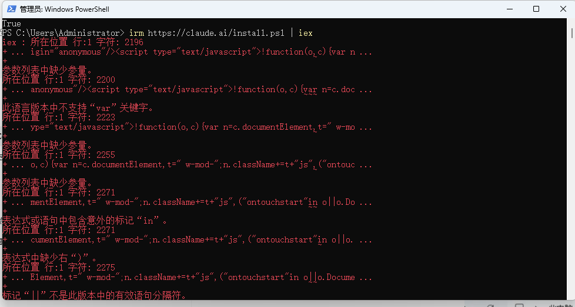
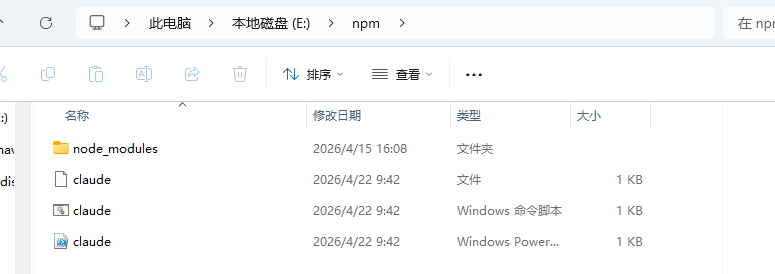
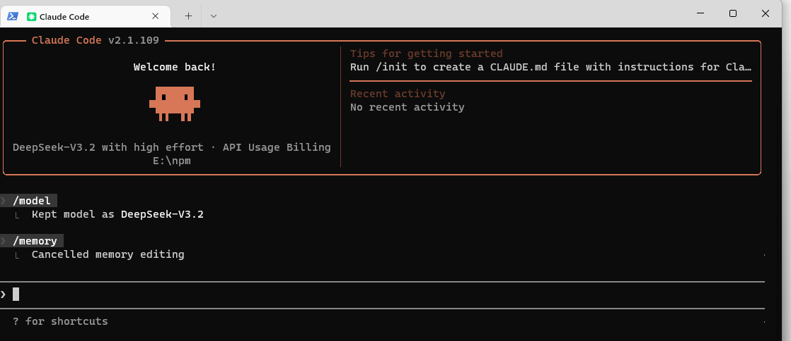
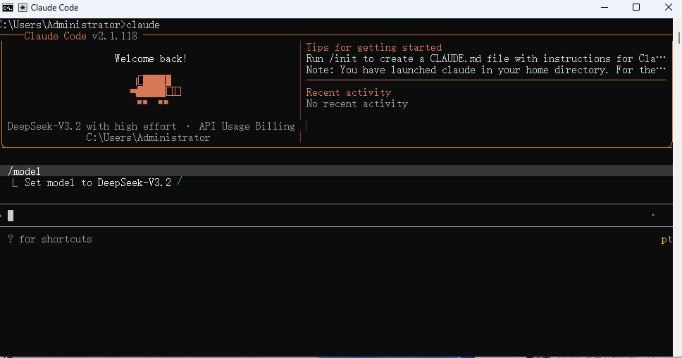

**Claude Code接入VSCode**

在使用之前，当前环境必须包含Java、node、git这三个环境工具，否则无法运行。

windows11安装claude的时候会有很多神奇的报错。



1. 首先打开powershell，先确认你打开的是否是真的64位系统的powershell，命令位：[Environment]::Is64BitProcess，返回true。
2. 其次设置你的代理<font style="color:rgb(221, 17, 68);background-color:rgb(248, 248, 248);">$env:HTTPS_PROXY="http://127.0.0.1:7890"  </font><font style="background-color:rgb(248, 248, 248);">，设置完成之后，开始执行官方的下载命令</font>

**如果还是会出现一堆的语法错误（如上图），别着急，直接使用npm全局下载包。**

**如果是通过npm安装的claude，友情提示：请把npm包放在c盘哦，不然claude在执行命令的时候会出现无法找到server的错误哦。而且无法在cmd或者powershell窗口执行claude命令！！！**

**如果没报错，直接进入权限问题即可。**

npm全局安装之后，打开你的npm包下载目录，你会看到claude相关文件





3. 在vscode中直接搜索claude插件，安装插件之后即可使用。vscode安装的插件是无法使用claude命令窗口的，只能进行提问，如果你需要安装mcp或者skill-creator是需要打开claude命令窗口。这个时候使用会显示权限问题也就是登录问题。

**权限问题**：找到Users\{your account}\.claude.json 文件，并且编辑，添加"hasCompletedOnboarding": true

执行上诉操作之后，我们就可以正常打开claude，但是会提示需要登录才能使用。由于claude官方账号翻墙使用容易被封，所以直接使用国内的大数据模型，数据模型的选择看你自己。在使用claude之前必须拥有一个大数据模型的账号（deepseek、chatGPT），这样才能在claude中使用正确的model，进行付费token传输，就可以在claude中进行问答。我选择使用deepseek这个国内的大模型数据。下载一个ccswitch，安装之后，把deepseek的apikey添加到ccswitch的供应商中。操作完成之后打开claude就可以正常使用了。



**Claude相关命令**

| 命令 | 解释 | 使用场景 |
| --- | --- | --- |
| /clear | 清空上下文 | 如果对话需要全新的开始，或者是当前对话已经无法解决问题 |
| /compact | 压缩对话，可以在后面加上参数，比如：保留用户需求 | 保留之前的对话记忆，压缩对话防止对话超过128k |
| /cost | 花费 | 字面意思，查看你花了所少钱 |
| /logout /login | 登出、登录 |  |
| /model | 切换数据模型 |  |
| /status | 状态 | 查看当前cc的状态 |
| /doctor | 检测 | 检查当前cc的安装状态shit |
| shift+tab | 切换模式 | claude在执行创建命令时会询问用户是否授权类似的操作，点击是之后就会进入授权模式 |
| ctrl+G | 切换编辑模式为vscode | 切换命令输入框为vscode输入模式，随便换行 |
| shift+enter | 输入换行 |  |
| claude --dangerously-skip-permissions | 启动允许自动操作终端命令 | claude默认操作终端是危险操作，每次操作都需要询问用户 |
| /rewind（按两次esc） | 回滚命令 | 但是回滚不会变更由终端命令创建的文件 |
| /resume | 恢复对话 |  |
| /hooks | 每次执行claude之后可以使用的方法 |  |


**接入MCP（figma）**

claude官方网站有figma的server接入命令，安装完成之后无需了解figma具体的操作或者操作的具体含义，我们只需要把figma稿件准备好即可。但是正版的figma很贵，所以我们可以使用开源版，虽然功能少，但是也能用。

首先，我们得知道一些基本命令：

```plain
# 列出所有已配置的服务器
claude mcp list

# 查看特定服务器的详细信息
claude mcp get github

# 删除服务器
claude mcp remove github

# 在 Claude Code 中检查服务器状态
/mcp
```

如果需要添加的mcp server为url形势，那么可以如下添加：

```plain
# 基础添加命令
claude mcp add --transport http <name> <url>

# 示例：连接到本地 HTTP MCP 服务器
claude mcp add --transport http my-server http://localhost:8080/mcp

# 需要认证时使用 --header 参数
claude mcp add --transport http secure-api https://api.example.com/mcp \
  --header "Authorization: Bearer your-token"
```

打开powershell，运行以下命令即可安装figma server

```plain
claude mcp add --transport http figma https://mcp.figma.com/mcp
```

首次使用会出现授权的提示，授权即可。

如果你要安装免费版本的，请打开powershell，执行以下命令：

```plain
npm install -g figma-developer-mcp
```

若是你只需要在当前项目使用这个mcp，那么在项目根目录新建.mcp.json文件，如果你希望所有的项目都可以使用这个mcp，那么直接修改.claude.json文件，在文件中添加macpservers相关内容：

```plain
{
  "mcpServers": {
    "figma-developer-mcp": {
      "command": "figma-developer-mcp",
      "args": [
        "--stdio"
      ],
      "env": {
        "FIGMA_API_KEY": "[YOUR_FIGMA_API_KEY]"
      }
    }
  }
}
```

+ `<font style="color:rgb(25, 27, 31);background-color:rgb(248, 248, 250);">figma-developer-mcp</font>`<font style="color:rgb(25, 27, 31);">：自定义别名，避免与官方 MCP 冲突</font>
+ `<font style="color:rgb(25, 27, 31);background-color:rgb(248, 248, 250);">FIGMA_API_KEY</font>`<font style="color:rgb(25, 27, 31);">：需要在Figma中生成个人访问令牌（直接下载app，打开之后进入account，然后进入</font>**<font style="color:rgb(0, 0, 0);">Security</font>**<font style="color:rgb(0, 0, 0);"> tab可以点击</font>**<font style="color:rgb(0, 0, 0);">Generate new token</font>**<font style="color:rgb(0, 0, 0);">就可以生成token了</font><font style="color:rgb(25, 27, 31);">）</font>

**claude.md文件**

如果我们需要每次打开claude对话框，都让claude恢复项目记忆，就需要在执行claude命令的项目中生成一个claude.md文件。

具体生成命令：/init

**Agent Skill**

Agent skill: 主对话框中使用，占用上下文空间，适合用来生成一些与上下文关系紧密的命令，比如：日报

subAgent：会在副对话框中执行，不占用主对话的上下文空间，适合执行一些与上下文关系不紧密，但是影响上下文的命令，比如审核代码	

如何创建Agent Skill：在项目的根目录下有一个.claude文件夹，在文件夹中新建skills文件夹，用来存放项目中所用到的skill文件。具体不同的skill可以新建不同的文件夹，再去文件夹中新建一个SKILL.md文件。

Skill文件示例：

```plain
---
name: dailyreport
description: 依据会议录音总结内容
---


# 每日会议汇报

## 总结规则                            //9-15行就是指令层

请将会议内容总结为一下几点：

- 参会人员
- 议题
- 决定
- 财务提醒：仅在提到"费用、预算、钱"时触发。须读取'集团财务手册.md'，指出决定中的金额是否超标，并明确审批人。

## 上传规则       //16-25行就是资源层。 16行就是Reference，18行开始就是Script

如果用户提到"上传"、"同步"、"发送到服务器"。你必须运行upload.py脚本将总结内容上传到服务器。
脚本使用方法：

```python
python upload.py "meeting report"
```

注意： 每项都只能用一句话来表述，不要分成多条
```

在skill的样例中，我们可以看到，一个skill大致分为三层，也就是渐进式披露结构（Progressive Disclosure）。其中资源层中，Reference在执行的时候，claude会读取对应文件内容，会把内容加载到上下文中，script在执行的时候，claude是不会去读取相关文件内容的，只会去执行文件，所以script中的文件不管多大都不会影响上下文的长度，前提是你的script文件写得流畅正确。


在不同的文件夹下打开claude，只要trust这个文件夹，就会在.claude.json文件中的peojects中生成相关的配置。


