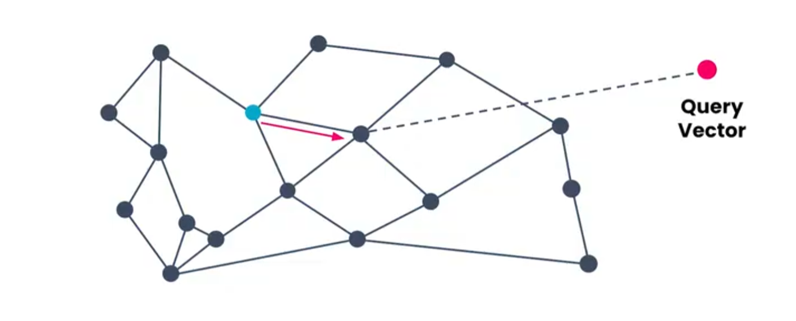
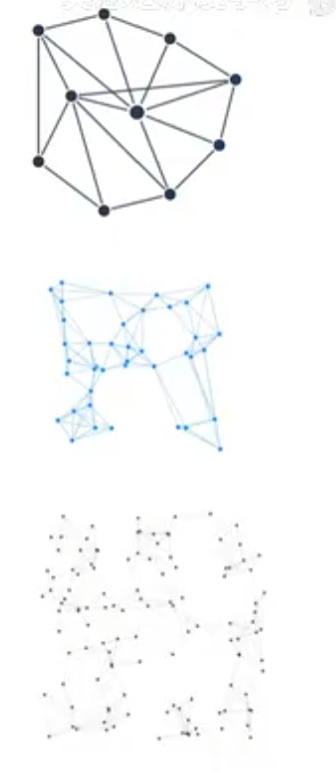
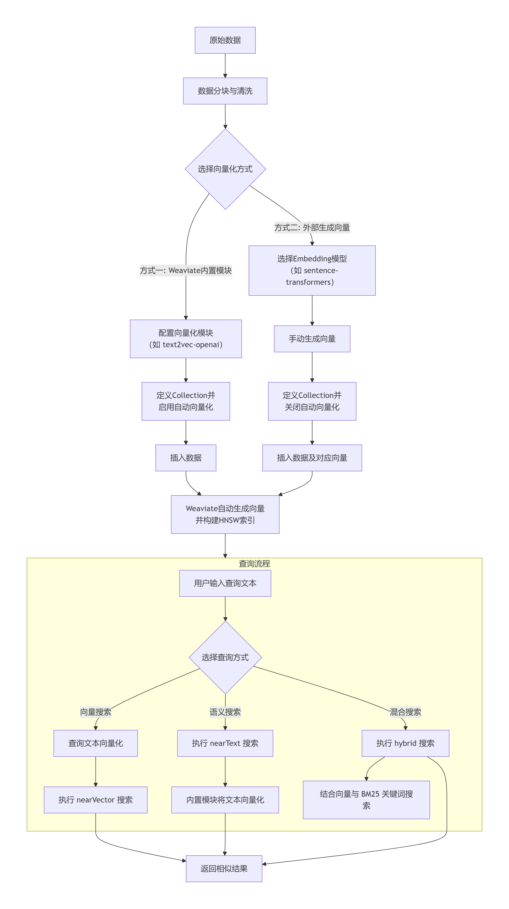

## 向量检索
### k近邻搜索（KNN）
主要实现包括以下几点：

+ <span style="color:rgb(15, 17, 21);">将</span>**<span style="color:rgb(15, 17, 21);">所有文档和提示</span>**<span style="color:rgb(15, 17, 21);">向量化</span>
+ **<span style="color:rgb(15, 17, 21);">计算</span>**<span style="color:rgb(15, 17, 21);">与所有文档向量的</span>**<span style="color:rgb(15, 17, 21);">距离</span>**
+ <span style="color:rgb(15, 17, 21);">根据距离</span>**<span style="color:rgb(15, 17, 21);">排序</span>**
+ **<span style="color:rgb(15, 17, 21);">返回</span>**<span style="color:rgb(15, 17, 21);">距离最近的 K 个元素</span>

KNN算法易于理解和实现，但是扩展性非常糟糕。主要在于：每次搜索所需要的计算数量线性增长，随着向量增多，检索速度直线下降。如果想让检索器在大规模数据场景下表现良好，我们就需要用到近似近邻算法（ANN）。

### 近似近邻算法（ANN）
<span style="color:rgb(15, 17, 21);">ANN (Approximate Nearest Neighbor) 是所有近似最近邻搜索算法的统称，其内部包含多种实现方案，HNSW是其中一种。</span>

<span style="color:rgb(15, 17, 21);">各类索引的核心差异在于实现原理，具体分类如下：</span>

| <span style="color:rgb(15, 17, 21);">类别</span> | <span style="color:rgb(15, 17, 21);">原理</span> | <span style="color:rgb(15, 17, 21);">代表算法</span> |
| --- | --- | --- |
| **<span style="color:rgb(15, 17, 21);">基于树</span>** | <span style="color:rgb(15, 17, 21);">构建树形结构，划分空间，剪枝搜索</span> | <span style="color:rgb(15, 17, 21);">Annoy, KD-Tree</span> |
| **<span style="color:rgb(15, 17, 21);">基于哈希</span>** | <span style="color:rgb(15, 17, 21);">通过哈希函数将相似向量映射到同一个“桶”中</span> | <span style="color:rgb(15, 17, 21);">LSH (局部敏感哈希)</span> |
| **<span style="color:rgb(15, 17, 21);">基于量化</span>** | <span style="color:rgb(15, 17, 21);">对原始向量进行压缩和聚类，减少搜索空间</span> | <span style="color:rgb(15, 17, 21);">IVF (倒排文件索引), PQ (乘积量化)</span> |
| **<span style="color:rgb(15, 17, 21);">基于图</span>** | <span style="color:rgb(15, 17, 21);">构建邻近图，通过图漫步进行高效检索</span> | <span style="color:rgb(15, 17, 21);">HNSW，是其核心代表</span> |


我们主要来讲讲基于图，也就是近邻图的主要实现步骤：

1. 创建一种名为‘近邻图’的数据结构，实现此步骤需要以下几步：
+ 计算每个向量与其它所有向量之间的距离
+ 在这个近邻图中为每一个向量添加一个节点
+ 为每一个向量创建一条边以及它最接近的其它一些向量

这就形成了类似网络的结构

2. 加速搜索

当检索器收到一个查询时，将其向量化以生成一查询向量，目标是找到与该查询向量最接近的向量。

    1. ANN算法会随机选择一个被称为候选向量的入口点作为起点，注意这个向量仅仅是近邻图中的一个节点，是一个随机的选择不带任何假设。
    2. 算法开始遍历近邻图，它会查看当前候选向量的每个近邻节点并且计算其中哪个离查询向量最近。由于只需要考虑少数几个近邻节点，这个遍历速度会很快。



    3. 离得最近的那个向量称为新的候选向量，然后再重复上述遍历过程。持续直到没有邻居比当前候选更接近查询向量，返回候选向量。返回的候选向量可以是多个向量列表，改变的只是每次在近邻图中移动，选择任何让你最接近查询向量的邻居。

ANN算法未必能找到向量库中的最优向量，可能有一个更接近查询向量的向量，只是不会被算法找到。这是由于ANN算法无法在近邻图中选择最优的整体路径，只能做到每一步的最优路径。在实际应用中，ANN算法可以找到非常接近的向量，速度上也比KNN快得多。

### 分层可导航小世界（HNSW）
<span style="color:rgb(15, 17, 21);">HNSW，因其卓越的性能和精度，已成为当前许多高性能向量数据库的“默认选项”或“首要高性能索引”，例如在Weaviate等系统中就是默认选择。</span>

HNSW显著加快搜索的早期阶段，进一步提升了性能。该算法依赖于分层近邻图的多层结构。

我们来看看它大概的样子，举个例子：一个包含一千篇文档的知识库中

1. 第一层

<span style="color:rgb(15, 17, 21);">包含全部 </span>**<span style="color:rgb(15, 17, 21);">1000 个向量</span>**<span style="color:rgb(15, 17, 21);">，按常规生成并且计算近邻图</span>

2. 第二层

随机保留100个向量，剔除其余所有向量。并且根据这100个向量生成一个新的近邻图

3. 第三层

随机保留10个向量，剔除其余所有向量，并且根据这10个向量生一个新的近邻图



那么我们从第三层（顶层）开始搜索

1. 算法会在这一层随机选择一个入口点作为**全局最高层入口点**，然后按照正常方式搜索第三层中的最佳候选
2. 将第三层得到的最佳候选作为第二层的入口点。第二层的数据更多，可能存在一个更接近查询向量的向量。在第二层继续按照正常方式遍历，找到第二层中的最佳候选
3. 来到第一层，将第二层获取的最佳候选作为入口点，继续按照正常方式遍历，这一层的向量最多，所以耗时会相对长一点，直到得到最佳候选。

从第三层到第二层再到第一层，这样的跳跃我们称之为**层级跳跃**。**<span style="color:rgb(15, 17, 21);">层级跳跃</span>**<span style="color:rgb(15, 17, 21);"> = 从顶层到底层逐层近邻搜索，每层以上一层找到的候选节点作为入口；</span>**<span style="color:rgb(15, 17, 21);">结合三层</span>**<span style="color:rgb(15, 17, 21);"> = 每层保留多个候选点作为下一层起点，最终在最底层得到精确的 Top-K 结果。</span>

| <span style="color:rgb(15, 17, 21);">层</span> | <span style="color:rgb(15, 17, 21);">向量数</span> | <span style="color:rgb(15, 17, 21);">图密度</span> | <span style="color:rgb(15, 17, 21);">作用</span> |
| --- | --- | --- | --- |
| <span style="color:rgb(15, 17, 21);">3</span> | <span style="color:rgb(15, 17, 21);">10</span> | <span style="color:rgb(15, 17, 21);">稀疏</span> | <span style="color:rgb(15, 17, 21);">快速跳过全局，确定大致区域</span> |
| <span style="color:rgb(15, 17, 21);">2</span> | <span style="color:rgb(15, 17, 21);">100</span> | <span style="color:rgb(15, 17, 21);">中等</span> | <span style="color:rgb(15, 17, 21);">缩小到局部区域</span> |
| <span style="color:rgb(15, 17, 21);">1</span> | <span style="color:rgb(15, 17, 21);">1000</span> | <span style="color:rgb(15, 17, 21);">稠密</span> | <span style="color:rgb(15, 17, 21);">精确查找最近节点</span> |


<span style="color:rgb(15, 17, 21);">HNSW算法结合了</span>**<span style="color:rgb(15, 17, 21);">高层的快速筛选</span>**<span style="color:rgb(15, 17, 21);">和</span>**<span style="color:rgb(15, 17, 21);">底层的精确计算</span>**<span style="color:rgb(15, 17, 21);">，不仅加快了搜索速度，更是增加了可以存储的向量总量。HNSW是目前公认的性能标杆之一，是ANN算法中基于图的一种。</span>

<span style="color:rgb(15, 17, 21);">当然HNSW也有它的短板：</span>

+ **<span style="color:rgb(15, 17, 21);">高内存占用</span>**<span style="color:rgb(15, 17, 21);">：为了支撑其多层图结构，HNSW需要存储额外的图连接信息，这是其最主要的资源消耗点</span>-<span style="color:rgb(15, 17, 21);">。业内有两个经验法则可参考，一是通常需要比原始向量数据多至少30%的内存来容纳索引结构</span>-<span style="color:rgb(15, 17, 21);">，二是当数据集维度极高达到1500维时，索引的内存开销可能膨胀到原始数据的10-20倍</span>-<span style="color:rgb(15, 17, 21);">。</span>
+ **<span style="color:rgb(15, 17, 21);">索引构建慢</span>**<span style="color:rgb(15, 17, 21);">：构建HNSW索引是一个逐点插入的过程，需要动态地建立图连接，计算量巨大</span>-<span style="color:rgb(15, 17, 21);">。特别地，其插入成本会随着数据集规模急剧增加，对于十万级别数据集，构建索引的时间可能比IVF算法慢上数千倍</span>-<span style="color:rgb(15, 17, 21);">，且不支持真正的</span>**<span style="color:rgb(15, 17, 21);">高频更新</span>**<span style="color:rgb(15, 17, 21);">。</span>

<span style="color:rgb(15, 17, 21);">当然，还存在很多其它优秀的算法，如下表格：</span>

| <span style="color:rgb(15, 17, 21);">算法</span> | <span style="color:rgb(15, 17, 21);">查询延迟</span> | <span style="color:rgb(15, 17, 21);">内存占用</span> | <span style="color:rgb(15, 17, 21);">构建速度</span> | **<span style="color:rgb(15, 17, 21);">TopK召回率</span>** | **<span style="color:rgb(15, 17, 21);">动态更新</span>** |
| --- | --- | --- | --- | --- | --- |
| **<span style="color:rgb(15, 17, 21);">HNSW</span>** | **<span style="color:rgb(15, 17, 21);">极低</span>** | **<span style="color:rgb(15, 17, 21);">极高</span>** | **<span style="color:rgb(15, 17, 21);">极低</span>** | **<span style="color:rgb(15, 17, 21);">极高</span>** | **<span style="color:rgb(15, 17, 21);">不支持</span>** |
| **<span style="color:rgb(15, 17, 21);">IVF</span>** | <span style="color:rgb(15, 17, 21);">低</span> | <span style="color:rgb(15, 17, 21);">低</span> | **<span style="color:rgb(15, 17, 21);">高</span>** | <span style="color:rgb(15, 17, 21);">中</span> | **<span style="color:rgb(15, 17, 21);">支持</span>** |
| **<span style="color:rgb(15, 17, 21);">IVF-PQ</span>** | <span style="color:rgb(15, 17, 21);">中</span> | **<span style="color:rgb(15, 17, 21);">极低</span>** | <span style="color:rgb(15, 17, 21);">高</span> | <span style="color:rgb(15, 17, 21);">中</span> | <span style="color:rgb(15, 17, 21);">支持</span> |
| **<span style="color:rgb(15, 17, 21);">PQ</span>** | <span style="color:rgb(15, 17, 21);">中</span> | **<span style="color:rgb(15, 17, 21);">极低</span>** | <span style="color:rgb(15, 17, 21);">低</span> | <span style="color:rgb(15, 17, 21);">低</span> | <span style="color:rgb(15, 17, 21);">不支持</span> |
| **<span style="color:rgb(15, 17, 21);">LSH</span>** | <span style="color:rgb(15, 17, 21);">低</span> | <span style="color:rgb(15, 17, 21);">低</span> | <span style="color:rgb(15, 17, 21);">低</span> | <span style="color:rgb(15, 17, 21);">低</span> | **<span style="color:rgb(15, 17, 21);">支持</span>** |


<span style="color:rgb(15, 17, 21);">所以我们在实际运用中，需要进行取舍，在精度、速度与资源三者间做权衡，从而选择更适合特定场景的其他算法：</span>

+ **<span style="color:rgb(15, 17, 21);">追求资源高效与大规模场景 ⇒ IVF系列</span>**
    - **<span style="color:rgb(15, 17, 21);">核心特点</span>**<span style="color:rgb(15, 17, 21);">：</span>**<span style="color:rgb(15, 17, 21);">构建成本低、内存占用少</span>**<span style="color:rgb(15, 17, 21);">，通过聚类将数据划分为多个“倒排文件”，搜索时只检索最相关的几个聚类</span>-<span style="color:rgb(15, 17, 21);">。</span>
    - **<span style="color:rgb(15, 17, 21);">适用场景</span>**<span style="color:rgb(15, 17, 21);">：</span>
        1. <span style="color:rgb(15, 17, 21);">处理</span>**<span style="color:rgb(15, 17, 21);">超大规模数据集</span>**<span style="color:rgb(15, 17, 21);">时内存占用的经济高效</span>-<span style="color:rgb(15, 17, 21);">。</span>
        2. <span style="color:rgb(15, 17, 21);">需要支持</span>**<span style="color:rgb(15, 17, 21);">在搜索结果上附加元数据过滤</span>**<span style="color:rgb(15, 17, 21);">的复杂查询（常用于电商推荐等场景）</span>-<span style="color:rgb(15, 17, 21);">。</span>
        3. <span style="color:rgb(15, 17, 21);">数据量大、</span>**<span style="color:rgb(15, 17, 21);">TopK值较高</span>**<span style="color:rgb(15, 17, 21);">（如要求返回2000条以上）时，IVF性能反超HNSW</span>-<span style="color:rgb(15, 17, 21);">。</span>
+ **<span style="color:rgb(15, 17, 21);">极致的内存压缩需求 ⇒ PQ（乘积量化）系列</span>**
    - **<span style="color:rgb(15, 17, 21);">核心特点</span>**<span style="color:rgb(15, 17, 21);">：将高维向量分割成多个低维子向量进行独立压缩编码，能实现</span>**<span style="color:rgb(15, 17, 21);">极高的压缩率</span>**-<span style="color:rgb(15, 17, 21);">。</span>
    - **<span style="color:rgb(15, 17, 21);">适用场景</span>**<span style="color:rgb(15, 17, 21);">：</span>
        1. <span style="color:rgb(15, 17, 21);">在极其苛刻的内存限制下，如手机上构建离线搜索系统。</span>
        2. <span style="color:rgb(15, 17, 21);">追求成本效益，用更多算力换取内存节约。</span>
        3. <span style="color:rgb(15, 17, 21);">常与IVF结合，形成</span>**<span style="color:rgb(15, 17, 21);">IVF-PQ</span>**<span style="color:rgb(15, 17, 21);">，兼顾规模、速度和内存，是工业界的“黄金组合”之一</span>-<span style="color:rgb(15, 17, 21);">。</span>
+ **<span style="color:rgb(15, 17, 21);">追求极简与快速部署 ⇒ Annoy</span>**
    - **<span style="color:rgb(15, 17, 21);">核心特点</span>**<span style="color:rgb(15, 17, 21);">：基于树结构的算法，原理简单，易于理解和部署，</span>**<span style="color:rgb(15, 17, 21);">轻量且内存友好</span>**-<span style="color:rgb(15, 17, 21);">。</span>
    - **<span style="color:rgb(15, 17, 21);">适用场景</span>**<span style="color:rgb(15, 17, 21);">：</span>
        1. <span style="color:rgb(15, 17, 21);">作为入门级方案快速上手验证效果。</span>
        2. <span style="color:rgb(15, 17, 21);">在资源受限的环境（如单机、边缘设备）中快速搭建原型系统。</span>

## <span style="color:rgb(15, 17, 21);">向量数据库</span>
<span style="color:rgb(15, 17, 21);">向量数据库是专为处理</span>**<span style="color:rgb(15, 17, 21);">高维向量数据</span>**<span style="color:rgb(15, 17, 21);">而设计的数据库系统。它通过将非结构化数据转换为向量（Embedding）并建立专门的索引，来解决传统数据库在处理语义理解和相似性搜索时的根本性挑战。</span>

<span style="color:rgb(15, 17, 21);">它所依赖的核心，也就是ANN算法，它没有在所有场景下用一个ANN算法“包打天下”，而是提供了多种索引选择，我们能根据业务场景，在</span>**<span style="color:rgb(15, 17, 21);">精度、速度、成本</span>**<span style="color:rgb(15, 17, 21);">三要素之间找到最佳平衡。让我们精简一下：</span>

+ **<span style="color:rgb(15, 17, 21);">专为向量搜索设计</span>**<span style="color:rgb(15, 17, 21);">  
</span><span style="color:rgb(15, 17, 21);">旨在存储高维向量，并利用 ANN 算法执行向量搜索。</span>
+ **<span style="color:rgb(15, 17, 21);">性能优于关系型数据库</span>**<span style="color:rgb(15, 17, 21);">  
</span><span style="color:rgb(15, 17, 21);">关系型数据库执行向量搜索的方式类似于低效的 KNN 搜索。</span>
+ **<span style="color:rgb(15, 17, 21);">为 ANN 搜索优化</span>**<span style="color:rgb(15, 17, 21);">  
</span><span style="color:rgb(15, 17, 21);">专为构建 HNSW 索引和计算向量距离而设计。具备良好的扩展性和运行速度。</span>

### 核心原理
1. **<span style="color:rgb(15, 17, 21);">向量化与嵌入</span>**<span style="color:rgb(15, 17, 21);">：首先，数据（文本、图像等）会通过机器学习模型转换成由浮点数组成的高维向量。这些向量的“方向”和“位置”代表了数据的语义特征。</span>
2. **<span style="color:rgb(15, 17, 21);">近似最近邻（ANN）搜索</span>**<span style="color:rgb(15, 17, 21);">：为了在海量高维向量中快速找到“邻居”，数据库采用ANN算法，将精确搜索的时间复杂度从 O(n) 降低到 O(log n)。而HNSW就是其中一种最主流的图索引算法。</span>
3. **<span style="color:rgb(15, 17, 21);">向量索引构建</span>**<span style="color:rgb(15, 17, 21);">：根据所选算法（如HNSW、IVF）为向量构建专属索引，这是高效检索的基础。</span>
4. **<span style="color:rgb(15, 17, 21);">查询处理</span>**<span style="color:rgb(15, 17, 21);">：收到查询时，先将查询内容向量化，然后利用索引快速检索出最相似的Top-K个结果并返回。</span>

当下的几款主流向量数据库如表格：

| <span style="color:rgb(15, 17, 21);">分类</span> | <span style="color:rgb(15, 17, 21);">产品</span> | <span style="color:rgb(15, 17, 21);">一句话定位</span> | <span style="color:rgb(15, 17, 21);">理想使用场景</span> |
| --- | --- | --- | --- |
| **<span style="color:rgb(15, 17, 21);">全托管方案</span>** | **<span style="color:rgb(15, 17, 21);">Pinecone</span>** | <span style="color:rgb(15, 17, 21);">零运维，性能强悍</span> | <span style="color:rgb(15, 17, 21);">希望完全专注于业务开发，无需操心底层运维的团队</span> |
| | **<span style="color:rgb(15, 17, 21);">腾讯云向量数据库 (VDB)</span>** | <span style="color:rgb(15, 17, 21);">开箱即用，性价比高</span> | <span style="color:rgb(15, 17, 21);">已在腾讯云上，或希望获得集成AI套件和高性价比的国内开发者</span> |
| | **<span style="color:rgb(15, 17, 21);">Cloud Weaviate</span>** | <span style="color:rgb(15, 17, 21);">托管版的开源混合搜索利器</span> | <span style="color:rgb(15, 17, 21);">希望享受全托管便利，同时其内置模块和混合搜索能力是核心需求</span> |
| **<span style="color:rgb(15, 17, 21);">开源与自托管</span>** | **<span style="color:rgb(15, 17, 21);">Milvus</span>** | <span style="color:rgb(15, 17, 21);">功能全面的企业级“航空母舰”</span> | <span style="color:rgb(15, 17, 21);">企业级大规模、高并发生产环境，有专门的运维团队来处理复杂的分布式部署</span> |
| | **<span style="color:rgb(15, 17, 21);">Weaviate</span>** | <span style="color:rgb(15, 17, 21);">“知识图谱+向量”模型，功能丰富</span> | <span style="color:rgb(15, 17, 21);">需要强大的混合搜索和内置AI模块（如自动向量化）的复杂应用</span> |
| | **<span style="color:rgb(15, 17, 21);">Qdrant</span>** | <span style="color:rgb(15, 17, 21);">纯Rust编写，兼顾性能与可靠性</span> | <span style="color:rgb(15, 17, 21);">对性能和内存控制有极致要求，且需要高级过滤功能的场景</span> |
| **<span style="color:rgb(15, 17, 21);">轻量与嵌入式</span>** | **<span style="color:rgb(15, 17, 21);">Chroma</span>** | <span style="color:rgb(15, 17, 21);">开发者的本地“瑞士军刀”</span> | <span style="color:rgb(15, 17, 21);">本地开发、快速原型验证和学习探索，是个人开发者和小规模项目的首选</span> |
| | **<span style="color:rgb(15, 17, 21);">Pgvector</span>** | <span style="color:rgb(15, 17, 21);">PostgreSQL的“一键”AI插件</span> | <span style="color:rgb(15, 17, 21);">团队技术栈重度依赖PostgreSQL，希望复用现有数据库能力，但数据量不大、性能要求不极致</span> |
| | **<span style="color:rgb(15, 17, 21);">LanceDB</span>** | <span style="color:rgb(15, 17, 21);">面向数据科学家的嵌入式列存数据库</span> | <span style="color:rgb(15, 17, 21);">适用于数据密集型应用（如图像、音频），希望直接在本地文件上进行分析的工作负载</span> |


接下来我们着重分析一下**<span style="color:rgb(15, 17, 21);">Weaviate</span>**<span style="color:rgb(15, 17, 21);">的相关使用，选用这个数据库是因为</span>**<span style="color:rgb(15, 17, 21);">Weaviate</span>**<span style="color:rgb(15, 17, 21);">默认使用的是HNSW索引。</span>

### <span style="color:rgb(15, 17, 21);">大致流程</span>
<span style="color:rgb(15, 17, 21);">使用向量数据库进行搜索，一般都会有以下步骤：</span>

<span style="color:rgb(15, 17, 21);">原始数据 → 切块（可选）→ 向量化（Embedding）→ 存入向量数据库 → 构建索引 → 执行搜索</span>

### <span style="color:rgb(15, 17, 21);">Weaviate向量数据库</span>


上图所示就是weaviate数据库的大致使用流程，接下来我们来分步骤分析一下。

#### 搜索流程
1. **准备环境**

weaviate可以使用docker进行启动，本地部署很便捷。

```bash
docker run -d -p 8080:8080 \
  -e QUERY_DEFAULTS_LIMIT=20 \
  -e AUTHENTICATION_ANONYMOUS_ACCESS_ENABLED=true \
  semitechnologies/weaviate:latest
```

需要注意，AUTHENTICATION_ANONYMOUS_ACCESS_ENABLED参数为true则是开启匿名访问，如果是开发环境需要设置为false。

2. **数据准备**

<span style="color:rgb(15, 17, 21);">Weaviate 支持文本、图片等多种类型，不同类型的数据需要进行不同的处理：</span>

+ **<span style="color:rgb(15, 17, 21);">文本</span>**<span style="color:rgb(15, 17, 21);">：清洗（去除多余空格、特殊字符）、分句/分块（chunking）。例如长文档会被切成多个小段落，每段约 200～500 tokens。</span>
+ **<span style="color:rgb(15, 17, 21);">图像</span>**<span style="color:rgb(15, 17, 21);">：统一尺寸、归一化像素值。</span>
+ **<span style="color:rgb(15, 17, 21);">音频</span>**<span style="color:rgb(15, 17, 21);">：转为固定时长的频谱图或梅尔频率倒谱系数（MFCC）。</span>

<span style="color:rgb(15, 17, 21);">分割成块（chunk）的目的是让每个搜索单元包含足够具体的语义，同时控制向量规模。</span>

3. **<span style="color:rgb(15, 17, 21);">定义数据结构（Schema）</span>**

<span style="color:rgb(15, 17, 21);">在 Weaviate 中，</span>**<span style="color:rgb(15, 17, 21);">Collection（集合）</span>**<span style="color:rgb(15, 17, 21);"> 类似关系型数据库的“表”。我们需要为数据定义清晰的 </span>**<span style="color:rgb(15, 17, 21);">Properties（属性）</span>**

+ **<span style="color:rgb(15, 17, 21);">命名</span>**<span style="color:rgb(15, 17, 21);">：给集合起一个有意义的名字，例如 </span>`<span style="color:rgb(15, 17, 21);"><YourCollectionName></span>`<span style="color:rgb(15, 17, 21);">。</span>
+ **<span style="color:rgb(15, 17, 21);">定义属性</span>**<span style="color:rgb(15, 17, 21);">：除了存储向量，你还需要存储原始数据（如文本、图片URL）和其他元数据（如ID、分类标签）。例如，一个文档集合可以包含"title"和"content"这两个文本属性</span><span style="color:rgb(15, 17, 21);">。</span>

```python
from weaviate.classes.config import Configure, Property, DataType

try:
    collection = client.collections.create(
        name="Document",
        properties=[
            Property(name="title", data_type=DataType.TEXT),
            Property(name="content", data_type=DataType.TEXT),
        ],
        # 如果启用了向量化模块，会自动为content向量化
        # 也可手动指定某个属性向量化。
    )
    print("Collection 'Document' created successfully.")
except:
    print("Collection 'Document' already exists.")
```

4. **<span style="color:rgb(15, 17, 21);">向量化</span>**

<span style="color:rgb(15, 17, 21);">Weaviate的向量化有两种方式：</span>

    1. **<span style="color:rgb(15, 17, 21);">外部生成</span>**<span style="color:rgb(15, 17, 21);">：使用如 </span>`<span style="color:rgb(15, 17, 21);">sentence-transformers</span>`<span style="color:rgb(15, 17, 21);"> 等工具，在代码中先将数据转换为向量，再存入 Weaviate。这让你对模型和流程有最大的掌控权。</span>
        1. **<span style="color:rgb(15, 17, 21);">优点</span>**<span style="color:rgb(15, 17, 21);">：灵活性高，你可以自由使用任何你喜欢的Embedding模型。</span>
        2. **<span style="color:rgb(15, 17, 21);">缺点</span>**<span style="color:rgb(15, 17, 21);">：需要自己编写代码来处理所有数据的向量化，工作量稍大。</span>
    2. **<span style="color:rgb(15, 17, 21);">内置模块 (推荐)</span>**<span style="color:rgb(15, 17, 21);">：</span>**<span style="color:rgb(15, 17, 21);">更便捷，是多数入门和实际项目的首选</span>**<span style="color:rgb(15, 17, 21);">。在启动 Weaviate 时，通过环境变量指定向量化模块，并把你的 API Key 传给 Weaviate，这样你在存入原始文本时，Weaviate 会自动调用模型生成向量，具体设置如下</span><span style="color:rgb(15, 17, 21);">：</span>

```bash
docker run ... -e DEFAULT_VECTORIZER_MODULE=text2vec-openai -e OPENAI_APIKEY="<YOUR_OPENAI_API_KEY>" ...
```

        1. **<span style="color:rgb(15, 17, 21);">优点</span>**<span style="color:rgb(15, 17, 21);">：彻底简化了流程，你只需提供文本，Weaviate负责其余工作。</span>
        2. **<span style="color:rgb(15, 17, 21);">缺点</span>**<span style="color:rgb(15, 17, 21);">：向量化模块的调用可能会增加额外的成本和延迟</span><span style="color:rgb(15, 17, 21);">。</span>

以下是代码的方式向量化并且插入数据的示例：

```python
import weaviate
from sentence_transformers import SentenceTransformer

# 1. 连接数据库
client = weaviate.connect_to_local(host="localhost", port=8080)

# 2. 准备模型
model = SentenceTransformer('all-MiniLM-L6-v2')

docs = [
    "猫是一种宠物",
    "狗会看守家园",
    "汽车需要加油"
]
# 手动生成向量
embeddings = model.encode(docs).tolist()

# 3. 定义集合结构
collection_name = "PetsAndCars"
# 如果集合已存在，则先删除
if client.collections.exists(collection_name):
    client.collections.delete(collection_name)

collection = client.collections.create(
    name=collection_name,
    # 关键点：手动提供向量时，必须设置 vectorizer_config 为 None
    vectorizer_config=None,
    properties=[
        weaviate.classes.config.Property(
            name="content",
            data_type=weaviate.classes.config.DataType.TEXT
        )
    ]
)

# 4. 批量插入数据
with collection.batch.fixed_size(batch_size=2) as batch:
    for i, (doc, vec) in enumerate(zip(docs, embeddings)):
        batch.add_object(
            properties={"content": doc},
            vector=vec,
            uuid=i
        )

# 确认插入成功
print(f"集合 '{collection.name}' 数据插入成功！")
```

5. **<span style="color:rgb(15, 17, 21);">开始搜索</span>**

<span style="color:rgb(15, 17, 21);">Weaviate 在搜索时默认使用</span>**<span style="color:rgb(15, 17, 21);">HNSW</span>**<span style="color:rgb(15, 17, 21);">。除了基础的 </span>`<span style="color:rgb(15, 17, 21);">nearText</span>`<span style="color:rgb(15, 17, 21);"> 文本搜索，Weaviate 还支持更丰富的查询：</span>

+ `**<span style="color:rgb(15, 17, 21);">nearImage</span>**`**<span style="color:rgb(15, 17, 21);"> 以图搜图</span>**<span style="color:rgb(15, 17, 21);">：用一张图片，搜索内容相似的图片。</span>
+ `**<span style="color:rgb(15, 17, 21);">nearVector</span>**`**<span style="color:rgb(15, 17, 21);"> 向量接龙</span>**<span style="color:rgb(15, 17, 21);">：用已有的向量值作为输入，来寻找它的“同类项”</span><span style="color:rgb(15, 17, 21);">。</span>
+ `**<span style="color:rgb(15, 17, 21);">nearObject</span>**`**<span style="color:rgb(15, 17, 21);"> </span>****<span style="color:rgb(15, 17, 21);">万物关联</span>**<span style="color:rgb(15, 17, 21);">：搜索与另一个已知数据项在语义上最接近的结果。</span>
+ `**<span style="color:rgb(15, 17, 21);">hybrid</span>**`**<span style="color:rgb(15, 17, 21);"> 混合搜索</span>**<span style="color:rgb(15, 17, 21);">：结合向量搜索（理解语义）和关键词搜索（精确匹配），获得更精准的结果。</span>
+ **<span style="color:rgb(15, 17, 21);">元数据过滤</span>**<span style="color:rgb(15, 17, 21);">：所有搜索都支持 </span>`<span style="color:rgb(15, 17, 21);">where</span>`<span style="color:rgb(15, 17, 21);"> 条件，对结果进行过滤。</span>
6. **调优**

我们还可以<span style="color:rgb(15, 17, 21);">在创建集合时调整HNSW的关键参数</span>，进行不同的优化

<span style="color:rgb(15, 17, 21);">HNSW索引关键参数</span>

+ `**<span style="color:rgb(15, 17, 21);">efConstruction</span>**`<span style="color:rgb(15, 17, 21);">：影响建图时的搜索范围，调高可提升召回率，但会增加构建时间和内存消耗。推荐范围：100~200。</span>
+ `**<span style="color:rgb(15, 17, 21);">maxConnections</span>**`**<span style="color:rgb(15, 17, 21);"> </span>****<span style="color:rgb(15, 17, 21);">(M)</span>**<span style="color:rgb(15, 17, 21);">：决定图中每个节点的最大连接数，调高可提升召回率，但会占用更多内存。推荐范围：16~64。</span>
+ `**<span style="color:rgb(15, 17, 21);">ef</span>**`<span style="color:rgb(15, 17, 21);">：</span>**<span style="color:rgb(15, 17, 21);">查询时最关键的调优参数</span>**<span style="color:rgb(15, 17, 21);">。调高会显著提升召回率，但会降低搜索速度。查询时可根据精度需求灵活调整。推荐范围：</span>`<span style="color:rgb(15, 17, 21);">ef</span>`<span style="color:rgb(15, 17, 21);"> < 500时性能良好，设置1000以上可提升召回率但搜索变慢。</span>

当然，HNSW虽然是默认的索引，我们还可以使用其他的索引，

| <span style="color:rgb(15, 17, 21);">索引类型</span> | <span style="color:rgb(15, 17, 21);">适用场景</span> | <span style="color:rgb(15, 17, 21);">关键特点</span> |
| --- | --- | --- |
| **<span style="color:rgb(15, 17, 21);">Flat (brute-force)</span>** | <span style="color:rgb(15, 17, 21);">数据集较小（<1万条）或对</span>**<span style="color:rgb(15, 17, 21);">精确召回率</span>**<span style="color:rgb(15, 17, 21);">有绝对要求时</span> | <span style="color:rgb(15, 17, 21);">暴力计算所有距离，保证100%精确，但复杂度O(n)，数据量大时极慢</span><span style="color:rgb(15, 17, 21);">。</span> |
| **<span style="color:rgb(15, 17, 21);">Dynamic</span>** | <span style="color:rgb(15, 17, 21);">优选索引类型，数据量从小变大的场景</span> | <span style="color:rgb(15, 17, 21);">当数据量超过阈值（默认1万条），自动从</span>`<span style="color:rgb(15, 17, 21);">Flat</span>`<span style="color:rgb(15, 17, 21);">无缝切换到</span>`<span style="color:rgb(15, 17, 21);">HNSW</span>`<br/><span style="color:rgb(15, 17, 21);">，兼顾两者优点</span><span style="color:rgb(15, 17, 21);">。</span> |
| **<span style="color:rgb(15, 17, 21);">HNSW (默认)</span>** | <span style="color:rgb(15, 17, 21);">绝大多数通用场景，尤其是中等规模数据量</span> | <span style="color:rgb(15, 17, 21);">默认索引，通过</span>**<span style="color:rgb(15, 17, 21);">多层图结构</span>**<span style="color:rgb(15, 17, 21);">实现快速的ANN搜索。</span> |
| **<span style="color:rgb(15, 17, 21);">Async</span>** | <span style="color:rgb(15, 17, 21);">写多读少，对写入延迟极度敏感的场景</span> | <span style="color:rgb(15, 17, 21);">异步构建索引，</span>**<span style="color:rgb(15, 17, 21);">写入速度极快</span>**<span style="color:rgb(15, 17, 21);">，但刚写入的数据可能无法立即被搜索到。</span> |


#### <span style="color:rgb(15, 17, 21);">hybrid</span>
<span style="color:rgb(15, 17, 21);">混</span><span style="color:rgb(15, 17, 21);">合搜索的执行可以分为两步：</span>

1. **<span style="color:rgb(15, 17, 21);">并行检索</span>**<span style="color:rgb(15, 17, 21);">：同时进行向量搜索（查找语义相近的内容）和关键词（BM25）搜索（查找包含特定词语的文档）。</span>
2. **<span style="color:rgb(15, 17, 21);">结果融合</span>**<span style="color:rgb(15, 17, 21);">：使用一个融合算法（Fusion Algorithm）将两组结果的分数或排名合并，生成最终排名。</span>

混合搜索中涉及到一个重要参数：<span style="color:rgb(15, 17, 21);">Alpha参数（平衡的调节器）。</span>`<span style="color:rgb(15, 17, 21);">alpha</span>`<span style="color:rgb(15, 17, 21);"> 参数是控制混合搜索行为的关键，它的值决定了</span>**<span style="color:rgb(15, 17, 21);">语义搜索</span>**<span style="color:rgb(15, 17, 21);">和</span>**<span style="color:rgb(15, 17, 21);">关键词搜索</span>**<span style="color:rgb(15, 17, 21);">各自的</span>**<span style="color:rgb(15, 17, 21);">权重</span>**<span style="color:rgb(15, 17, 21);">。</span>`<span style="color:rgb(15, 17, 21);">alpha</span>`<span style="color:rgb(15, 17, 21);"> 是一个位于 </span>**<span style="color:rgb(15, 17, 21);">0 到 1</span>**<span style="color:rgb(15, 17, 21);"> 之间的浮点数</span>：

+ **<span style="color:rgb(15, 17, 21);">alpha = 1</span>**<span style="color:rgb(15, 17, 21);">：结果将完全依赖于语义搜索，系统忽略关键词相关性。</span>
+ **<span style="color:rgb(15, 17, 21);">alpha = 0</span>**<span style="color:rgb(15, 17, 21);">：结果将完全依赖于关键词搜索，系统忽略语义相似度。</span>
+ **<span style="color:rgb(15, 17, 21);">alpha = 0.5</span>**<span style="color:rgb(15, 17, 21);">：两种搜索模式的结果权重各占一半</span><span style="color:rgb(15, 17, 21);">。</span>
+ **<span style="color:rgb(15, 17, 21);">alpha = 0.75 (默认值)</span>**<span style="color:rgb(15, 17, 21);">：这是许多场景下的一个不错的起点，它会让语义搜索的结果占稍高权重，但仍保留关键词匹配的信号。</span>

<span style="color:rgb(15, 17, 21);">Weaviate 提供了两种方法来合并关键词和语义搜索结果：</span>

| <span style="color:rgb(15, 17, 21);">策略</span> | <span style="color:rgb(15, 17, 21);">工作原理</span> | <span style="color:rgb(15, 17, 21);">默认版本</span> | <span style="color:rgb(15, 17, 21);">特点</span> |
| --- | --- | --- | --- |
| `**<span style="color:rgb(15, 17, 21);">rankedFusion</span>**` | <span style="color:rgb(15, 17, 21);">基于搜索结果在各自列表中的排名来计算分数，例如，第1名的对象分数最高，第2名次之。</span> | <span style="color:rgb(15, 17, 21);">v1.23 及更低版本</span> | <span style="color:rgb(15, 17, 21);">历史最久的方法，实现简单，但仅保留排名信息，可能丢失原始评分的丰富度。</span> |
| `**<span style="color:rgb(15, 17, 21);">relativeScoreFusion</span>**` | <span style="color:rgb(15, 17, 21);">将关键词和语义搜索的原始评分归一化（通常到0-1范围），然后进行加权求和。</span> | **<span style="color:rgb(15, 17, 21);">v1.24 及更高版本</span>** | <span style="color:rgb(15, 17, 21);">能更精细地保留和融合原始评分的差异，通常效果更优，</span><span style="color:rgb(15, 17, 21);">因此是新版Weaviate的</span>**<span style="color:rgb(15, 17, 21);">默认选择。</span>** |


<span style="color:rgb(15, 17, 21);">Weaviate数据库可以定义collection，所以会存在多个</span>**<span style="color:rgb(15, 17, 21);">collection</span>**<span style="color:rgb(15, 17, 21);">的情况，进行混合搜索时必须使用 </span>`<span style="color:rgb(15, 17, 21);">target_vector</span>`<span style="color:rgb(15, 17, 21);"> 参数明确指定使用哪一个。</span>

```python
response = client.collections.get("Document").query.hybrid(
    query="搜索文本",
    target_vector="title_vector", # 指定使用 'title_vector' 这个向量
    alpha=0.7
)
```

如果我们需要了解<span style="color:rgb(15, 17, 21);">最终分数是由哪些关键词和语义部分的得分加权计算来的，</span>可以设置`<span style="color:rgb(15, 17, 21);">return_metadata=["explain_score"]</span>`<span style="color:rgb(15, 17, 21);">，在搜索的结果中获取一个 </span>`<span style="color:rgb(15, 17, 21);">_additional { explainScore }</span>`<span style="color:rgb(15, 17, 21);"> 字段，这可以帮助我们更好得进行调试。</span>

<span style="color:rgb(15, 17, 21);">在整个 RAG 流水线中，混合搜索可作为</span>**<span style="color:rgb(15, 17, 21);">粗排</span>**<span style="color:rgb(15, 17, 21);">阶段，提供多样化的候选。当对结果的精确度要求很高时，考虑在混合搜索后加上一个</span>**<span style="color:rgb(15, 17, 21);">重排序器</span>**<span style="color:rgb(15, 17, 21);">进行</span>**<span style="color:rgb(15, 17, 21);">精排</span>**<span style="color:rgb(15, 17, 21);">，能进一步提升最终排名的质量。</span>

<span style="color:rgb(15, 17, 21);">可以为特定的文本属性设置更高的匹配权重（例如在标题字段中匹配到的关键词比正文更重要），同时也可以组合 </span>`<span style="color:rgb(15, 17, 21);">where</span>`<span style="color:rgb(15, 17, 21);"> 过滤器来限定搜索范围，例如：</span>

```java
Hybrid hy = HybridArgument.builder()
    .query("金马奖")
    .alpha(0.25f)                 // 设置权重
    .properties(new String[]{"name^2", "work"}) // 将 name 属性的权重提高2倍
    .build();

WhereFilter filter = WhereFilter.builder() //条件过滤
    .path("category")
    .operator("Equal")
    .valueString("电影")
    .limit(10)  //设置返回数量上限为10条
    .build();
```

**<span style="color:#DF2A3F;">注意</span>**：<span style="color:rgb(15, 17, 21);">排序参数 </span>`<span style="color:rgb(15, 17, 21);">sort</span>`<span style="color:rgb(15, 17, 21);"> 不能与 </span>`<span style="color:rgb(15, 17, 21);">hybrid</span>`<span style="color:rgb(15, 17, 21);"> 参数组合使用。</span>


