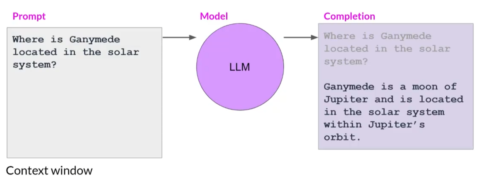
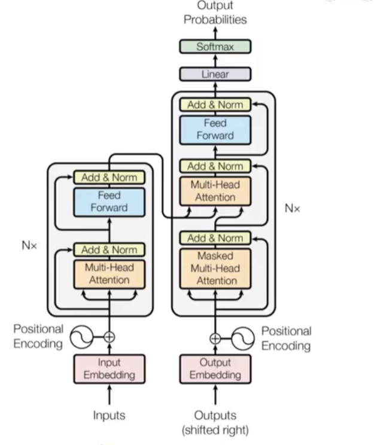
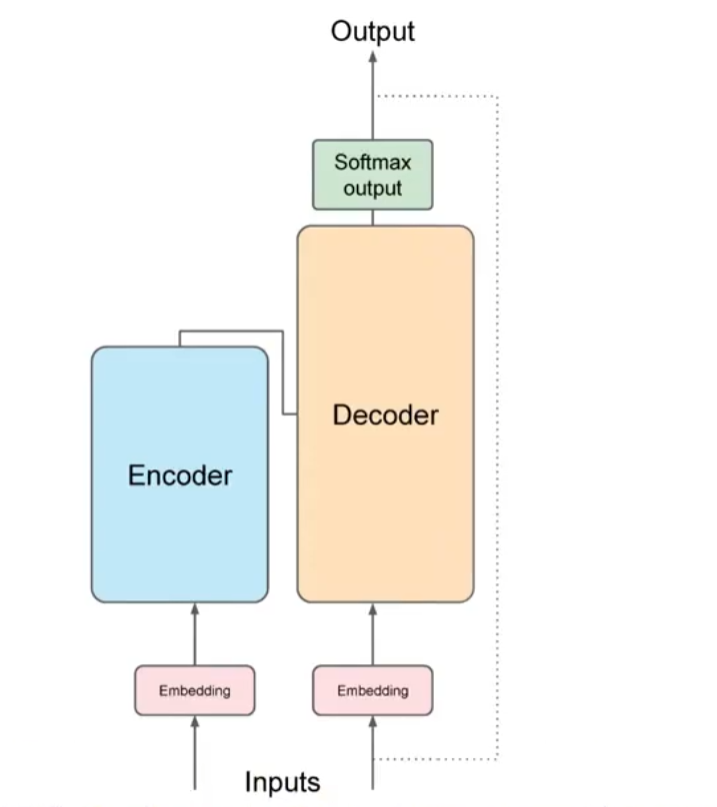
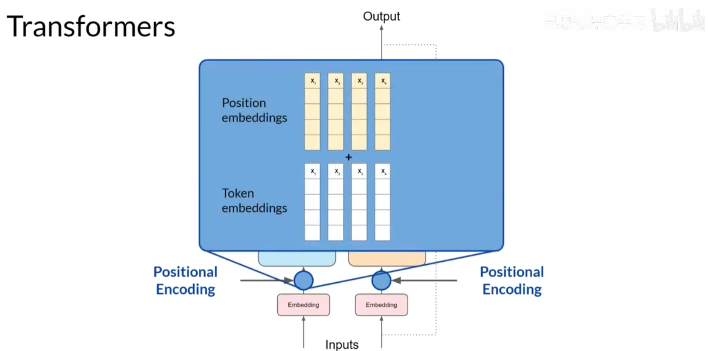
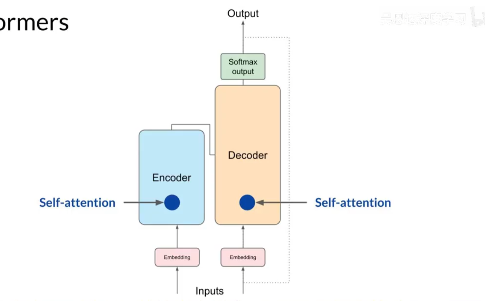
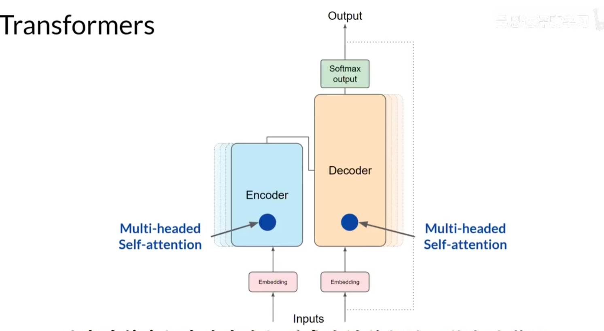
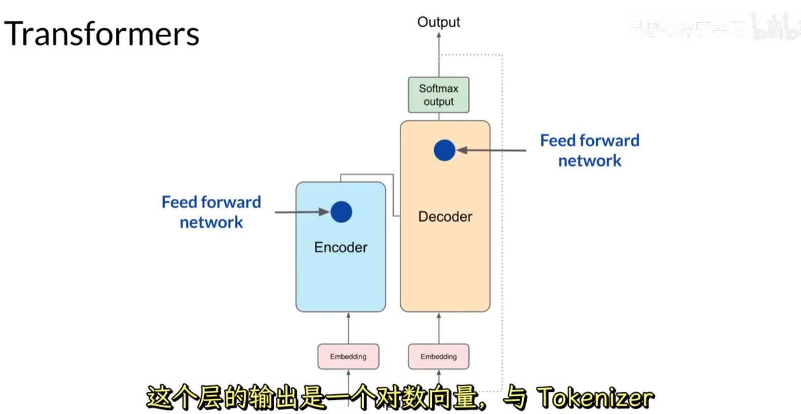
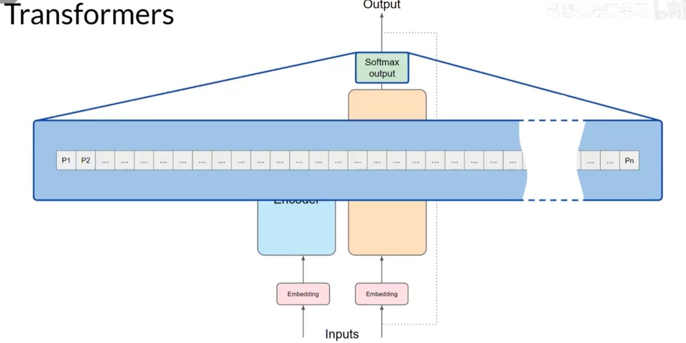
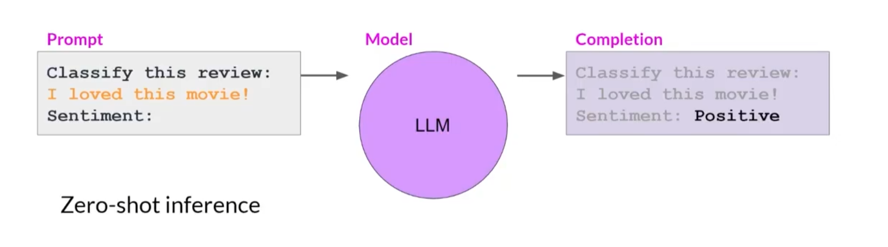
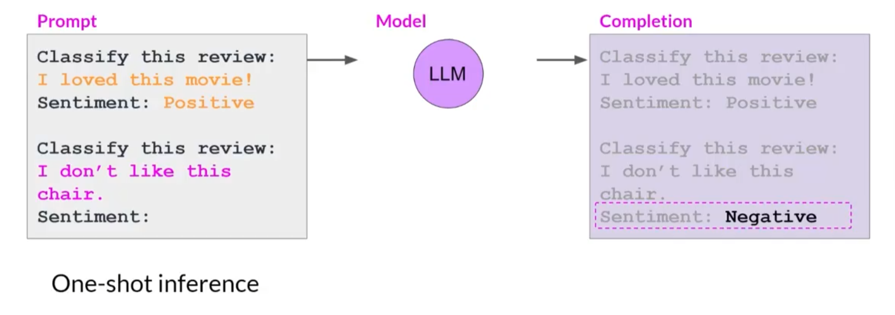

<!--
 * @File: 
 * @Description: 
 * @Author: guyawei (1972065889@qq.com)
 * @Date: 2026-05-30 20:53:33
 * @LastEditTime: 2026-05-30 21:22:47
 * @LastEditors: guyawei (1972065889@qq.com)
 * @FilePath: \blog\docs\ai\llm.md
-->
# LLM大模型（大语言模型）
## Prompts and completions

prompt： 传递给大语言模型的指令文本

上下文窗口：Prompt可用的空间或记忆，通常足够放下几千个字（每个模型的上下文量不一致）

Prompt被传递给模型。模型预测下一个词，因为prompt包含了问题，模型就生成了一个答案。

模型输出被称为完成（Completion），使用模型生成文本的行为被称为推理

一个流行的应用领域是通过将LLM与外部数据源连接或者调用外部API来对LLM能力进行增强

早期的语言模型使用的是循环网络神经网络或者RNN架构

RNN：需要大量计算和内存来执行生成任务，能力被限制

取代它们的：Transformers框架

+ 有效地扩展到使用多核GPU
+ 可以并行处理输入数据
+ 利用更大的训练数据集
+ **学会关注它正在处理的词的含义**

### Transformer架构被分成两个独立的部分：编码器和解码器

我们在模型输入的时候，使用的是文字也就是单词，在文本被传递给模型处理之前，我们必须将这些文本进行分词，也就是把这些文本变成token，传递给嵌入层，这个是一个可以训练的向量嵌入空间，每一个token都被表示为一个向量，并且在该空间占据一个独特的位置。每一个tokenID都对应一个多维向量，这些向量可以学习编码输入序列中单个token的含义和上下文。

当token向量前往编码器或者解码器的时候，需要添加上位置编码（Positional Encoding）

位置编码：保留关于输入单词顺序的信息，不会丧失单词在句子中的位置的相关性。

token和位置编码结合之后得到的结果向量会传递给自注意力层

在这一层中，模型分析输入序列中Token之间的关系，因为是向量数据，所以模型能够关注输入序列的不同部分，更好得捕捉单词之间的上下文依赖关系。

在训练期间学习并存储在这些层中的自注意力权重反映了输入序列中每个单词对所有其它单词的重要性。

Transformer架构具有多头自注意力，所以自注意力并不只是发生一次。也就意味着。多组自注意力权重或被并行、独立的学习

每个权重都是随机初始化的，给定足够的训练数据和时间，每个自注意力都将学习到不同的方面。

接下来注意力权重会应用到输入数据上，输出被处理通过一个全连接的前向网络。这一层的输出是一个对数向量，与Tokenizer字典中的每一个Token的概率分数成比例。

这些对数会被传递给最后的Softmax层，它们被归一化为每个单词的概率分数。

这个输出会包含词汇表中每个单词的概率，可能会有成千上万个分数，每一个单独的token都会有一个比较高的概率分数高于其余部分，这就是最有可能预测的Token，当然最后的组成是可以通过方法变更的，后面会讲到

编码器：将输入序列编码为输入的结构和含义的深层表示

解码器：从输入Token触发器开始工作，使用编码器的上下文理解生成新的token

它们以循环的方式进行，直到达到某个停止条件。

### Prompt Engineering 提示工程

输入到模型中的文本被称为Prompt，生成文本的动作被称为推断（Inference），输出的文本被称为完成（Completion），全文或者可用于Prompt的记忆被称为上下文窗口（Context Window）。

如下图所示，将输入数据包含在prompt中，被称为零样例推断（Zero-shot Inference）

如下图所示，包含单个样例的方法被称为单样例推断（One-shot Inference）

当然我们还可以输入多个样例，那就是少样例推断（Few-shot Inference）。如果说，我们在输入了五六个样例模型的返回结果还是不理想的话，就需要对模型进行微调（Fine-tuning）
