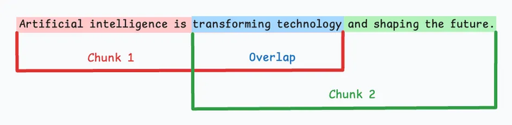
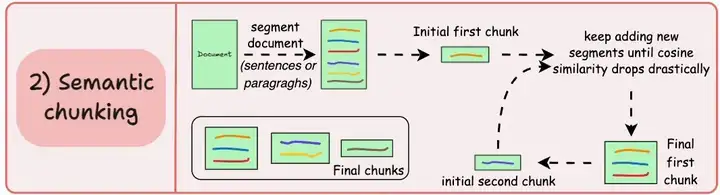
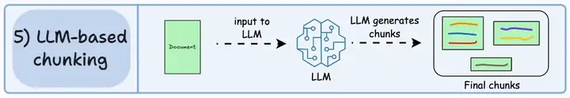

<span style="color:rgb(15, 17, 21);">在向量检索时，文本分块就像是把一本厚书拆成一张张可以独立检索的书页。做好这一步，能将系统准确率从60%提升到94%，关键在于采用合适的分块策略和技术。对于模型来说，文本一定要分块：</span>

1. **<span style="color:rgb(15, 17, 21);">模型能力限制</span>**<span style="color:rgb(15, 17, 21);">：向量嵌入模型和LLM都有严格的输入长度限制，一次能处理的文本量非常有限。</span>
2. **<span style="color:rgb(15, 17, 21);">提升检索精度</span>**<span style="color:rgb(15, 17, 21);">：将长文档切块后，检索系统能更精准地定位到最相关的片段，而非返回整个文档。</span>
3. **<span style="color:rgb(15, 17, 21);">保持语义独立</span>**<span style="color:rgb(15, 17, 21);">：长文档常包含多个主题，合理分块可以让每个块聚焦于一个核心思想，便于独立检索。</span>

## 主流分块策略
当下大模型中，主流在使用的文本分块只要分为以下四种，从简单到复杂依次为：固定大小分块、递归分块、语义分块、延迟分块。当然我们也可以基于LLM进行分块。

#### **<span style="color:rgb(15, 17, 21);">1. 固定大小分块 (Fixed-size Chunking) - 简单快速</span>**
<span style="color:rgb(15, 17, 21);">按固定字符或Token数机械分割，是最直观的方法。</span>

+ **<span style="color:rgb(15, 17, 21);">优点</span>**<span style="color:rgb(15, 17, 21);">：实现简单，处理速度快。</span>
+ **<span style="color:rgb(15, 17, 21);">缺点</span>**<span style="color:rgb(15, 17, 21);">：极易切断句子和概念，破坏语义完整性。</span>
+ **<span style="color:rgb(15, 17, 21);">适用场景</span>**<span style="color:rgb(15, 17, 21);">：内容高度标准化（如日志文件）或快速原型验证的基准（baseline）。</span>
+ **<span style="color:rgb(15, 17, 21);">技术实现</span>**<span style="color:rgb(15, 17, 21);">：</span><span style="color:rgb(15, 17, 21);">LangChain</span><span style="color:rgb(15, 17, 21);">的</span><span style="color:rgb(15, 17, 21);">CharacterTextSplitter</span><span style="color:rgb(15, 17, 21);">。</span>



#### **<span style="color:rgb(15, 17, 21);">2. 递归分块 (Recursive Chunking) - 兼顾结构</span>**
<span style="color:rgb(15, 17, 21);">通过一组优先级分隔符（段落、句子等）由粗到细地分割文本。</span>

+ **<span style="color:rgb(15, 17, 21);">优点</span>**<span style="color:rgb(15, 17, 21);">：尽量保留自然语义边界，在结构控制上更智能。</span>
+ **<span style="color:rgb(15, 17, 21);">缺点</span>**<span style="color:rgb(15, 17, 21);">：块大小可能存在差异。</span>
+ **<span style="color:rgb(15, 17, 21);">适用场景</span>**<span style="color:rgb(15, 17, 21);">：</span>**<span style="color:rgb(15, 17, 21);">绝大多数通用RAG项目的最佳起点</span>**<span style="color:rgb(15, 17, 21);">。在2026年多项基准测试中，它在端到端准确率上均表现最佳。</span>
+ **<span style="color:rgb(15, 17, 21);">核心技术</span>**<span style="color:rgb(15, 17, 21);">：</span><span style="color:rgb(15, 17, 21);">LangChain</span><span style="color:rgb(15, 17, 21);">的</span><span style="color:rgb(15, 17, 21);">RecursiveCharacterTextSplitter</span><span style="color:rgb(15, 17, 21);">。</span>

#### **<span style="color:rgb(15, 17, 21);">3. 语义分块 (Semantic Chunking) - 话题感知</span>**
<span style="color:rgb(15, 17, 21);">利用模型识别句子的语义，当相邻句子相似度低于阈值时（即话题转换），便在此处切分。</span>



+ **<span style="color:rgb(15, 17, 21);">优点</span>**<span style="color:rgb(15, 17, 21);">：分块边界精准，能确保语义完整。</span>
+ **<span style="color:rgb(15, 17, 21);">缺点</span>**<span style="color:rgb(15, 17, 21);">：计算成本高，且对阈值敏感。分块大小可能差异极大，小片段会让LLM“断章取义”。</span>
+ **<span style="color:rgb(15, 17, 21);">适用场景</span>**<span style="color:rgb(15, 17, 21);">：对检索</span>**<span style="color:rgb(15, 17, 21);">召回率</span>**<span style="color:rgb(15, 17, 21);">要求极高的场景（如专业法律、医疗文档检索）。建议配合重排序模型或元数据过滤弥补其可能丢失上下文的短板。</span>
+ **核心技术：**`LangChain`的实验性`SemanticChunker`、`Chonkie`库。

```python
# 基于SBERT的语义边界检测
from sentence_transformers import SentenceTransformer
model = SentenceTransformer('paraphrase-MiniLM-L6-v2')

def semantic_chunking(sentences, threshold=0.85):
    chunks = []
    current_chunk = [sentences[0]]

    for i in range(1, len(sentences)):
        emb1 = model.encode(current_chunk[-1])
        emb2 = model.encode(sentences[i])
        sim = cosine_similarity(emb1, emb2)

        if sim > threshold:
            current_chunk.append(sentences[i])
        else:
            chunks.append(" ".join(current_chunk))
            current_chunk = [sentences[i]]

    return chunks
```

##### <span style="color:rgb(15, 17, 21);">SentenceTransformer </span>
**<span style="color:rgb(15, 17, 21);">目前最主流、最实用的句子嵌入开源方案之一，</span>**<span style="color:rgb(15, 17, 21);">一个专门用来将</span>**<span style="color:rgb(15, 17, 21);">句子和段落转换成固定长度向量</span>**<span style="color:rgb(15, 17, 21);">（嵌入向量）的 Python 框架。它的核心特点是：经过专门训练，能让</span>**<span style="color:rgb(15, 17, 21);">语义相似的句子在向量空间中距离很近</span>**<span style="color:rgb(15, 17, 21);">，可直接用余弦相似度进行比较，非常适合做语义搜索、聚类等任务。</span>

###### <span style="color:rgb(15, 17, 21);">大致原理</span>
1. **<span style="color:rgb(15, 17, 21);">基础模型</span>**<span style="color:rgb(15, 17, 21);">：底层是一个 Transformer 编码器（例如</span><span style="color:rgb(15, 17, 21);"> </span>`bert-base-nli-mean-tokens`<span style="color:rgb(15, 17, 21);">）。</span>
2. **<span style="color:rgb(15, 17, 21);">池化策略</span>**<span style="color:rgb(15, 17, 21);">：将输入句子送入模型后，对最后一层所有 token 的输出进行</span>**<span style="color:rgb(15, 17, 21);">平均池化</span>**<span style="color:rgb(15, 17, 21);">（默认），得到一个固定大小的向量（例如 768 维）。这个向量就是句子嵌入。</span>
3. **<span style="color:rgb(15, 17, 21);">训练目标</span>**<span style="color:rgb(15, 17, 21);">：训练时使用孪生网络结构，输入一对句子（比如一个正例一个负例），优化目标让相似句子的向量距离更近，不相似句子的距离更远。常用损失函数有：</span>
    - **<span style="color:rgb(15, 17, 21);">分类损失</span>**<span style="color:rgb(15, 17, 21);">（Softmax Loss）</span>
    - **<span style="color:rgb(15, 17, 21);">三元组损失</span>**<span style="color:rgb(15, 17, 21);">（Triplet Loss）</span>
    - **<span style="color:rgb(15, 17, 21);">余弦相似度损失</span>**<span style="color:rgb(15, 17, 21);">（Cosine Similarity Loss）等</span>

<span style="color:rgb(15, 17, 21);">最终模型就能把任意长度的文本，压缩成一个能反映语义的稠密向量。</span>

###### <span style="color:rgb(15, 17, 21);">预训练模型</span>
<span style="color:rgb(15, 17, 21);">SentenceTransformer 生态内拥有超过</span>**<span style="color:rgb(15, 17, 21);">14,000个</span>**<span style="color:rgb(15, 17, 21);">预训练模型，覆盖了从通用到特定领域的各种需求。</span>`all-MiniLM-L6-v2`<span style="color:rgb(15, 17, 21);"> 和 </span>`paraphrase-MiniLM-L6-v2`<span style="color:rgb(15, 17, 21);"> 是 SentenceTransformer 模型家族中的两款明星产品。</span>

| <span style="color:rgb(15, 17, 21);">模型系列/名称</span> | <span style="color:rgb(15, 17, 21);">核心特点与适用场景</span> | <span style="color:rgb(15, 17, 21);">维度</span> | <span style="color:rgb(15, 17, 21);">速度/性能侧重</span> |
| --- | --- | --- | --- |
| **`<all-MiniLM-L6-v2`** | **<span style="color:rgb(15, 17, 21);">通用、轻量、极速</span>**<span style="color:rgb(15, 17, 21);">。非常适合有实时性要求、资源受限的通用句子编码场景。</span> | <span style="color:rgb(15, 17, 21);">384</span> | **<span style="color:rgb(15, 17, 21);">速度极快</span>**<span style="color:rgb(15, 17, 21);">，存储和内存占用小</span> |
| **`all-mpnet-base-v2`** | **<span style="color:rgb(15, 17, 21);">通用、高精度</span>**<span style="color:rgb(15, 17, 21);">。追求最佳质量，适用于对准确性要求高的通用任务。</span> | <span style="color:rgb(15, 17, 21);">768</span> | <span style="color:rgb(15, 17, 21);">速度约为前者一半，但</span>**<span style="color:rgb(15, 17, 21);">质量最佳</span>** |
| **`all-distilroberta-v1`** | **<span style="color:rgb(15, 17, 21);">通用、均衡</span>**<span style="color:rgb(15, 17, 21);">。在性能和效率间取得平衡，是另一款优秀的通用模型。</span> | <span style="color:rgb(15, 17, 21);">768</span> | <span style="color:rgb(15, 17, 21);">性能与速度均衡</span> |
| **`all-MiniLM-L12-v2`** | **<span style="color:rgb(15, 17, 21);">通用、轻量、高质量</span>**<span style="color:rgb(15, 17, 21);">。L6的</span>**<span style="color:rgb(15, 17, 21);">12层版</span>**<span style="color:rgb(15, 17, 21);">，质量更高，但速度稍慢。</span> | <span style="color:rgb(15, 17, 21);">384</span> | <span style="color:rgb(15, 17, 21);">质量优于L6，速度稍慢</span> |
| **`paraphrase-`**<br/>**<span style="color:rgb(15, 17, 21);"> </span><span style="color:rgb(15, 17, 21);">系列</span>** | **<span style="color:rgb(15, 17, 21);">语义相似度专家</span>**<span style="color:rgb(15, 17, 21);">。专门为语义文本相似度（STS）任务微调，适合释义检测、文本聚类。</span> | <span style="color:rgb(15, 17, 21);">384-768</span> | <span style="color:rgb(15, 17, 21);">在语义相似度任务上</span>**<span style="color:rgb(15, 17, 21);">表现极佳</span>** |
| **`multi-qa-`**<br/>**<span style="color:rgb(15, 17, 21);"> </span><span style="color:rgb(15, 17, 21);">系列</span>** | **<span style="color:rgb(15, 17, 21);">语义搜索专家</span>**<span style="color:rgb(15, 17, 21);">。专为非对称语义搜索（短查询 vs. 长文档）优化，如搭建本地知识库。</span> | <span style="color:rgb(15, 17, 21);">768</span> | <span style="color:rgb(15, 17, 21);">搜索场景下</span>**<span style="color:rgb(15, 17, 21);">相关性高</span>** |
| **`paraphrase-multilingual-`**<br/>**<span style="color:rgb(15, 17, 21);"> </span><span style="color:rgb(15, 17, 21);">系列</span>** | **<span style="color:rgb(15, 17, 21);">多语言通才</span>**<span style="color:rgb(15, 17, 21);">。支持50+种语言，适合跨语言应用或中文场景。</span> | <span style="color:rgb(15, 17, 21);">768</span> | <span style="color:rgb(15, 17, 21);">多语言场景的</span>**<span style="color:rgb(15, 17, 21);">首选模型</span>** |
| **<span style="color:rgb(15, 17, 21);">其他专业模型</span>** | **<span style="color:rgb(15, 17, 21);">领域专家</span>**<span style="color:rgb(15, 17, 21);">。如用于论文推荐的</span>`specter`<span style="color:rgb(15, 17, 21);">，或用于</span>**<span style="color:rgb(15, 17, 21);">文本-图像检索的CLIP系列</span>**<span style="color:rgb(15, 17, 21);">等多模态模型。</span> | <span style="color:rgb(15, 17, 21);">多样</span> | <span style="color:rgb(15, 17, 21);">在特定领域任务上</span>**<span style="color:rgb(15, 17, 21);">表现突出</span>** |


+ **<span style="color:rgb(15, 17, 21);">通用场景，追求速度</span>**<span style="color:rgb(15, 17, 21);">：首选 </span>`all-MiniLM-L6-v2`<span style="color:rgb(15, 17, 21);">。</span>
+ **<span style="color:rgb(15, 17, 21);">通用场景，追求精度</span>**<span style="color:rgb(15, 17, 21);">：首选 </span>`all-mpnet-base-v2`<span style="color:rgb(15, 17, 21);">。</span>
+ **<span style="color:rgb(15, 17, 21);">处理语义相似度/聚类</span>**<span style="color:rgb(15, 17, 21);">：可选 </span>`paraphrase-MiniLM-L6-v2`<span style="color:rgb(15, 17, 21);"> 或其他 </span>`paraphrase-`<span style="color:rgb(15, 17, 21);"> 系列模型。</span>
+ **<span style="color:rgb(15, 17, 21);">构建跨语言应用</span>**<span style="color:rgb(15, 17, 21);">：可选 </span>`paraphrase-multilingual-mpnet-base-v2`<span style="color:rgb(15, 17, 21);"> 或 </span>`distiluse-base-multilingual-cased`<span style="color:rgb(15, 17, 21);">。</span>

#### **<span style="color:rgb(15, 17, 21);">4. 延迟分块 (Late Chunking) - 保留全局视角</span>**
**<span style="color:rgb(15, 17, 21);">先为整个文档生成向量，再进行分块</span>**<span style="color:rgb(15, 17, 21);">，让每个小块都“继承”了全局信息，而非只依赖局部语义。</span>

+ **<span style="color:rgb(15, 17, 21);">优点</span>**<span style="color:rgb(15, 17, 21);">：极大提升检索的上下文完整性。</span>
+ **<span style="color:rgb(15, 17, 21);">缺点</span>**<span style="color:rgb(15, 17, 21);">：对嵌入模型有特殊要求，兼容性受限。</span>
+ **<span style="color:rgb(15, 17, 21);">适用场景</span>**<span style="color:rgb(15, 17, 21);">：处理逻辑关联强、需要宏观视角的长文档。</span>

#### **<span style="color:rgb(15, 17, 21);"></span>**<span style="color:rgb(24, 24, 24) !important;">LLM智能分块（LLM-based Chunking）</span>


<span style="color:rgb(15, 17, 21);">利用大语言模型（LLM）进行文本分块，本质上是用它的语义理解能力，自动识别出文本中逻辑完整、主题连贯的“天然段落边界”。相比固定长度或正则分块，LLM 分块更接近人的阅读习惯，在 RAG（检索增强生成）等场景中能有效提升检索与回答的准确性。</span>

<span style="color:rgb(15, 17, 21);">大致上可以分为三种策略：</span>

##### <span style="color:rgb(15, 17, 21);">1.提示工程直接切分：一次性输出分块结果</span>
<span style="color:rgb(15, 17, 21);">整个文本交给 LLM，通过提示词指令要求它在合适的位置插入分隔符，然后我们根据分隔符拆分。</span>

<span style="color:rgb(15, 17, 21);">提示词设计非常关键，需要明确分块粒度、输出格式，以下用 Few-shot 示例稳定格式。</span>

```python
import openai  //以openai为模型

def chunk_by_direct_split(text, model="gpt-4o-mini"):
    prompt = f"""你是一个专业的文本结构化助手。请将以下文本按照语义完整性切分成多个块。
每个块应是一个独立、连贯的信息单元。块与块之间用 <CHUNK_SEP> 分隔。
不要添加任何解释，只输出分块后的文本。

示例：
输入：人工智能发展迅速。它已经应用于医疗、金融等领域。未来，AI将改变我们的生活。我们需要关注伦理问题。
输出：人工智能发展迅速。它已经应用于医疗、金融等领域。<CHUNK_SEP>未来，AI将改变我们的生活。我们需要关注伦理问题。

现在请切分以下文本：
{text}
"""
    response = openai.chat.completions.create(
        model=model,
        messages=[{"role": "user", "content": prompt}],
        temperature=0
    )
    result = response.choices[0].message.content
    # 根据分隔符切分并清理空白
    chunks = [chunk.strip() for chunk in result.split("<CHUNK_SEP>") if chunk.strip()]
    return chunks

long_text = "..."  # 你的长文本
chunks = chunk_by_direct_split(long_text)
```

**<span style="color:rgb(15, 17, 21);">提示词优化技巧：</span>**

+ <span style="color:rgb(15, 17, 21);">指定“每个块大约包含 2-3 个句子”或“保持块的大小在 200-500 字”。</span>
+ <span style="color:rgb(15, 17, 21);">要求 LLM “确保块之间的信息不重叠，且块内逻辑闭合”。</span>
+ <span style="color:rgb(15, 17, 21);">使用结构化输出（如 function calling 返回 JSON 数组）会更稳定。</span>

##### <span style="color:rgb(15, 17, 21);">2.边界检测式分块：用 LLM 判断“是否应该在此处断开”</span>
<span style="color:rgb(15, 17, 21);">这种方式更精细：将文本按句切分，搭建一个滑动窗口，逐个询问 LLM “当前句子是否应该开启一个新的块”。可以实现准线性顺序处理，适合</span>**<span style="color:rgb(15, 17, 21);">超长文本</span>**<span style="color:rgb(15, 17, 21);">。</span>

```python
import re
from openai import OpenAI

client = OpenAI()

def should_split(sent1, sent2, model="gpt-4o-mini"):
    prompt = f"""判断以下两个句子是否应该被划分到不同的文本块中。
一个文本块内的句子应围绕同一微观主题。如果句子之间话题转变、逻辑转折或引入全新信息，则应分在不同块。
只回答 YES 或 NO。

句子1: {sent1}
句子2: {sent2}
回答:"""
    resp = client.chat.completions.create(
        model=model,
        messages=[{"role": "user", "content": prompt}],
        temperature=0
    )
    return resp.choices[0].message.content.strip().upper() == "YES"

def llm_boundary_chunk(text, model="gpt-4o-mini"):
    sentences = re.split(r'(?<=[。！？.!?])\s*', text)  # 适配中英文标点
    sentences = [s.strip() for s in sentences if s.strip()]
    chunks = []
    current_chunk = [sentences[0]]

    for i in range(1, len(sentences)):
        if should_split(sentences[i-1], sentences[i], model):
            chunks.append(" ".join(current_chunk))
            current_chunk = [sentences[i]]
        else:
            current_chunk.append(sentences[i])
    chunks.append(" ".join(current_chunk))
    return chunks
```

+ <span style="color:rgb(15, 17, 21);">优点：粒度可控，边界判断清晰，可解释性强。</span>
+ <span style="color:rgb(15, 17, 21);">缺点：API 调用次数多（约等于句子数），成本高、速度慢。可通过缓存相邻句对的判断结果、并行批处理或先用嵌入粗筛边界（相似度极低处直接断）来优化。</span>

##### <span style="color:rgb(15, 17, 21);">3.命题化分块（Proposition Chunking）</span>
<span style="color:rgb(15, 17, 21);">这是更高级的策略：先用 LLM 把篇章重写为原子事实列表（Propositions），每条命题只含一个独立事实，再通过聚类或模型将相关命题合并成块。这样得到的块信息密度极高，没有冗余和指代歧义。</span>  
<span style="color:rgb(15, 17, 21);">该方法在 Dense X Retrieval 等研究中被证明能显著提升 RAG 效果。</span>

<span style="color:rgb(15, 17, 21);">流程如下：</span>

###### <span style="color:rgb(15, 17, 21);">a.原子命题提取</span>
<span style="color:rgb(15, 17, 21);">用 LLM 将每一段原始文本拆解成 JSON 格式的命题列表。提示词需要强制模型进行</span>**<span style="color:rgb(15, 17, 21);">指代消解</span>**<span style="color:rgb(15, 17, 21);">和</span>**<span style="color:rgb(15, 17, 21);">缩写展开</span>**<span style="color:rgb(15, 17, 21);">，确保每个命题脱离上下文也能看懂。</span>

```python
def extract_propositions(text_chunk, model="gpt-4o-mini"):
    prompt = f"""将以下文本分解为一组原子事实命题。要求：
1. 每个命题是一个简洁、独立的陈述句。
2. 必须解析所有代词、省略和缩写，使命题脱离原文仍完整无歧义。
3. 排除纯修辞、问候语或没有任何事实信息的句子。
4. 以 JSON 数组格式返回，键名为 "propositions"。

示例：
输入："OpenAI 于 2015 年成立，总部位于旧金山。2022 年底他们发布了 ChatGPT，引发全球关注。"
输出：{{"propositions": [
  "OpenAI 于 2015 年成立。",
  "OpenAI 总部位于旧金山。",
  "OpenAI 在 2022 年底发布了 ChatGPT。",
  "ChatGPT 的发布引发了全球关注。"
]}}

输入文本：
{text_chunk}

JSON 输出："""
    response = client.chat.completions.create(
        model=model,
        messages=[{"role": "user", "content": prompt}],
        temperature=0,
        response_format={"type": "json_object"}
    )
    import json
    return json.loads(response.choices[0].message.content)["propositions"]
```

###### <span style="color:rgb(15, 17, 21);">b.命题精炼与去重</span>
<span style="color:rgb(15, 17, 21);">当文档很长时，不同段落可能产生语义几乎相同的命题。你可以通过计算所有命题的嵌入向量，利用余弦相似度去除高重叠项（例如相似度 >0.95 的命题只保留一个）。也可以再用一次轻量级 LLM 调用对列表做去重，但嵌入计算更经济。</span>

###### <span style="color:rgb(15, 17, 21);">c.命题聚类成块（重组合）</span>
<span style="color:rgb(15, 17, 21);">这一步是真正意义上的“命题化分块”。单独一个命题太小，不适合直接作为上下文喂给生成模型。我们需要将语义相近的命题聚合成块，同时控制块的大小（通常 300～500 词）。</span>

**<span style="color:rgb(15, 17, 21);">推荐方案：基于嵌入的层次聚类</span>**

```python
from sklearn.cluster import AgglomerativeClustering
import numpy as np

def cluster_propositions(propositions, embeddings, similarity_threshold=0.7, max_chunk_size=500):
    # 计算相似度矩阵
    cos_sim = cosine_similarity(embeddings)

    # 用层次聚类，距离阈值为 1 - 相似度阈值
    clustering = AgglomerativeClustering(
        n_clusters=None,
        metric='precomputed',
        linkage='average',
        distance_threshold=1 - similarity_threshold
    )
    clusters = clustering.fit_predict(1 - cos_sim)

    # 将同一簇的命题拼接，若单簇过长则强制再拆
    chunks = []
    for cluster_id in np.unique(clusters):
        cluster_props = [p for i, p in enumerate(propositions) if clusters[i] == cluster_id]
        chunk_text = " ".join(cluster_props)
        # 简单的最大长度控制
        if len(chunk_text) > max_chunk_size:
            # 可递归切割或按句再断
            sub_chunks = [chunk_text[i:i+max_chunk_size] for i in range(0, len(chunk_text), max_chunk_size)]
            chunks.extend(sub_chunks)
        else:
            chunks.append(chunk_text)
    return chunks
```

<span style="color:rgb(15, 17, 21);">当然也可以用 LLM 来分组，比如将一批命题列表提交给 LLM，要求它按主题分组，但提示词需要精心设计，且成本较高。嵌入聚类是当前性价比最高的选择。</span>

###### <span style="color:rgb(15, 17, 21);">d.索引与检索</span>
<span style="color:rgb(15, 17, 21);">将这些重构后的命题块进行嵌入，存入向量数据库。检索时查询向量会直接和这些高纯度信息块进行匹配，返回与查询事实最相关的上下文。</span>

##### <span style="color:rgb(15, 17, 21);">4.现有框架中的实现与组合方法</span>
<span style="color:rgb(15, 17, 21);">目前主流 LLM 框架（LangChain、LlamaIndex）</span>**<span style="color:rgb(15, 17, 21);">内置的分块器大多仍基于嵌入相似度</span>**<span style="color:rgb(15, 17, 21);">（如</span><span style="color:rgb(15, 17, 21);"> </span>`SemanticChunker`<span style="color:rgb(15, 17, 21);">），但你可以非常方便地将 LLM 注入其中。例如：</span>

+ **<span style="color:rgb(15, 17, 21);">LangChain</span>****<span style="color:rgb(15, 17, 21);"> </span>****`SemanticChunker`**<span style="color:rgb(15, 17, 21);"> </span><span style="color:rgb(15, 17, 21);">本质靠计算相邻句的余弦相似度，按分位数确定断点。你可以修改其</span><span style="color:rgb(15, 17, 21);"> </span>`breakpoint_threshold_type`<span style="color:rgb(15, 17, 21);"> </span><span style="color:rgb(15, 17, 21);">或自定义</span><span style="color:rgb(15, 17, 21);"> </span>`sentence_split_fn`<span style="color:rgb(15, 17, 21);">，在里面调用 LLM 做更准确的语义分类。</span>
+ **<span style="color:rgb(15, 17, 21);">LlamaIndex</span>**<span style="color:rgb(15, 17, 21);"> </span><span style="color:rgb(15, 17, 21);">的</span><span style="color:rgb(15, 17, 21);"> </span>`SemanticSplitterNodeParser`<span style="color:rgb(15, 17, 21);"> </span><span style="color:rgb(15, 17, 21);">同样用嵌入划分，但它允许自定义</span><span style="color:rgb(15, 17, 21);"> </span>`split_functions`<span style="color:rgb(15, 17, 21);">，你可以传入一个调用 LLM 的函数来辅助决策。</span>

<span style="color:rgb(15, 17, 21);">一个更务实的组合策略是：</span>

1. **<span style="color:rgb(15, 17, 21);">先用快速嵌入模型粗分</span>**<span style="color:rgb(15, 17, 21);">，找出语义转折明显的候选断点（相似度骤降处）。</span>
2. **<span style="color:rgb(15, 17, 21);">再对置信度不高的边界调用 LLM</span>**<span style="color:rgb(15, 17, 21);"> 进行精细确认，既保证质量又控制成本。</span>

那么我们一般会在什么情况下使用LLM进行分块呢？

+ <span style="color:rgb(15, 17, 21);">文本逻辑复杂，充满转折、列举、对话，固定长度切分导致信息碎片化时。</span>
+ <span style="color:rgb(15, 17, 21);">对 RAG 质量要求极高，且愿意为离线处理花费推理成本。</span>
+ <span style="color:rgb(15, 17, 21);">多语言、代码/文本混合等传统方法难以处理的场景。</span>

需要注意的是：

+ **<span style="color:rgb(15, 17, 21);">成本与延迟</span>**<span style="color:rgb(15, 17, 21);">：LLM 分块比正则/嵌入慢</span>**<span style="color:rgb(15, 17, 21);">几十倍</span>**<span style="color:rgb(15, 17, 21);">，仅建议在索引构建的离线阶段使用。</span>
+ **<span style="color:rgb(15, 17, 21);">输出解析稳定性</span>**<span style="color:rgb(15, 17, 21);">：务必设置低温度，使用 JSON 模式，或编写重试/校验逻辑，避免 LLM 自由发挥。</span>
+ **<span style="color:rgb(15, 17, 21);">块大小仍要控制</span>**<span style="color:rgb(15, 17, 21);">：即使是语义分块，也要设置最大字符数，防止个别块过大影响检索和生成窗口。可在 LLM 提示中加入“每个块最多不超过 500 字”的约束，然后做二级检查。</span>
