<!--
 * @File: 
 * @Description: 
 * @Author: guyawei (1972065889@qq.com)
 * @Date: 2026-05-30 21:01:05
 * @LastEditTime: 2026-06-02 19:06:32
 * @LastEditors: guyawei (1972065889@qq.com)
 * @FilePath: \blog\docs\ai\search.md
-->
# RAG-检索增强生成Retrieve Augemented Generation
大模型基础模型是无法满足实际业务需求的，特别是公司业务：

- **<span style="color:rgb(25, 27, 31);">知识的局限性</span>**<span style="color:rgb(25, 27, 31);">：大模型自身的知识完全源于训练数据，而现有的主流大模型（deepseek、gpt、通义千问…）的训练集基本都是构建于网络公开的数据，对于一些实时性的、非公开的或私域的数据是没有。</span>
- **<span style="color:rgb(25, 27, 31);">幻觉问题</span>**<span style="color:rgb(25, 27, 31);">：所有的深度学习模型的底层原理都是基于数学概率，模型输出实质上是一系列数值运算，大模型也不例外，所以它经常会一本正经地胡说八道，尤其是在大模型自身不具备某一方面的知识或不擅长的任务场景。</span>
- **<span style="color:rgb(25, 27, 31);">数据安全性</span>**<span style="color:rgb(25, 27, 31);">：对于企业来说，数据安全至关重要，没有企业愿意承担数据泄露的风险，尤其是大公司，没有人将私域数据上传第三方平台进行训练会推理。这也导致完全依赖通用大模型自身能力的应用方案不得不在数据安全和效果方面进行取舍。</span>

```bash
RAG(检索增强生成) = 检索技术  LLM提示
```

<span style="color:rgb(25, 27, 31);">有3个最著名的基于 LLM 的管道和应用程序的开源库——</span>**<span style="color:rgb(25, 27, 31);">LangChain</span>**<span style="color:rgb(25, 27, 31);"> 和 </span>**<span style="color:rgb(25, 27, 31);">LlamaIndex</span>**<span style="color:rgb(25, 27, 31);">，</span>**<span style="color:rgb(25, 27, 31);">Dify</span>**<span style="color:rgb(25, 27, 31);">。</span>

### <span style="color:rgb(25, 27, 31);">RAG的实现过程</span>
如下图所示，这就是大概的工作流程。<span style="color:rgb(25, 27, 31);">主要思路就是利用LLM来生成多个查询，期望能够通过这些查询让问题的各个方面在</span>**<span style="color:rgb(25, 27, 31);">上下文中</span>**<span style="color:rgb(25, 27, 31);">显现出来。之后你可以使用生成的查询进行</span>**<span style="color:rgb(25, 27, 31);">向量搜索</span>**<span style="color:rgb(25, 27, 31);">，并且基于其在结果集中的显示方式来对内容进行重新排序。</span>

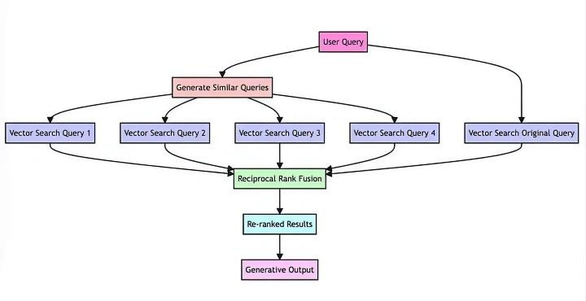


### <span style="color:rgb(25, 27, 31);">RAG架构</span>
<span style="color:rgb(25, 27, 31);">RAG的架构如图中所示，简单来讲，RAG就是通过</span>**<span style="color:rgb(25, 27, 31);">检索</span>**<span style="color:rgb(25, 27, 31);">获取相关的知识并将其融入</span>**<span style="color:rgb(25, 27, 31);">Prompt</span>**<span style="color:rgb(25, 27, 31);">，让大模型能够参考相应的知识从而给出合理回答。</span>

<span style="color:rgb(25, 27, 31);">因此，可以将RAG的核心理解为“</span>**<span style="color:rgb(25, 27, 31);">检索生成</span>**<span style="color:rgb(25, 27, 31);">”，前者主要是利用</span>**<span style="color:rgb(25, 27, 31);">向量数据库</span>**<span style="color:rgb(25, 27, 31);">的高效存储和检索能力，召回目标知识；后者则是利用大模型和Prompt工程，将召回的知识合理利用，生成目标答案。</span>

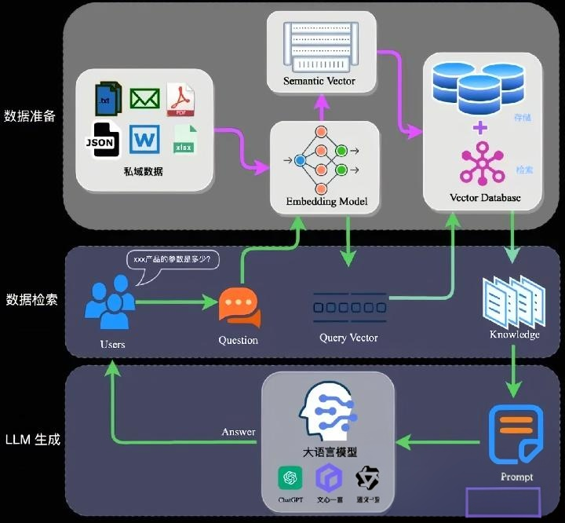

<span style="color:rgb(25, 27, 31);">完整的RAG应用流程主要包含两个阶段：</span>

- <span style="color:rgb(25, 27, 31);">数据准备阶段：数据提取——>文本分割——>向量化（</span>**<span style="color:rgb(25, 27, 31);">embedding</span>**<span style="color:rgb(25, 27, 31);">）——>数据入库</span>
- <span style="color:rgb(25, 27, 31);">应用阶段：用户提问——>数据检索（召回）——>注入</span>**<span style="color:rgb(25, 27, 31);">Prompt</span>**<span style="color:rgb(25, 27, 31);">——>LLM生成答案</span>

### **<span style="color:rgb(25, 27, 31);">数据准备阶段</span>**<span style="color:rgb(25, 27, 31);">：</span>
<span style="color:rgb(25, 27, 31);">数据准备一般是一个离线的过程，主要是将</span>**<span style="color:rgb(25, 27, 31);">私域数据向量化</span>**<span style="color:rgb(25, 27, 31);">后构建索引并存入数据库的过程。主要包括：数据提取、文本分割、向量化、数据入库等环节。</span>

<CropImage  src="../imgs/rag_d.png" :width="720" :title="数据准备" :crop="[0,0,1,1]" :id="u6123545d" :class="ne-image" />

- **<span style="color:rgb(25, 27, 31);">数据提取</span>**
    - <span style="color:rgb(25, 27, 31);">数据加载：包括多格式数据加载、不同数据源获取等，根据需要，将数据处理为同一个范式。</span>
    - <span style="color:rgb(25, 27, 31);">数据处理：包括数据过滤、压缩、格式化等。</span>
    - <span style="color:rgb(25, 27, 31);">元数据获取：提取数据中关键信息，例如文件名、Title、时间等 。</span>
- **<span style="color:rgb(25, 27, 31);">文本分割</span>**<span style="color:rgb(25, 27, 31);">：  </span>
    - <span style="color:rgb(25, 27, 31);">文本分割主要考虑两个因素：</span>
    - <span style="color:rgb(25, 27, 31);">embedding模型的Tokens限制情况</span>
    - <span style="color:rgb(25, 27, 31);">语义完整性对整体的检索效果的影响</span>

- **<span style="color:rgb(25, 27, 31);">一些常见的文本分割方式如下：</span>**
    - <span style="color:rgb(25, 27, 31);">句分割：以”句”的粒度进行切分，保留</span>**<span style="color:rgb(25, 27, 31);">一个句子的完整语义</span>**<span style="color:rgb(25, 27, 31);">。常见切分符包括：句号、感叹号、问号、换行符等。</span>
    - <span style="color:rgb(25, 27, 31);">固定长度分割：根据embedding模型的token长度限制，将文本分割为固定长度（如1024/512个tokens），这种切分方式会损失很多语义信息，一般通过在头尾增加一定</span>**<span style="color:rgb(25, 27, 31);">冗余量</span>**<span style="color:rgb(25, 27, 31);">来缓解。</span>
 
- **向量化（embedding）：**  
<span style="color:rgb(25, 27, 31);">向量化是一个将文本数据转化为向量矩阵的过程，该过程会直接影响到后续检索的效果。当然你可以自学怎么去向量化，这是一个十分耗时的过程。现成 的模型也有，常见的embedding模型如下表所示，这些embedding模型基本能满足</span>**<span style="color:rgb(25, 27, 31);">大部分需求</span>**<span style="color:rgb(25, 27, 31);">，但对于特殊场景（例如涉及一些罕见专有词或字等）或者想进一步优化效果，则可以选择开源Embedding模型微调或直接训练适合自己场景的Embedding模型。</span>

| <span style="color:rgb(25, 27, 31);background-color:rgb(235, 236, 237);">模型名称</span> | 描述 | <span style="color:rgb(25, 27, 31);">获取地址</span> |
| --- | --- | --- |
| <span style="color:rgb(25, 27, 31);">ChatGPT-Embedding</span> | <span style="color:rgb(25, 27, 31);">ChatGPT-Embedding由OpenAI公司提供，以接口形式调用。</span> | [platform.openai.com/doc](https://platform.openai.com/doc) |
| <span style="color:rgb(25, 27, 31);">ERNIE-Embedding V1</span> | <span style="color:rgb(25, 27, 31);">ERNIE-Embedding V1由百度公司提供，依赖于文心大模型能力，以接口形式调用。</span> | [cloud.baidu.com/doc/WEN](https://cloud.baidu.com/doc/WEN) |
| <span style="color:rgb(25, 27, 31);">M3E</span> | <span style="color:rgb(25, 27, 31);">M3E是一款功能强大的开源Embedding模型，包含m3e-small、m3e-base、m3e-large等多个版本，支持微调和本地部署。</span> | [huggingface.co/moka-ai/](https://huggingface.co/moka-ai/) |
| <span style="color:rgb(25, 27, 31);">BGE</span> | <span style="color:rgb(25, 27, 31);">BGE由北京智源人工智能研究院发布，同样是一款功能强大的开源Embedding模型，包含了支持中文和英文的多个版本，同样支持微调和本地部署</span> | [huggingface.co/BAAI/bge](https://huggingface.co/BAAI/bge) |


- **<span style="color:rgb(25, 27, 31);">数据入库</span>**<span style="color:rgb(25, 27, 31);">：</span>

<span style="color:rgb(25, 27, 31);">数据向量化后构建索引，并写入数据库的过程可以概述为数据入库过程。适用于RAG场景的数据库包括：FAISS、Chromadb、ES、milvus等。一般可以根据业务场景、硬件、性能需求等多因素综合考虑，选择合适的数据库。</span>

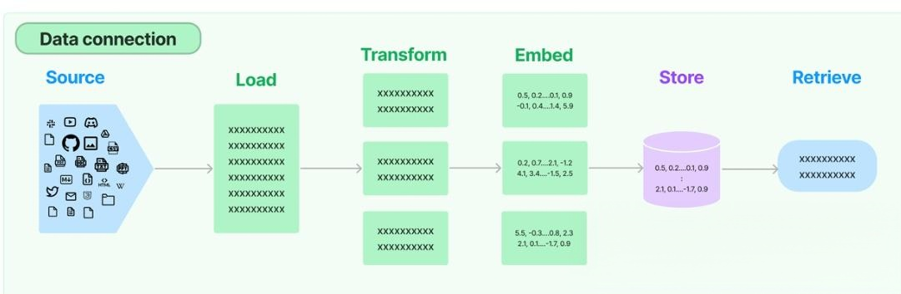

- **<span style="color:rgb(25, 27, 31);">应用阶段</span>**<span style="color:rgb(25, 27, 31);">：</span>

    &emsp;<span style="color:rgb(25, 27, 31);">在应用阶段，可以根据用户的提问，通过高效的检索方法，召回与提问最相关的知识，并融入Prompt。大模型参考当前提问和相关知识，生成相应的答案。关键环节包括：数据检索、注入Prompt等。</span>

    - **<span style="color:rgb(25, 27, 31);">数据检索</span>**<span style="color:rgb(25, 27, 31);">：</span>

        &emsp;<span style="color:rgb(25, 27, 31);">常见的数据检索方法包括：相似性检索、全文检索等，根据检索效果，一般可以选择多种检索方式融合，提升召回率。</span>

        - <span style="color:rgb(25, 27, 31);">相似性检索：即计算查询向量与所有存储向量的相似性得分，返回得分高的记录。常见的相似性计算方法包括：余弦相似性、欧氏距离、曼哈顿距离等。</span>
        - <span style="color:rgb(25, 27, 31);">全文检索：全文检索是一种比较经典的检索方式，在数据存入时，通过关键词构建倒排索引；在检索时，通过关键词进行全文检索，找到对应的记录。</span>
    - **<span style="color:rgb(25, 27, 31);">注入Prompt</span>**

&emsp;<span style="color:rgb(25, 27, 31);">Prompt作为大模型的直接输入，是影响模型输出准确率的关键因素之一。在RAG场景中，Prompt一般包括任务描述、背景知识（检索得到）、任务指令（一般是用户提问）等，根据任务场景和大模型性能，也可以在Prompt中适当加入其他指令优化大模型的输出。Prompt的设计只有方法、没有语法，比较依赖于个人经验，在实际应用过程中，往往需要根据大模型的实际输出进行针对性的Prompt调优。</span>

## 数据检索
数据检索一般有三种方式：元数据过滤、关键词、语义

### 元数据检索
<span style="color:rgb(15, 17, 21);">使用刚性条件，根据标题、作者、创建日期、访问权限等元数据来缩小文档范围。不能单独使用。</span>

优点

- <span style="color:rgb(15, 17, 21);">易于理解和调试</span>
- <span style="color:rgb(15, 17, 21);">快速、优化成熟、稳定可靠</span>
- **<span style="color:rgb(15, 17, 21);">强制执行严格的检索规则，精确匹配过滤条件（只有这个搜索可以办到）</span>**

缺点：

- <span style="color:rgb(15, 17, 21);">并非真正的搜索</span>
- <span style="color:rgb(15, 17, 21);">僵化、忽略内容，且无法进行排序</span>

### 关键词搜索
在讲关键词搜索之前，我们得先了解关键词搜索是怎么去选着搜索到的文档的，这就需要了解BM25评分制度，至于为什么叫 这个名字，完全是因为它是第25个研发团队提出的评分函数变体。系统会根据算法的评分来筛选出符合分数的结果list。

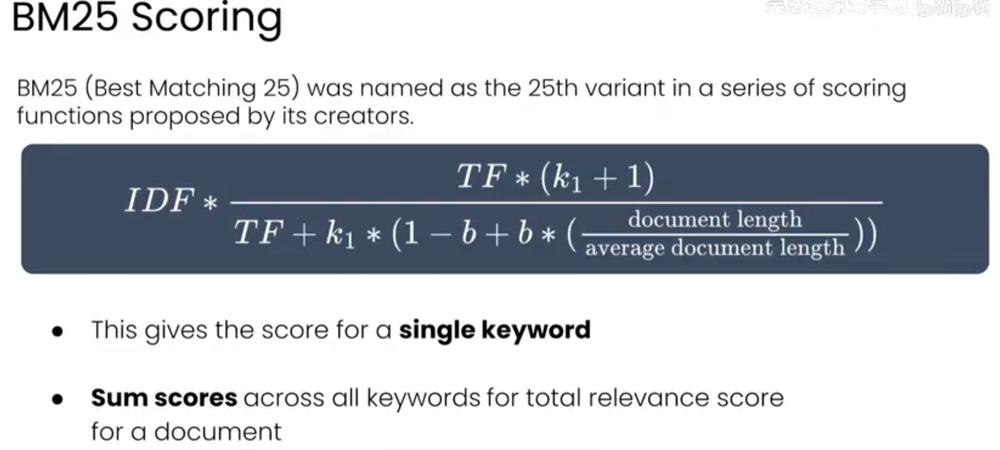

它和TF-IDF很像并且做了更改，它是用来计算相关度分数的，它的工作方式：

- 给出单个关键词的评分
- 将所有关键词的得分求和，得到文档总相关性得分，从而对整个文档进行排名

BM25引入了两个超参数，k和b：

#### <span style="color:rgb(15, 17, 21);">k1 - 词频饱和</span>
- **<span style="color:rgb(15, 17, 21);">控制</span>**<span style="color:rgb(15, 17, 21);">：词频对得分的影响程度</span>
- **<span style="color:rgb(15, 17, 21);">范围</span>**<span style="color:rgb(15, 17, 21);">：通常在 1.2 到 2.0 之间</span>
- **<span style="color:rgb(15, 17, 21);">效果</span>**<span style="color:rgb(15, 17, 21);">：值越高，词频的影响越大；值越低，影响越小</span>

#### <span style="color:rgb(15, 17, 21);">b - 长度归一化</span>
- **<span style="color:rgb(15, 17, 21);">控制</span>**<span style="color:rgb(15, 17, 21);">：文档长度的归一化程度</span>
- **<span style="color:rgb(15, 17, 21);">范围</span>**<span style="color:rgb(15, 17, 21);">：介于 0（无归一化）和 1（完全归一化）之间</span>
- **<span style="color:rgb(15, 17, 21);">效果</span>**<span style="color:rgb(15, 17, 21);">：平衡对短文档与长文档的偏好</span>

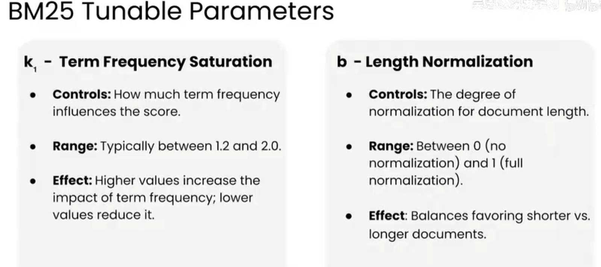

### 语义搜索
将文档与查询内容根据语义关联进行匹配，并且能识别出关键词搜索无法捕捉的语义差异。

语义搜索相对于关键词搜索来说，相同点：

* <span style="color:rgb(15, 17, 21);">查询文本和文档各自被分配一个向量</span>
* <span style="color:rgb(15, 17, 21);">通过比较向量来生成分数</span>

主要区别在于向量的分配方式：

- **<span style="color:rgb(15, 17, 21);">关键词搜索</span>**<span style="color:rgb(15, 17, 21);">：统计词频</span>
- **<span style="color:rgb(15, 17, 21);">语义搜索</span>**<span style="color:rgb(15, 17, 21);">：使用嵌入模型（通过将文档或查询输入到特殊的数学模型（嵌入模型）中来生成向量）</span>

&emsp;<span style="color:rgb(15, 17, 21);">嵌入模型会将词元映射到空间中的某个位置。这个位置由一个</span>**<span style="color:rgb(15, 17, 21);">向量</span>**<span style="color:rgb(15, 17, 21);">来表示。它会将语义相似的词映射到空间中相互接近的位置，这个空间不单单是二维平面，在大模型中一般都是上千个维度，这使得每个元素的嵌入位置十分灵活。当然，不仅仅是单词可以作为嵌入，语句、文档都可以作为嵌入的类型，都会生成向量。</span>

&emsp;<span style="color:rgb(15, 17, 21);">我们在计算向量间的距离时，会用到欧几里得距离：通过一个向量到另一个向量间画一条直线，这就是两个向量之间的最短距离。计算这个距离的公式本质上是毕大哥斯拉斯定理。那么在多维空间，无法使用上述定理来进行计算，需要使用</span>**<span style="color:rgb(15, 17, 21);">余弦相似度</span>**<span style="color:rgb(15, 17, 21);"> 来衡量向量之间的距离。</span>

**<span style="color:rgb(15, 17, 21);">余弦相似度：</span>**<span style="color:rgb(15, 17, 21);">衡量的是两个向量指向方向的相似程度，不考虑它们在空间中的实际距离远近。余弦相似度的值范围是从1（向量方向完全一致）到-1（向量方向完全相反）。</span>

**<span style="color:rgb(15, 17, 21);">点积：</span>**<span style="color:rgb(15, 17, 21);">测量一个向量在另一个向量方向上的投影长度。如果两个向量互相垂直，那就会等于0</span>

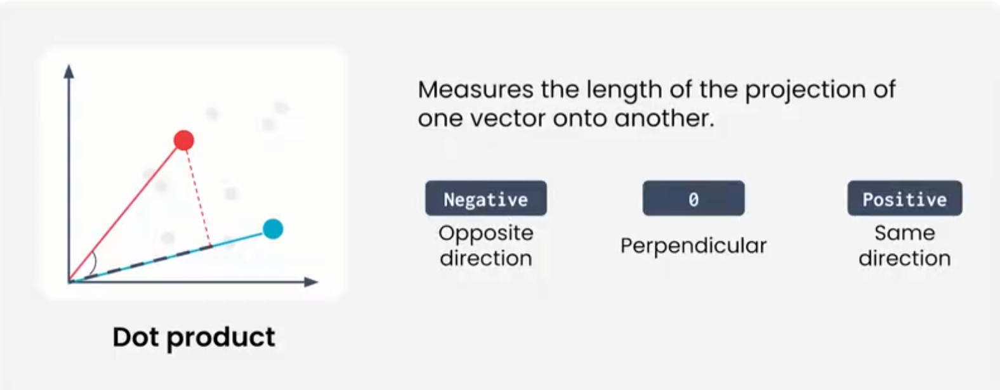

### <span style="color:rgb(15, 17, 21);">嵌入模型</span>
&emsp;嵌入模型需要正样本对和负样本对作为训练实例，一个模型基本上需要百万或者千万个样本对才能让模型更加合理，嵌入模型才能捕捉到更多文本之间的关联。

&emsp;在训练初期，嵌入模型会将每段文本映射为一个随机向量，与文本的内容毫无关联性。随着正负样本对的增多，嵌入模型会根据正负样本对之间的对比来评估自身性能，也就是对比训练。根据训练效果，模型会相应地更新内部参数。

#### <span style="color:rgb(15, 17, 21);">对比训练过程</span>
* <span style="color:rgb(15, 17, 21);">基于对正例对和负例对的评分来更新内部参数</span>
* <span style="color:rgb(15, 17, 21);">重复该过程：嵌入 → 用成对数据评分 → 更新参数</span>
* <span style="color:rgb(15, 17, 21);">迭代重复该过程，不断改进模型</span>

<span style="color:rgb(15, 17, 21);">嵌入模型小结：</span>

* <span style="color:rgb(15, 17, 21);">语义向量是抽象的，并且在一定程度上是随机的</span>
* <span style="color:rgb(15, 17, 21);">训练之前：空间中的位置没有任何含义</span>
* <span style="color:rgb(15, 17, 21);">训练之后：位置有了含义，因为相似文本的聚类已经形成</span>
* <span style="color:rgb(15, 17, 21);">只能比较来自同一个嵌入模型的向量</span>

## <span style="color:rgb(15, 17, 21);">混合搜索</span>
先来回顾一下三个搜索的优缺点：

* <span style="color:rgb(15, 17, 21);">元数据过滤</span>

    <span style="color:rgb(15, 17, 21);">使用存储在文档元数据中的刚性条件来缩小搜索结果范围</span><span style="color:rgb(15, 17, 21);"> </span>
    <span style="color:rgb(15, 17, 21);">快速、简单、是非判断型筛选，但不能单独使用</span>

* <span style="color:rgb(15, 17, 21);">关键词搜索</span>

    <span style="color:rgb(15, 17, 21);">根据文档是否包含与提示中相同的关键词进行评分</span><span style="color:rgb(15, 17, 21);"></span>
    <span style="color:rgb(15, 17, 21);">速度快，在关键词起关键作用时表现尤佳，但依赖精确匹配</span>

* <span style="color:rgb(15, 17, 21);">语义搜索</span>

    <span style="color:rgb(15, 17, 21);">根据文档与提示的含义相似程度进行评分和排序 </span>
    <span style="color:rgb(15, 17, 21);">速度较慢，计算成本高，但更灵活</span>

混合搜索的大致流程如下图：，文中只是用了hybird search作为例子

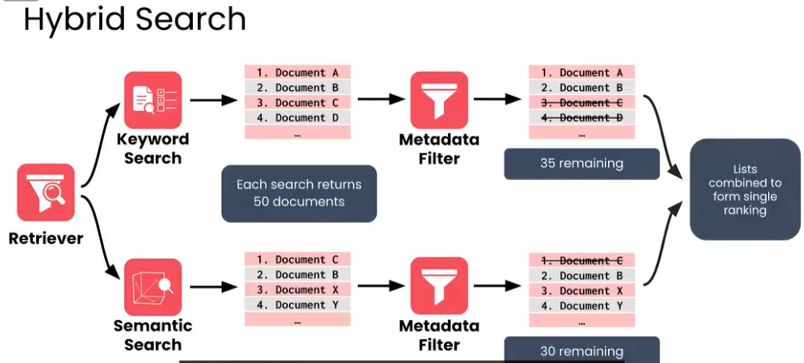

#### 逆序秩融合
* <span style="color:rgb(15, 17, 21);">奖励在每个排名列表中排名靠前的文档</span>
* <span style="color:rgb(15, 17, 21);">控制关键词搜索与语义搜索排名的权重</span>
* <span style="color:rgb(15, 17, 21);">得分等于排名的倒数（公式如下图，也就是RRF）  </span>
    <span style="color:rgb(15, 17, 21);">第1名 = 1 分，第2名 = 0.5 分，依此类推</span>
* <span style="color:rgb(15, 17, 21);">将所有排名列表中的总分相加，用于最终排序</span>

RRF，公式如下图：

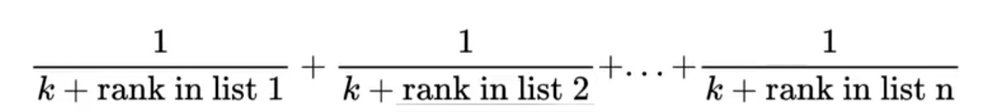

**参数K**

用于控制**排名最高**的文档的影响。

<span style="color:rgb(15, 17, 21);">当 k = 0 时 </span><br />
&emsp;&emsp;<span style="color:rgb(15, 17, 21);"> 排名第一的文档会跃居整体排名的首位  </span>
&emsp;&emsp;<span style="color:rgb(15, 17, 21);"> 第1名与第10名之间相差10倍</span>

<span style="color:rgb(15, 17, 21);">当 k = 50 时</span><br />
&emsp;&emsp;<span style="color:rgb(15, 17, 21);"> 单个高排名不会主导整体排名  </span>
&emsp;&emsp;<span style="color:rgb(15, 17, 21);"> 第1名与第10名之间相差1.2倍</span>

RRF只关注每个列表中的排名，并不关注导致这些排名的分数，这就需要用到另外一个超参数Bata，这个参数可以对语义搜索或关键词搜索产生的排名进行加权。

Beta参数的值一般在0.7会相对普遍。对于需要精确词语匹配的应用场景，但又希望有一定语义，你就会希望对关键词搜索结果赋予更大的权重；当语义搜索更加重要时，语义搜索的权重就会更大被赋予。

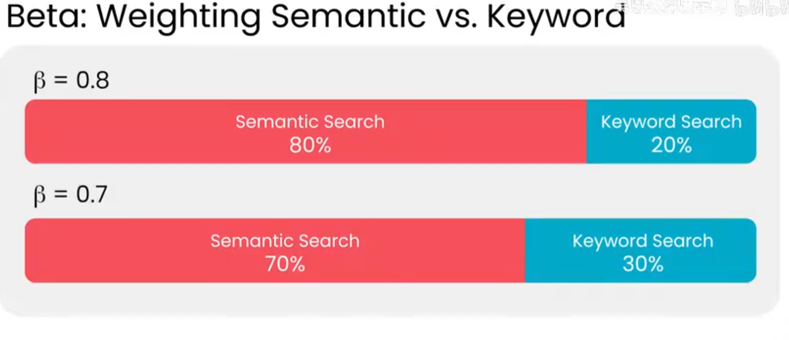

在上述配置之后，搜索返回的结果我们通常称之为“topK”也就是最有可能的结果列表。

## 检索质量评估
**评估一个检索是否合格**：

- 精确率：反映检索器返回无关文档的情况，相当于结果的可信度
- 召回率：反映了检索器是否遗漏了相关文档，也就是检索的覆盖率

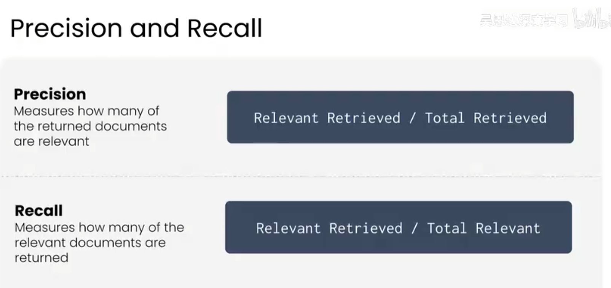

- **<span style="color:rgb(15, 17, 21);">平均精度均值</span>**

**<span style="color:rgb(15, 17, 21);">MAP@K</span>**<span style="color:rgb(15, 17, 21);"> 用于评估前 K 个文档中相关文档的平均精度。它基于一个名为“平均精度”的相关指标构建。这个值越高结果越好。</span>

<span style="color:rgb(15, 17, 21);">如图所示举例：</span>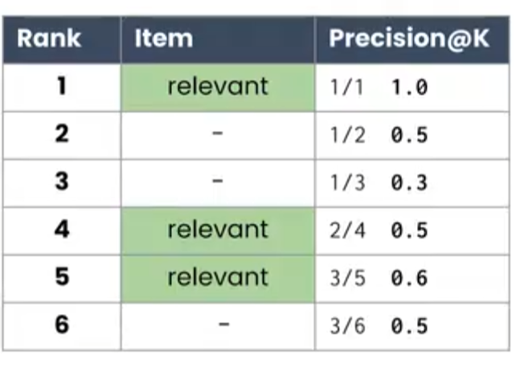

**<span style="color:rgb(15, 17, 21);">仅对相关文档的精度求和</span>**

&emsp;&emsp;<span style="color:rgb(15, 17, 21);">1</span><span style="color:rgb(15, 17, 21);"></span><span style="color:rgb(15, 17, 21);">0.5</span><span style="color:rgb(15, 17, 21);"></span><span style="color:rgb(15, 17, 21);">0.6</span><span style="color:rgb(15, 17, 21);">=</span><span style="color:rgb(15, 17, 21);">2.1</span><span style="color:rgb(15, 17, 21);">1</span><span style="color:rgb(15, 17, 21);"></span><span style="color:rgb(15, 17, 21);">0.5</span><span style="color:rgb(15, 17, 21);"></span><span style="color:rgb(15, 17, 21);">0.6</span><span style="color:rgb(15, 17, 21);">=</span><span style="color:rgb(15, 17, 21);">2.1</span>

**<span style="color:rgb(15, 17, 21);">除以相关文档的数量</span>**

&emsp;&emsp;<span style="color:rgb(15, 17, 21);">2.1</span><span style="color:rgb(15, 17, 21);">/</span><span style="color:rgb(15, 17, 21);">3</span><span style="color:rgb(15, 17, 21);">=</span><span style="color:rgb(15, 17, 21);">0.7</span><span style="color:rgb(15, 17, 21);">2.1/3</span><span style="color:rgb(15, 17, 21);">=</span><span style="color:rgb(15, 17, 21);">0.7</span>

<span style="color:rgb(15, 17, 21);">此计算结果即为</span>**<span style="color:rgb(15, 17, 21);">平均精度（AP）</span>**<span style="color:rgb(15, 17, 21);">；而对于平均精度均值（MAP），则需要计算多个提示词下 AP 值的平均值。</span>

- **<span style="color:rgb(15, 17, 21);">倒数排名（Reciprocal rank）</span>**

衡量第一个相关结果在返回结果中的排名位置。比如：

&emsp;&emsp;<span style="color:rgb(15, 17, 21);">第一个相关文档在排名第 1 时 → 1.0</span>  
&emsp;&emsp;<span style="color:rgb(15, 17, 21);">第一个相关文档在排名第 2 时 → 0.5</span>  
&emsp;&emsp;<span style="color:rgb(15, 17, 21);">第一个相关文档在排名第 4 时 → 0.25</span>

第一个相关结果的排名位置越靠后，倒数排名的值越小。通常情况下，我们会多个查询进行计算，得到平均的倒数排名，简称为MRR（Mean Reciprocal Rank）

#### <span style="color:rgb(15, 17, 21);">如何使用检索器评估指标</span>
**<span style="color:rgb(15, 17, 21);">召回率 或 recall@K</span>**

<span style="color:rgb(15, 17, 21);">最常被引用的指标，体现了查找相关文档这一基本目标</span>

**<span style="color:rgb(15, 17, 21);">精确率 与 MAP（平均精度均值）</span>**

<span style="color:rgb(15, 17, 21);">评估不相关文档以及排序效果</span>

**<span style="color:rgb(15, 17, 21);">平均倒数排名</span>**

<span style="color:rgb(15, 17, 21);">衡量模型在排序最顶部位置的表现</span>

##### <span style="color:rgb(15, 17, 21);">指标的作用：</span>
- <span style="color:rgb(15, 17, 21);">评估检索器的性能</span>
- <span style="color:rgb(15, 17, 21);">检查调整是否改善了结果</span>

<span style="color:rgb(15, 17, 21);">所有指标都依赖于拥有作为真实参照的相关文档</span>

  
 
