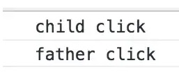
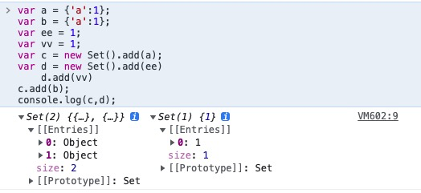
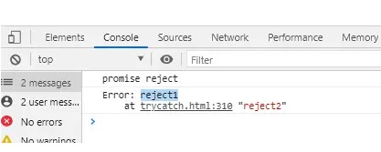
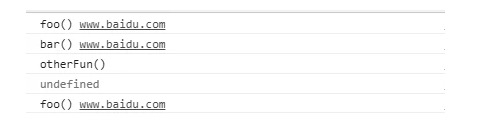
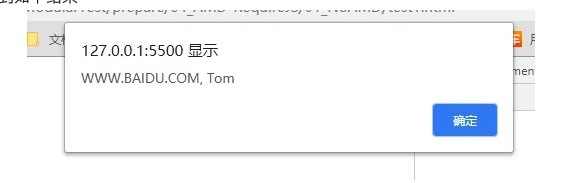
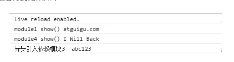
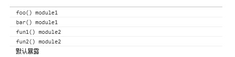

# 1.Javascript基本数据类型
<span style="color:rgb(56, 56, 56);">JavaScript共有八种数据类型，分为</span>

+ <span style="color:rgb(56, 56, 56);">原始数据类型：String、Number、Undefined、Null、Boolean；</span>
+ <span style="color:rgb(56, 56, 56);">引用数据类型：Object、Array、function</span>
+ <span style="color:rgb(56, 56, 56);">Symbol：创建后独一无二的不可变数据，为es6新增</span>
+ <span style="color:rgb(56, 56, 56);">BigInt：数字类型，可以存储超出number范围的数据，可以表示任意精度，为es6新增</span>

# 2.数据类型的校验方式
## typeof
```javascript
console.log(typeof 2);               // number
console.log(typeof true);            // boolean
console.log(typeof 'str');           // string
console.log(typeof []);              // object    
console.log(typeof function(){});    // function
console.log(typeof {});              // object
console.log(typeof undefined);       // undefined
console.log(typeof null);            // object
```

## instanceof
**<span style="color:rgb(168, 98, 234);background-color:rgb(248, 245, 255);">instanceof</span>**<span style="color:rgb(56, 56, 56);">可以正确判断对象的类型，</span>**<span style="color:rgb(56, 56, 56);">其内部运行机制是判断在其原型链中能否找到该类型的原型</span>**

**<span style="color:rgb(168, 98, 234);background-color:rgb(248, 245, 255);">instanceof</span>****<span style="color:rgb(56, 56, 56);">只能正确判断引用数据类型</span>**<span style="color:rgb(56, 56, 56);">，而不能判断基本数据类型</span>

**<span style="color:rgb(168, 98, 234);background-color:rgb(248, 245, 255);">instanceof</span>**<span style="color:rgb(56, 56, 56);"> 运算符可以用来测试一个对象在其原型链中是否存在一个构造函数的 </span>**<span style="color:rgb(168, 98, 234);background-color:rgb(248, 245, 255);">prototype</span>**<span style="color:rgb(56, 56, 56);"> 属性</span>

```javascript
console.log(2 instanceof Number);                    // false
console.log(true instanceof Boolean);                // false 
console.log('str' instanceof String);                // false 
 
console.log([] instanceof Array);                    // true
console.log(function(){} instanceof Function);       // true
console.log({} instanceof Object);                   // true
```

## <span style="color:rgb(56, 56, 56);">constructor</span>
**<span style="color:rgb(168, 98, 234);background-color:rgb(248, 245, 255);">constructor</span>**<span style="color:rgb(56, 56, 56);">有两个作用，一是判断数据的类型，二是对象实例通过 </span>**<span style="color:rgb(168, 98, 234);background-color:rgb(248, 245, 255);">constrcutor</span>**<span style="color:rgb(56, 56, 56);"> 对象访问它的构造函数。需要注意，如果创建一个对象来改变它的原型，</span>**<span style="color:rgb(168, 98, 234);background-color:rgb(248, 245, 255);">constructor</span>**<span style="color:rgb(56, 56, 56);">就不能用来判断数据类型</span>

```javascript
console.log((2).constructor === Number); // true
console.log((true).constructor === Boolean); // true
console.log(('str').constructor === String); // true
console.log(([]).constructor === Array); // true
console.log((function() {}).constructor === Function); // true
console.log(({}).constructor === Object); // true

function Fn(){};
 
Fn.prototype = new Array();
 
var f = new Fn();
 
console.log(f.constructor===Fn);    // false
console.log(f.constructor===Array); // true
```

## <span style="color:rgb(56, 56, 56);">Object.prototype.toString.call()</span>
**<span style="color:rgb(168, 98, 234);background-color:rgb(248, 245, 255);">Object.prototype.toString.call()</span>**<span style="color:rgb(56, 56, 56);"> 使用 Object 对象的原型方法 toString 来判断数据类型</span>

<span style="color:rgb(56, 56, 56);">toString是Object的原型方法，而Array、function等</span>**<span style="color:rgb(56, 56, 56);">类型作为Object的实例，都重写了toString方法</span>**<span style="color:rgb(56, 56, 56);">。不同的对象类型调用toString方法时，根据原型链的知识，调用的是对应的重写之后的toString方法</span>

```javascript
var a = Object.prototype.toString;
 
console.log(a.call(2));  //[object Number]
console.log(a.call(true));  //[object Boolean]
console.log(a.call('str'));  //[object String]
console.log(a.call([]));   //[object Array]
console.log(a.call(function(){}));  //[object Function]
console.log(a.call({}));    //[object Object]
console.log(a.call(undefined));    //[object Undefined]
console.log(a.call(null));    //[object Null]

```

# 3.null和undefined的区别
 null表示"没有对象"，即该处不应该有值。典型用法是：

（1） 作为函数的参数，表示该函数的参数不是对象。

（2） 作为对象原型链的终点。

undefined表示"缺少值"，就是此处应该有一个值，但是还没有定义。典型用法是：

（1）变量被声明了，但没有赋值时，就等于undefined。

（2）调用函数时，应该提供的参数没有提供，该参数等于undefined。

（3）对象没有赋值的属性，该属性的值为undefined。

（4）函数没有返回值时，默认返回undefined。

# **4.箭头函数和普通函数有什么区别**
1. <span style="color:rgb(51, 51, 51);">普通函数通过 function 关键字定义， this 无法结合词法作用域使用，在运行时绑定，只取决于函数的调用方式，在哪里被调用，调用位置。（取决于调用者，和是否独立运行）</span>
2. <span style="color:rgb(51, 51, 51);">箭头函数使用被称为 “胖箭头” 的操作 => 定义，箭头函数不应用普通函数 this 绑定的四种规则，而是根据外层（函数或全局）的作用域来决定 this，且箭头函数的绑定无法被修改（new 也不行）。</span>
    - <span style="color:rgb(51, 51, 51);">一个函数内部有两个方法：[[Call]] 和 [[Construct]]，在通过 new 进行函数调用时，会执行 [[construct]] 方法，创建一个实例对象，然后再执行这个函数体，将函数的 this 绑定在这个实例对象上</span>
    - <span style="color:rgb(51, 51, 51);">当直接调用时，执行 [[Call]] 方法，直接执行函数体</span>
    - <span style="color:rgb(51, 51, 51);">箭头函数没有 [[Construct]] 方法，不能被用作构造函数调用，当使用 new 进行函数调用时会报错。</span>
    - <span style="color:rgb(51, 51, 51);">箭头函数常用于回调函数中，包括事件处理器或定时器</span>
    - <span style="color:rgb(51, 51, 51);">箭头函数和 var self = this，都试图取代传统的 this 运行机制，将 this 的绑定拉回到词法作用域</span>
    - <span style="color:rgb(51, 51, 51);">没有原型、没有 this、没有 super，没有 arguments，没有 new.target</span>
    - <span style="color:rgb(51, 51, 51);">不能通过 new 关键字调用</span>

# 5.new 一个函数发生了什么
<span style="color:rgb(51, 51, 51);">构造调用：</span>

- <span style="color:rgb(51, 51, 51);">创造一个全新的对象</span>
- <span style="color:rgb(51, 51, 51);">这个对象会被执行 [[Prototype]] 连接，将这个新对象的 [[Prototype]] 链接到这个构造函数.prototype 所指向的对象</span>
- <span style="color:rgb(51, 51, 51);">这个新对象会绑定到函数调用的 this</span>
- <span style="color:rgb(51, 51, 51);">如果函数没有返回其他对象，那么 new 表达式中的函数调用会自动返回这个新对象</span>

**追问：** <span style="color:rgb(51, 51, 51);">new 一个构造函数，如果函数返回 return {} 、 return null ， return 1 ， return true 会发生什么情况?</span>

<span style="color:rgb(51, 51, 51);">如果函数返回一个对象，那么new 这个函数调用返回这个函数的返回对象，否则返回 new 创建的新对象</span>

# 6.了解 this 嘛，bind，call，apply 具体指什么
<span style="color:rgb(51, 51, 51);">它们都是函数的方法</span>

<span style="color:rgb(51, 51, 51);">call: Array.prototype.call(this, args1, args2)</span>

<span style="color:rgb(51, 51, 51);">apply: Array.prototype.apply(this, [args1, args2]) ：ES6 之前用来展开数组调用, foo.appy(null, [])，ES6 之后使用 ... 操作符</span>

- <span style="color:rgb(51, 51, 51);">New 绑定 > 显示绑定 > 隐式绑定 > 默认绑定</span>
- <span style="color:rgb(51, 51, 51);">如果需要使用 bind 的柯里化和 apply 的数组解构，绑定到 null，尽可能使用 Object.create(null) 创建一个 DMZ 对象</span>

<span style="color:rgb(51, 51, 51);">四条规则：</span>

- <span style="color:rgb(51, 51, 51);">默认绑定，没有其他修饰(bind、apply、call)，在非严格模式下定义指向全局对象，在严格模式下定义指向 undefined</span>

```javascript
function foo() {   
  console.log(this.a);  
}  
var a = 2;
foo(); //2
```

- <span style="color:rgb(51, 51, 51);">隐式绑定：调用位置是否有上下文对象，或者是否被某个对象拥有或者包含，那么隐式绑定规则会把函数调用中的 this 绑定到这个上下文对象。而且，对象属性链只有上一层或者说最后一层在调用位置中起作用</span>

```javascript
function foo() {   
  console.log(this.a);
}  
var obj = {   a: 2,   foo: foo, }  
obj.foo(); // 2 
```

- <span style="color:rgb(51, 51, 51);">显示绑定：通过在函数上运行 call 和 apply ，来显示的绑定 this</span>

```javascript
function foo() {   
console.log(this.a); 
}  
var obj = {   a: 2 };  
foo.call(obj); //2
```

<span style="color:rgb(51, 51, 51);">显示绑定之硬绑定</span>

```javascript
function foo(something) {   
  console.log(this.a, something);      
  return this.a + something; 
}  
function bind(fn, obj) {   
  return function() {     
    return fn.apply(obj, arguments);   
  }; 
}  
var obj = { a: 2 }  
var bar = bind(foo, obj); //undefined
```

<span style="color:rgb(51, 51, 51);">New 绑定，new 调用函数会创建一个全新的对象，并将这个对象绑定到函数调用的 this。</span>

- <span style="color:rgb(51, 51, 51);">New 绑定时，如果是 new 一个硬绑定函数，那么会用 new 新建的对象替换这个硬绑定 this</span>

# 7.this指向
```javascript
//列1
var o = {
    user:"追梦子",
    fn:function(){
        console.log(this.user); 
    }
}
window.o.fn(); // 输出结果为追梦子

//列2
var o = {
    a:10,
    b:{
        a:12,
        fn:function(){
            console.log(this.a); 
        }
    }
}
o.b.fn(); // 输出结果为12 

//列3
var o = { 
    a:10, 
    b:{ 
        fn:function(){ 
            console.log(this.a);
        } 
    } 
} 
o.b.fn();  // 输出结果为undefined

//列4
var o = { 
    a:10, 
    b:{ 
        a:12, 
        fn:function(){ 
            console.log(this.a); //undefined 
            console.log(this); //window 
        } 
    } 
} 
var j = o.b.fn; 
j();  // 输出结果为window
```

从上面1-3个例子可以看出： 

<span style="color:rgb(72, 72, 72);">1、如果一个函数中有this，但是它没有被上一级的对象所调用，那么this指向的就是window，这里需要说明的是在js的严格版中this指向的不是window，但是我们这里不探讨严格版的问题，你想了解可以自行上网查找。</span>

<span style="color:rgb(72, 72, 72);">2、如果一个函数中有this，这个函数有被上一级的对象所调用，那么this指向的就是上一级的对象。</span>

<span style="color:rgb(72, 72, 72);">3、如果一个函数中有this，</span>**<span style="color:rgb(72, 72, 72);">这个函数中包含多个对象，尽管这个函数是被最外层的对象所调用，this指向的也只是它上一级的对象，</span>**<span style="color:rgb(72, 72, 72);">例子3可以证明。</span>

<span style="color:#E8323C;">this永远指向的是最后调用它的对象</span><span style="color:rgb(255, 147, 0);">，也就是看它执行的时候是谁调用的，例子4中虽然函数fn是被对象b所引用，但是在将fn赋值给变量j的时候并没有执行所以最终指向的是window，这和例子3是不一样的，例子3是直接执行了fn。</span>

# 8.事件循环机制（Event Loop）
主线程从"任务队列"中读取事件，这个过程是循环不断的，所以整个的这种运行机制又称为Event Loop（事件循环）。

### 浏览器下的事件循环
- 任务进入执行栈中，判断是同步还是异步 
- 若是同步，直接进入主线程按照调用栈的顺序被执行 
- 若是异步，则进行一些处理，再将回调函数推入任务队列 
- 当主线程中的同步任务执行完成后，执行栈为空，开始读取任务队列 
- 任务队列中的任务依次进入执行栈被执行，直到任务队列为空

#### 对异步任务再次细分，可以分为<span style="color:rgb(51, 51, 51);">宏任务（macrotask）和微任务（microtask）</span>。
- <span style="color:rgb(51, 51, 51);">在异步任务回调函数进入任务队列前会对这个异步任务进行判断看他是宏任务还是微任务</span>
- <span style="color:rgb(51, 51, 51);">宏任务进入宏任务队列，微任务进入微任务队列</span>
- <span style="color:rgb(51, 51, 51);">在同步任务执行完成后，会先执行微任务队列的任务，直到微任务队列为空，再执行宏任务队列中的任务</span>
- <span style="color:rgb(51, 51, 51);">循环往复</span>

### nodejs的事件循环
（1）V8引擎解析JavaScript脚本。

（2）解析后的代码，调用Node API。

（3）libuv库负责Node API的执行。它将不同的任务分配给不同的线程，形成一个Event Loop（事件循环），以异步的方式将任务的执行结果返回给V8引擎。

（4）V8引擎再将结果返回给用户。

#### nodejs还需要注意的是<span style="color:#E8323C;background-color:#FFE8E6;">process.nextTick()</span>和<span style="color:#E8323C;background-color:#FFE8E6;">setImmediate()</span>
<span style="color:rgb(51, 51, 51);">任何时候在给定的阶段中调用</span><span style="color:#E8323C;background-color:#FFE8E6;"> process.nextTick()</span><span style="color:rgb(51, 51, 51);">，所有传递到 </span><span style="color:#E8323C;background-color:#FFE8E6;">process.nextTick()</span><span style="color:rgb(51, 51, 51);"> 的回调将在事件循环继续之前解析。这可能会造成一些糟糕的情况，因为</span>**<span style="color:rgb(51, 51, 51);">它允许通过递归</span>****<span style="color:#E8323C;background-color:#FFE8E6;"> process.nextTick()</span>****<span style="color:rgb(51, 51, 51);">调用来“饿死”您的 I/O</span>**<span style="color:rgb(51, 51, 51);">，阻止事件循环到达 </span>**<span style="color:rgb(51, 51, 51);">轮询</span>**<span style="color:rgb(51, 51, 51);"> 阶段。</span>

<span style="color:rgb(51, 51, 51);">为什么要使用？有两个主要原因：</span>

1. <span style="color:rgb(51, 51, 51);">允许用户处理错误，清理任何不需要的资源，或者在事件循环继续之前重试请求。</span>
2. <span style="color:rgb(51, 51, 51);">有时有让回调在栈展开后，但在事件循环继续之前运行的必要。</span>

<span style="color:#E8323C;background-color:#FFE8E6;">setImmediate()</span><span style="color:rgb(51, 51, 51);"> 在事件循环的接下来的迭代或 'tick' 上触发。</span>

# 9.var、let和const的区别
<span style="color:#E8323C;background-color:#FFE8E6;">var</span> 声明变量，作用域全局。 会发生变量提升，值为<span style="color:#E8323C;background-color:#FFE8E6;">undefined</span>

<span style="color:#E8323C;background-color:#FFE8E6;">let</span> 声明变量，作用域块内。不会提升，声明后可用，否则抛<span style="color:#E8323C;background-color:#FFE8E6;">ReferenceError</span>

<span style="color:#E8323C;background-color:#FFE8E6;">const</span> 声明只读常量，作用域块内。声明后不赋值或改值均会报错，<span style="color:#E8323C;background-color:#FFE8E6;">SyntaxError/TypeError</span>。不会提升，声明后可用

# 10.JSX事件机制
<span style="color:rgb(64, 64, 64);">React的事件系统主要分为3个步骤：</span>

+ <span style="color:rgb(64, 64, 64);">事件绑定：ReactBrowserEventEmitter的trapBubbledEvent等方法为节点或文档绑定事件；</span>
+ <span style="color:rgb(64, 64, 64);">事件监听：ReactEventListener.dispatchEvent将把该回调函数分发给事件对象的_dispatchListener属性；调用ReactBrowserEventEmitter.ReactEventListener方法以监听节点事件。</span>
+ <span style="color:rgb(64, 64, 64);">事件分发与触发：对触发的事件进行分发，并创建合成事件对象，在回调中用构建合成事件对象并执行合成事件对的象绑定回调。</span>

## 事件执行机制
### 大致流程
1. 进入统一的事件分发函数(<span style="color:#E8323C;background-color:#FFE8E6;">dispatchEvent</span>)
2. 结合原生事件找到当前节点对应的<span style="color:#E8323C;background-color:#FFE8E6;">ReactDOMComponent</span>对象
3. 开始<span style="color:#E8323C;background-color:#FFE8E6;">事件的合成</span>
    1. 根据当前事件类型生成指定的合成对象
    2. 封装原生事件和冒泡机制
    3. 查找当前元素以及他所有父级
    4. 在<span style="color:#E8323C;background-color:#FFE8E6;">listenerBank</span>查找事件回调并合成到 <span style="color:#E8323C;background-color:#FFE8E6;">event</span>(合成事件结束)
4. 批量处理合成事件内的回调事件（事件触发完成 end）

```javascript
handleFatherClick=(e)=>{
    console.log('father click');
}

handleChildClick=(e)=>{
    console.log('child click');
}

render(){
    return (
      <div className="box">
          <div className="father" onClick={this.handleFatherClick}> father
              <div className="child" onClick={this.handleChildClick}>child </div>
          </div>
     </div>
  )
}


```

<span style="color:rgb(51, 51, 51);">当我点击 child div 的时候，会同时触发father的事件。会输出如下内容：</span>



(需要更详细的解析，请看事件详解文章，或者[https://cloud.tencent.com/developer/article/1516369](https://cloud.tencent.com/developer/article/1516369))

# 11.Set和Map
## 11.1Set
<span style="color:rgb(232, 62, 140);background-color:rgb(246, 246, 246);">Set </span><span style="color:rgb(85, 85, 85);">对象允许你存储任何类型的值，无论是原始值或者是对象引用。它类似于数组，但是成员的值都是唯一的，没有重复的值。</span>

<span style="color:rgb(232, 62, 140);background-color:rgb(246, 246, 246);">Set </span><span style="color:rgb(85, 85, 85);">本身是一个构造函数，用来生成</span><span style="color:rgb(232, 62, 140);background-color:rgb(246, 246, 246);">Set </span><span style="color:rgb(85, 85, 85);"> 数据结构。</span><span style="color:rgb(232, 62, 140);background-color:rgb(246, 246, 246);">Set </span><span style="color:rgb(85, 85, 85);">函数可以接受一个数组（或者具有 </span><span style="color:rgb(232, 62, 140);background-color:rgb(246, 246, 246);">Iterable </span><span style="color:rgb(85, 85, 85);">  接口的其他数据结构）作为参数，用来初始化。</span>

#### <span style="color:rgb(85, 85, 85);">特殊值</span>
+ <span style="color:rgb(85, 85, 85);">+0 与 -0 在存储判断唯一性的时候是恒等的，所以不重复</span>
+ <span style="color:rgb(85, 85, 85);">undefined 与 undefined 是恒等的，所以不重复</span>
+ <span style="color:rgb(85, 85, 85);">NaN 与 NaN 是不恒等的，但是在 Set 中认为NaN与NaN相等，所有只能存在一个，不重复。</span>
+ <span style="color:rgb(85, 85, 85);">两个相同的object，使用set不会覆盖</span>



#### 对象属性
+ <span style="color:rgb(85, 85, 85);">size：返回Set实例的成员总数。</span>

#### <span style="color:rgb(85, 85, 85);">实例方法</span>
+ <span style="color:rgb(85, 85, 85);">add(value)：添加某个值，返回 Set 结构本身(可以链式调用)</span>
+ <span style="color:rgb(85, 85, 85);">delete(value)：删除某个值，删除成功返回true，否则返回false。</span>
+ <span style="color:rgb(85, 85, 85);">has(value)：返回一个布尔值，表示该值是否为Set的成员。</span>
+ <span style="color:rgb(85, 85, 85);">clear()：清除所有成员，没有返回值。</span>

```javascript
const mySet = new Set(['a', 'a', 'b', 1, 2, 1])
console.log(mySet)  // {'a', 'b', 1, 2}
myset.add('c').add({'a': 1})
console.log(mySet) // {'a', 'b', 1, 2, 'c', {a: 1}}
console.log(mySet.size) // 6

mySet.has(2) // true
```

#### 遍历方法
+ <span style="color:rgb(85, 85, 85);">keys()：返回键名的遍历器。</span>
+ <span style="color:rgb(85, 85, 85);">values()：返回键值的遍历器。</span>
+ <span style="color:rgb(85, 85, 85);">entries()：返回键值对的遍历器。</span>
+ <span style="color:rgb(85, 85, 85);">forEach()：使用回调函数遍历每个成员。</span>

<span style="color:rgb(85, 85, 85);">由于Set结构没有键名，只有键值（或者说键名和键值是同一个值），所以keys方法和values方法的行为完全一致。</span>

```javascript
const set = new Set(['a', 'b', 'c'])

for (let item of set.keys()) {
  console.log(item)
}
// a
// b
// c

for (let item of set.values()) {
  console.log(item)
}
// a
// b
// c

for (let item of set.entries()) {
  console.log(item)
}
// ["a", "a"]
// ["b", "b"]
// ["c", "c"]

// 直接遍历set实例，等同于遍历set实例的values方法
for (let i of set) {
  console.log(i)
}
// a
// b
// c

set.forEach((value, key) => console.log(key + ' : ' + value))

// a: a
// b: b
// c: c
```

#### 使用场景
+ <span style="color:rgb(85, 85, 85);">数组去重(利用扩展运算符)</span>

```javascript
const mySet = new Set([1, 2, 3, 4, 4])
[...mySet] // [1, 2, 3, 4]
```

+ <span style="color:rgb(85, 85, 85);">合并两个set对象</span>

```javascript
let a = new Set([1, 2, 3])
let b = new Set([4, 3, 2])
let union = new Set([...a, ...b]) // {1, 2, 3, 4}
```

+ <span style="color:rgb(85, 85, 85);">交集</span>

```javascript
let a = new Set([1, 2, 3])
let b = new Set([4, 3, 2])
let intersect = new Set([...a].filter(x => b.has(x)))  // {2, 3} 利用数组的filter方法
```

+ <span style="color:rgb(85, 85, 85);">差集</span>

```javascript
let a = new Set([1, 2, 3])
let b = new Set([4, 3, 2])
let difference = new Set([...a].filter(x => !b.has(x))) //  {1} 
```

## 11.2Map
<span style="color:rgb(232, 62, 140);background-color:rgb(246, 246, 246);">Map </span><span style="color:rgb(0, 0, 0);">对象保存键值对。任何值(对象或者原始值) 都可以作为一个键或一个值。构造函数</span><span style="color:rgb(232, 62, 140);background-color:rgb(246, 246, 246);">Map</span><span style="color:rgb(0, 0, 0);">可以接受一个数组作为参数。</span>

#### Map和Object的区别
+ <span style="color:rgb(0, 0, 0);">一个</span><span style="color:rgb(232, 62, 140);background-color:rgb(246, 246, 246);">Object</span><span style="color:rgb(0, 0, 0);"> 的键只能是字符串或者 </span><span style="color:rgb(232, 62, 140);background-color:rgb(246, 246, 246);">Symbols</span><span style="color:rgb(0, 0, 0);">，但一个</span><span style="color:rgb(232, 62, 140);background-color:rgb(246, 246, 246);">Map</span><span style="color:rgb(0, 0, 0);"> 的键可以是任意值。</span>
+ <span style="color:rgb(232, 62, 140);background-color:rgb(246, 246, 246);">Map</span><span style="color:rgb(0, 0, 0);">中的键值是有序的（FIFO 原则），而添加到对象中的键则不是。</span>
+ <span style="color:rgb(232, 62, 140);background-color:rgb(246, 246, 246);">Map</span><span style="color:rgb(0, 0, 0);">的键值对个数可以从 size 属性获取，而 </span><span style="color:rgb(232, 62, 140);background-color:rgb(246, 246, 246);">Object</span><span style="color:rgb(0, 0, 0);"> 的键值对个数只能手动计算。</span>
+ <span style="color:rgb(232, 62, 140);background-color:rgb(246, 246, 246);">Object</span><span style="color:rgb(0, 0, 0);"> 都有自己的原型，原型链上的键名有可能和你自己在对象上的设置的键名产生冲突。</span>

#### 对象属性
+ <span style="color:rgb(85, 85, 85);">size：返回Map对象中所包含的键值对个数</span>

#### 对象方法
+ <span style="color:rgb(85, 85, 85);">set(key, val): 向Map中添加新元素</span>
+ <span style="color:rgb(85, 85, 85);">get(key): 通过键值查找特定的数值并返回</span>
+ <span style="color:rgb(85, 85, 85);">has(key): 判断Map对象中是否有Key所对应的值，有返回true,否则返回false</span>
+ <span style="color:rgb(85, 85, 85);">delete(key): 通过键值从Map中移除对应的数据</span>
+ <span style="color:rgb(85, 85, 85);">clear(): 将这个Map中的所有元素删除</span>

```javascript
const m1 = new Map([['a', 111], ['b', 222]])
console.log(m1) // {"a" => 111, "b" => 222}
m1.get('a')  // 111

const m2 = new Map([['c', 3]])
const m3 = new Map(m2)
m3.get('c') // 3
m3.has('c') // true
m3.set('d', 555)
m3.get('d') // 555
```

#### 遍历方法
+ <span style="color:rgb(85, 85, 85);">keys()</span><span style="color:rgb(85, 85, 85);">：返回键名的遍历器</span>
+ <span style="color:rgb(85, 85, 85);">values()</span><span style="color:rgb(85, 85, 85);">：返回键值的遍历器</span>
+ <span style="color:rgb(85, 85, 85);">entries()</span><span style="color:rgb(85, 85, 85);">：返回键值对的遍历器</span>
+ <span style="color:rgb(85, 85, 85);">forEach()：使用回调函数遍历每个成员</span>

```javascript
const map = new Map([['a', 1], ['b',  2]])

for (let key of map.keys()) {
  console.log(key)
}
// "a"
// "b"

for (let value of map.values()) {
  console.log(value)
}
// 1
// 2

for (let item of map.entries()) {
  console.log(item)
}
// ["a", 1]
// ["b", 2]

// 或者
for (let [key, value] of map.entries()) {
  console.log(key, value)
}
// "a" 1
// "b" 2

// for...of...遍历map等同于使用map.entries()

for (let [key, value] of map) {
  console.log(key, value)
}
// "a" 1
// "b" 2
```

#### map转换其他数据类型
+ <span style="color:rgb(85, 85, 85);">map转换为数组（使用扩展运算符）</span>

```javascript
const arr = [[{'a': 1}, 111], ['b': 222]]

const myMap = new Map(arr)

[...myMap] // map转数组。 [[{'a': 1}, 111], ['b': 222]]

```

+ <span style="color:rgb(85, 85, 85);">Map与对象的互换</span>

```javascript
const obj = {}
const map = new Map(['a', 111], ['b', 222])
for(let [key,value] of map) {
  obj[key] = value
}
console.log(obj) // {a:111, b: 222}
```

+ <span style="color:rgb(85, 85, 85);">JSON字符串要转换成Map可以先利用JSON.parse()转换成数组或者对象，然后再转换即可。</span>

# 12.trycatch
1. <span style="color:#E8323C;background-color:#FFE8E6;">try catch</span>不能捕获异步代码,所以不能捕获<span style="color:#E8323C;background-color:#FFECE0;">promise.reject()</span>的错误,并且<span style="color:#E8323C;background-color:#FFE8E6;">promise</span>期约故意将异步行为封装起来，从而隔离外部的同步代码
2. <span style="color:#E8323C;background-color:#FFE8E6;">try catch</span> 能对<span style="color:#E8323C;background-color:#FFE8E6;">promise</span>的<span style="color:#E8323C;background-color:#FFE8E6;">reject()</span>落定状态的结果进行捕获
3. <span style="color:#E8323C;background-color:#FFE8E6;">try catch</span>能捕捉到的异常，必须是`<span style="color:#E8323C;background-color:#FFE8E6;">主线程执行</span>`已经进入 <span style="color:#E8323C;background-color:#FFE8E6;">try catch</span>, 但 <span style="color:#E8323C;background-color:#FFE8E6;">try catch </span>尚未执行完的时候抛出来的,意思是如果将执行<span style="color:#E8323C;background-color:#FFE8E6;">try catch</span>分为前中后，只有中才能捕获到异常
4. <span style="color:#E8323C;background-color:#FFE8E6;">try catch</span>应该只在确切知道接下来该做什么的时候捕获错误

## 面试常见之trycatch与promise
### promise的异常
<span style="color:rgb(255, 80, 44);background-color:rgb(255, 245, 245);">如果不设置回调函数，Promise内部抛出的错误，不会反应到外部。</span>

#### <span style="color:rgb(51, 51, 51);">Promise.prototype.then()捕获-- reject回调函数</span>
特点：

1. 无法捕获resolve()回调中出现的异常，需要无限链式调用then回调去捕获异常
2. 无法中断后续的then操作

```javascript
const createPromise = new Promise((resolve, reject) => {
  setTimeout(() => {
    reject('promise')
  }, 1000)
})
createPromise.then(res => {
  console.log(res, 'resolved');
}, res => {
  console.log(res, 'reject');
  throw new Error('reject1')
}).then(null, res=> {
  console.log(res, 'reject2');
})
```



#### <span style="color:rgb(51, 51, 51);">Promise.prototype.catch()捕获异常</span>
特点：

1. 因为promise对象的错误具有“冒泡”性质，会一直向后传递，直到被捕获为止。也就是说，错误总是会被下一个catch语句捕获，catch()返回的是一个promise对象，因此catch后面还可以接着调用then()方法，除非finally

<span style="color:rgb(51, 51, 51);">记住一点:  </span><span style="color:rgb(255, 80, 44);background-color:rgb(255, 245, 245);">Promise.prototype.catch()</span><span style="color:rgb(51, 51, 51);"> 方法用于给期约添加拒绝处理程序, 这个方法只接收一个参数：onRejected 处理程序。事实上，这个方法就是一个语法糖，调用它就相当于调用</span><span style="color:rgb(255, 80, 44);background-color:rgb(255, 245, 245);">Promise.prototype.then(null, onRejected)</span>

```javascript
let p = Promise.reject();
let onRejected = function(e) {
  setTimeout(console.log, 0, 'rejected');
};
// 这两种添加拒绝处理程序的方式是一样的：
p.then(null, onRejected); // rejected
p.catch(onRejected); // rejected
```

#### <span style="color:rgb(51, 51, 51);">async/ await结合try...catch使用</span>
1. 什么是<span style="color:#CF1322;background-color:#FFE8E6;">async</span>函数
    - <span style="color:#CF1322;background-color:#FFE8E6;">async</span>函数完全可以看作多个异步操作，包装成的一个<span style="color:#CF1322;background-color:#FFE8E6;">promise</span>对象，而<span style="color:#CF1322;background-color:#FFE8E6;">await</span>命令就是内部<span style="color:#CF1322;background-color:#FFE8E6;">then</span>命令的语法糖
    - <span style="color:#CF1322;background-color:#FFE8E6;">async</span>函数返回一个<span style="color:#CF1322;background-color:#FFE8E6;">promise</span>对象，可以使用<span style="color:#CF1322;background-color:#FFE8E6;">then</span>方法添加回调函数。当函数执行的时候，一旦遇到<span style="color:#CF1322;background-color:#FFE8E6;">await</span>就会先返回，等到异步操作完成，再接着执行函数体内后面的语句。
2. 什么是<span style="color:#CF1322;background-color:#FFE8E6;">await</span>
    - <span style="color:#CF1322;background-color:#FFE8E6;">await</span>只能在异步函数<span style="color:#CF1322;background-color:#FFE8E6;">async function</span>中使用
    - <span style="color:#CF1322;background-color:#FFE8E6;">await</span>表达式会暂停当前<span style="color:#CF1322;background-color:#FFE8E6;">async function</span>的执行， 等待<span style="color:#CF1322;background-color:#FFE8E6;">promise</span>处理完成。若<span style="color:#CF1322;background-color:#FFE8E6;">promise</span>正常处理（<span style="color:#CF1322;background-color:#FFE8E6;">fulfilled</span>），其回调的<span style="color:#CF1322;background-color:#FFE8E6;">resolve</span>函数参数作为<span style="color:#CF1322;background-color:#FFE8E6;">await</span>表达式的值，继续执行<span style="color:#CF1322;background-color:#FFE8E6;">async function</span>。
    - 若<span style="color:#CF1322;background-color:#FFE8E6;">promise</span>处理异常（<span style="color:#CF1322;background-color:#FFE8E6;">rejected</span>）。<span style="color:#CF1322;background-color:#FFE8E6;">await</span>表达式会把<span style="color:#CF1322;background-color:#FFE8E6;">promise</span>的异常抛出。
    - <span style="color:#CF1322;background-color:#FFE8E6;">await</span>如果返回的是<span style="color:#CF1322;background-color:#FFE8E6;">reject</span>状态的<span style="color:#CF1322;background-color:#FFE8E6;">promise</span>，如果不被捕获抛出，就会中断<span style="color:#CF1322;background-color:#FFE8E6;">async</span>函数的执行
    - 如果<span style="color:#CF1322;background-color:#FFE8E6;">await</span>操作符后的表达式的值不是一个<span style="color:#CF1322;background-color:#FFE8E6;">promise</span>，则返回该值本省
    - <span style="color:#CF1322;background-color:#FFE8E6;">async await</span>函数中，通常使用<span style="color:#CF1322;background-color:#FFE8E6;">try/catch</span>来捕获错误。

```javascript
const createPromise = new Promise((resove, reject) => {
  setTimeout(() => {
    throw new Error('我是个错误,但是我并不想落定状态,没有reject()')
  }, 1000)
});
async function awaitTest() {
  try {
    console.log('测试1')
    const res = await createPromise // 调用的时候内部已经中止了,也不是settled的状态,所以没法去返回结果,那就更不可能进行到赋值给res的操作了
    console.log(res, '测试2')
  } catch(e) {
    console.log(e, 'await调用报错咯!');
  } 
  console.log('可以让我执行一下吗?');
};
awaitTest();
```

# 13.Javascript模块化（AMD、CMD、CommonJs、UMD）
## 为什么需要模块化
1. <span style="color:rgb(33, 37, 41);">命名问题：所有文件的方法都挂载到</span><span style="color:rgb(214, 51, 132);">window/global</span><span style="color:rgb(33, 37, 41);">上，会污染全局环境，并且需要考虑命名冲突问题</span>
2. <span style="color:rgb(33, 37, 41);">依赖问题：</span><span style="color:rgb(214, 51, 132);">script</span><span style="color:rgb(33, 37, 41);">是顺序加载的，如果各个文件文件有依赖，就得考虑</span><span style="color:rgb(214, 51, 132);">js</span><span style="color:rgb(33, 37, 41);">文件的加载顺序</span>
3. <span style="color:rgb(33, 37, 41);">网络问题：如果</span><span style="color:rgb(214, 51, 132);">js</span><span style="color:rgb(33, 37, 41);">文件过多，所需请求次数就会增多，增加加载时间</span>

## 什么是模块化
+ 将一个复杂的程序依据一定的规则（规范）封装成几个块（文件），并进行组合在一起
+ 块的内部数据与实现是私有的，只是向外部暴露一些接口（方法）与外部其他模块通信

## 模块化的进化
### 全局function模式：将不同的功能封装成不同的全局函数
+ 编码：将不同的功能封装成不同的全局函数
+ 问题：污染全局命名空间，容易引起命名冲突或数据不安全，而且模块成员之间看不出直接关系

```javascript
//module1.js

/**
 * 全局函数模式: 将不同的功能封装成不同的全局函数
 * 问题: Global被污染了, 很容易引起命名冲突
 */
//数据
let data = 'atguigu.com';
function foo() {
    console.log('foo()')
};
function bar() {
    console.log('bar()')
};

//module2.js
   
let data2 = 'other data';

function foo() {  //与另一个模块中的函数冲突了
  console.log(`foo() ${data2}`)
};

//test.html

<!DOCTYPE html>
<html lang="en">
<head>
  <meta charset="UTF-8">
  <title>01_全局function模式</title>
</head>
<body>
<script type="text/javascript" src="module1.js"></script>
<script type="text/javascript" src="module2.js"></script>
<script type="text/javascript">

  foo();
  bar();
</script>
</body>
</html>
```

### namespace模式：简单对象封装
+ 作用：减少了全局变量，解决命名冲突
+ 问题：数据不安全（外部可以直接修改模块内部的数据）

```javascript
/**
 * namespace模式: 简单对象封装
 * 作用: 减少了全局变量
 * 问题: 不安全(数据不是私有的, 外部可以直接修改)
 */

//module1.js   
let myModule = {
  data: 'atguigu.com',
  foo() {
    console.log(`foo() ${this.data}`)
  },
  bar() {
    console.log(`bar() ${this.data}`)
  }
};

//module2.js
let myModule2 = {
  data: 'atguigu.com2222',
  foo() {
    console.log(`foo() ${this.data}`)
  },
  bar() {
    console.log(`bar() ${this.data}`)
  }
};

//test.html

   
<!DOCTYPE html>
<html lang="en">
<head>
  <meta charset="UTF-8">
  <title>02_namespace模式</title>
</head>
<body>
<script type="text/javascript" src="module2.js"></script>
<script type="text/javascript" src="module22.js"></script>
<script type="text/javascript">
  myModule.foo();
  myModule.bar();

  myModule2.foo();
  myModule2.bar();

  myModule.data = 'other data'; //能直接修改模块内部的数据
  myModule.foo();

</script>
</body>
</html>

//ps：这样的写法会暴露所有模块成员，内部状态可以被外部改写。
```

### IIFE模式：匿名函数自调用（闭包）
+ 作用：数据是私有的，外部只能通过暴露的方法操作
+ 编码：将数据和行为封装到一个函数内部，通过给window添加属性来向外暴露接口
+ 问题：如果当前这个模块依赖另外一个模块会产生的问题

```html
// index.html文件
<script type="text/javascript" src="module.js"></script>
<script type="text/javascript">
  myModule.foo();
  myModule.bar();
  console.log(myModule.data); //undefined 不能访问模块内部数据
  myModule.data = 'xxxx'; //不是修改的模块内部的data
  myModule.foo(); //没有改变
</script>
```

```javascript
// module.js文件
(function(window) {
  let data = 'www.baidu.com'
  //操作数据的函数
  function foo() {
    //用于暴露有函数
    console.log(`foo() ${data}`)
  };
  function bar() {
    //用于暴露有函数
    console.log(`bar() ${data}`)
    otherFun() //内部调用
  };
  function otherFun() {
    //内部私有的函数
    console.log('otherFun()')
  };
  //暴露行为
  window.myModule = { foo, bar } //ES6写法
})(window);
```

<span style="color:rgb(33, 37, 41);">最后得到的结果：</span>



### IIFE模式增强：引入依赖（<span style="color:rgb(33, 37, 41);">现代模块实现的基石</span>）
一下列子通过jquery方法将页面的背景颜色改成红色，所以必须先引入jQuery库，就把这个库当作参数传入。<span style="color:#E8323C;background-color:#FFE8E6;">这样做除了保证模块的独立性，还使得模块之间的依赖关系变得明显</span>

```javascript
// module.js文件
(function(window, $) {
  let data = 'www.baidu.com'
  //操作数据的函数
  function foo() {
    //用于暴露有函数
    console.log(`foo() ${data}`)
    $('body').css('background', 'red')
  };
  function bar() {
    //用于暴露有函数
    console.log(`bar() ${data}`)
    otherFun() //内部调用
  };
  function otherFun() {
    //内部私有的函数
    console.log('otherFun()')
  };
  //暴露行为
  window.myModule = { foo, bar }
})(window, jQuery);
```

```html
// index.html文件
<!-- 引入的js必须有一定顺序 -->
<script type="text/javascript" src="jquery-1.10.1.js"></script>
<script type="text/javascript" src="module.js"></script>
<script type="text/javascript">
  myModule.foo();
</script>
```

## 模块化的好处
+ 避免命名冲突（减少命名空间污染）
+ 更好的分离，按需加载
+ 更高复用性
+ 高可维护性

## 模块化的问题
模块化需要引入多个js文件，就会出现如下的问题：

1. 请求过多

需要依赖多个模块，会发送多个请求，导致请求过多

2. 依赖模糊

不知道具体依赖关系是什么，很容易因为不了解相互之间的依赖关系导致加载先后顺序出错

3. 难以维护

以上两个原因导致了难以维护

<span style="color:#E8323C;">我们可以通过模块化规范来解决这些问题，其中最流行的就是</span><span style="color:#E8323C;">commonjs, AMD, ES6, CMD规范</span>

## 模块化规范
### Commonjs
#### 概述
Node应用由模块组成，采用CommonJS模块规范。每个文件就是一个模块，有自己的作用域。在一个文件里面定义的变量、函数、类都是私有的，对其他文件不可见。<span style="color:#F5222D;">在服务器端，模块的加载运行时间是同步加载的；在浏览器端，模块需要提前编译打包处理。</span>

#### 特点
+ 所有代码都运行在模块作用域，不会污染全局作用域
+ 模块可以多次加载，但是只会在第一次加载时运行一次，然后运行结果就被缓存了，以后再加载，就直接读取缓存结果。要想让模块再次运行，必须清楚缓存。
+ 模块加载的顺序，按照其在代码中出现的顺序

#### 基本语法
<span style="color:#F5222D;">加载某个模块其实就是加载改模块的module.exports属性</span>

+ 暴露模块：<span style="color:#F5222D;">module.exports = value</span>或<span style="color:#F5222D;">exports.xxx = value</span>
+ 引入模块：<span style="color:#F5222D;">require(xxx)</span>，如果是第三方模块，<span style="color:#F5222D;">xxx</span>为模块名；如果是自定义模块，<span style="color:#F5222D;">xxx</span>为模块文件路径

```javascript
// example.js
var x = 5;
var addX = function (value) {
  return value + x;
};
module.exports.x = x;
module.exports.addX = addX;
```

上面的代码通过module.exports输出变量x和函数addX

```javascript
var example = require('./example.js');//如果参数字符串以“./”开头，则表示加载的是一个位于相对路径
console.log(example.x); // 5
console.log(example.addX(1)); // 6
```

<span style="color:#F5222D;">require命令的基本功能就是：读入并执行一个js文件，然后返回该模块的exports对象。如果没有发现制定模块，则报错</span>

#### 加载机制
CommonJS模块的加载机制：输入的是被输出的值的拷贝。也就是说，一旦输出一个值，模块内部的变化就影响不到这个值。

```javascript
// lib.js
var counter = 3;
function incCounter() {
  counter++;
};
module.exports = {
  counter: counter,
  incCounter: incCounter,
};

//上面的代码输出内部变量counter和改写这个变量的内部方法incCounter

// main.js
var counter = require('./lib').counter;
var incCounter = require('./lib').incCounter;

console.log(counter);  // 3
incCounter();
console.log(counter); // 3
```

以上代码说明，counter输出以后，lib.js模块内部的变化就影响不到counter了。<span style="color:#F5222D;">这是因为counter是一个原始类型的值，会被缓存。除非写成一个函数，才能得倒内部变动后的值。</span>

### AMD
<span style="color:#F5222D;">CommonJS</span>规范加载模块是<span style="color:#F5222D;">同步</span>的，也就是说，只有加载完成，才能执行后面的操作。<span style="color:#F5222D;">AMD</span>规范则是<span style="color:#F5222D;">非同步</span>加载模块的，允许制定回调函数。

由于<span style="color:#F5222D;">Nodejs</span>主要用于服务器端变成，模块文件一般都已经存在域本地硬盘，加载起来快，可以不考虑非同步的加载方式，适用<span style="color:#F5222D;">CommonJS</span>规范。

<span style="color:#F5222D;">浏览器环境的话，需要从服务器端加载模块，这是就必须采用非同步模式，因此浏览器一般采用AMD规范。</span>

#### 基本语法
定义暴露模块：

```javascript
//定义没有依赖的模块
define(function(){
  return 模块;
});
```

```javascript
//定义有依赖的模块
define(['module1', 'module2'],function(m1, m2){
  return 模块;
});
```

引用适用模块：

```javascript
require(['module1', 'module2'], function(m1, m2){使用m1/m2});
```

#### 未使用AMD规范与使用require.js的对比
+ <span style="color:rgb(33, 37, 41);">未使用AMD规范</span>

```javascript
// dataService.js文件
(function (window) {
  let msg = 'www.baidu.com'
  function getMsg() {
    return msg.toUpperCase()
  }
  window.dataService = {getMsg}
})(window)

// alerter.js文件
(function (window, dataService) {
  let name = 'Tom'
  function showMsg() {
    alert(dataService.getMsg() + ', ' + name)
  }
  window.alerter = {showMsg}
})(window, dataService)

// main.js文件
(function (alerter) {
  alerter.showMsg()
})(alerter)

// index.html文件
<div><h1>Modular Demo 1: 未使用AMD(require.js)</h1></div>
<script type="text/javascript" src="js/modules/dataService.js"></script>
<script type="text/javascript" src="js/modules/alerter.js"></script>
<script type="text/javascript" src="js/main.js"></script>

```

得倒如下结果：



缺点：会发送多个请求，引入的js文件顺序不能搞错

+ 使用"require.js"

requirejs的基本思想是：通过define方法，将代码定义为模块，通过require方法，实现代码的模块加载。

```javascript
//1.下载requirejs，导入项目
//2.创建项目结构
|-js
  |-libs
    |-require.js
  |-modules
    |-alerter.js
    |-dataService.js
  |-main.js
|-index.html

// dataService.js文件 
// 定义没有依赖的模块
define(function() {
  let msg = 'www.baidu.com'
  function getMsg() {
    return msg.toUpperCase()
  }
  return { getMsg } // 暴露模块
})

//alerter.js文件，引入第三方库jquery
// 定义有依赖的模块
define(['dataService', 'jquery'], function(dataService, $) {
  let name = 'Tom'
  function showMsg() {
    alert(dataService.getMsg() + ', ' + name)
  }
  $('body').css('background', 'green')
  // 暴露模块
  return { showMsg }
})

// main.js文件
(function() {
  require.config({
    baseUrl: 'js/', //基本路径 出发点在根目录下
    paths: {
      //自定义模块
      alerter: './modules/alerter', //此处不能写成alerter.js,会报错
      dataService: './modules/dataService',
      // 第三方库模块
      jquery: './libs/jquery-1.10.1' //注意：写成jQuery会报错
    }
  })
  require(['alerter'], function(alerter) {
    alerter.showMsg()
  })
})()

// index.html文件
<!DOCTYPE html>
<html>
  <head>
    <title>Modular Demo</title>
  </head>
  <body>
    <!-- 引入require.js并指定js主文件的入口 -->
    <script data-main="js/main" src="js/libs/require.js"></script>
  </body>
</html>
```

### CMD
CMD规范专门用于浏览器端，模块的加载是异步的，模块在使用时才会加载执行。CMD规范整合了CommonJS和AMD规范的特点。在Seajs中，所有的js模块都遵循CMD模块定义规范。

#### 基本语法
定义暴露模块：

```javascript
//定义没有依赖的模块
define(function(require, exports, module){
  exports.xxx = value;
  module.exports = value;
});


//定义有依赖的模块
define(function(require, exports, module){
  //引入依赖模块(同步)
  var module2 = require('./module2')
  //引入依赖模块(异步)
    require.async('./module3', function (m3) {
    })
  //暴露模块
  exports.xxx = value;
});
```

引入使用模块：

```javascript
define(function (require) {
  var m1 = require('./module1');
  var m4 = require('./module4');
  m1.show();
  m4.show();
});
```

#### 在seajs的简单使用
```javascript
//1.下载sea.js，并引入项目
//创建项目结构：
|-js
  |-libs
    |-sea.js
  |-modules
    |-module1.js
    |-module2.js
    |-module3.js
    |-module4.js
    |-main.js
|-index.html

//seajs模块代码
// module1.js文件
define(function (require, exports, module) {
  //内部变量数据
  var data = 'atguigu.com'
  //内部函数
  function show() {
    console.log('module1 show() ' + data)
  }
  //向外暴露
  exports.show = show
})
// module2.js文件
define(function (require, exports, module) {
  module.exports = {
    msg: 'I Will Back'
  }
})
// module3.js文件
define(function(require, exports, module) {
  const API_KEY = 'abc123'
  exports.API_KEY = API_KEY
})
// module4.js文件
define(function (require, exports, module) {
  //引入依赖模块(同步)
  var module2 = require('./module2')
  function show() {
    console.log('module4 show() ' + module2.msg)
  }
  exports.show = show
  //引入依赖模块(异步)
  require.async('./module3', function (m3) {
    console.log('异步引入依赖模块3  ' + m3.API_KEY)
  })
})
// main.js文件
define(function (require) {
  var m1 = require('./module1')
  var m4 = require('./module4')
  m1.show()
  m4.show()
})

//在index.html中使用
<script type="text/javascript" src="js/libs/sea.js"></script>
<script type="text/javascript">
  seajs.use('./js/modules/main')
</script>
```

得到结果：



### UMD
<span style="color:#E8323C;">UMD</span>代表通用模块定义（<span style="color:rgb(214, 51, 132);">Universal Module Definition</span>）。所谓的通用，就是兼容了<span style="color:#E8323C;">CmmonJS</span>和<span style="color:#E8323C;">AMD</span>规范，这意味着无论是在<span style="color:#E8323C;">CmmonJS</span>规范中的项目还是<span style="color:#E8323C;">AMD</span>规范中的项目，都可以直接引用<span style="color:#E8323C;">UMD</span>规范的模块使用。

#### 原理
在模块中判断全局是否存在<span style="color:#E8323C;">exports</span>和define，如果存在<span style="color:#E8323C;">exports</span>，那么以<span style="color:#E8323C;">CmmonJS</span>的方式暴露模块，如果存在<span style="color:#E8323C;">define</span>那么以<span style="color:#E8323C;">AMD</span>的方式暴露模块。

```javascript
(function (root, factory) {
  if (typeof define === "function" && define.amd) {
    define(["jquery", "underscore"], factory);
  } else if (typeof exports === "object") {
    module.exports = factory(require("jquery"), require("underscore"));
  } else {
    root.Requester = factory(root.$, root._);
  }
}(this, function ($, _) {
  // this is where I defined my module implementation
  const Requester = { // ... };
  return Requester;
}));
```

通常会在webpack打包的时候用到：<span style="color:rgb(214, 51, 132);">output.libraryTarget</span><span style="color:rgb(33, 37, 41);">将模块以哪种规范的文件输出。</span>

### <span style="color:rgb(33, 37, 41);">ESM（也就是ES6）</span>
在ECMScript 2015版本出来以后，确定了一种新的模块加载方式：<span style="color:rgb(214, 51, 132);">ES6 Module</span>

<span style="color:rgb(214, 51, 132);"></span>

ES6模块的设计思想是尽量的静态化，使得编译时就能确定模块的依赖关系，以及输入和输出的变量。CommonJS和AMD模块，都只能在运行时确定这些东西，比如，CommonJS模块就是对象，输入时必须查找对象。

#### 模块语法
export命令用于规定模块的对外接口，import命令用于输入其他模块提供的功能。

#### ES6模块与CommonJS的差异
+ CommonJS模块输出的是一个拷贝值，ES6模块输出的是值的引用。
+ CommonJS模块是运行时加载，ES6模块是编译时输出接口。CommonJS加载的是一个对象（module.exports属性），该对象只有在脚本运行时才会生成。而ES6模块不是对象，它的对外接口只是一种静态定义，在代码静态解析阶段就会生成。

```javascript
// lib.js
export let counter = 3;
export function incCounter() {
  counter++;
}


// main.js
import { counter, incCounter } from './lib';
console.log(counter); // 3
incCounter();
console.log(counter); // 4
```

**<span style="color:#E8323C;">ES6模块时动态引用，并且不会缓存值，模块里面的变量绑定其躲在的模块</span>**

#### ES6-Babel-Browserify使用
<span style="color:#F5222D;">使用Babel将ES6编译成ES5代码，使用Browserify编译打包js。</span>

```javascript
//package.json
{
   "name" : "es6-babel-browserify",
   "version" : "1.0.0"
 }

//安装babel-cli，babel-preset-es2015和browserify
npm install babel-cli browserify -g
npm install babel-preset-es2015 --save-dev
preset 预设(将es6转换成es5的所有插件打包)

//定义.babelrc文件
{
    "presets": ["es2015"]
  }

//定义模块代码
//module1.js文件
// 分别暴露
export function foo() {
  console.log('foo() module1')
}
export function bar() {
  console.log('bar() module1')
}

//module2.js文件
// 统一暴露
function fun1() {
  console.log('fun1() module2')
}
function fun2() {
  console.log('fun2() module2')
}
export { fun1, fun2 }

//module3.js文件
// 默认暴露 可以暴露任意数据类项，暴露什么数据，接收到就是什么数据
export default () => {
  console.log('默认暴露')
}

// app.js文件
import { foo, bar } from './module1'
import { fun1, fun2 } from './module2'
import module3 from './module3'
foo()
bar()
fun1()
fun2()
module3()

//编译
1.使用Babel将ES6编译为ES5代码(但包含CommonJS语法) : babel js/src -d js/lib
2.使用Browserify编译js: browserify js/lib/app.js -o js/lib/bundle.js
//在index.html中引入
<script type="text/javascript" src="js/lib/bundle.js"></script>
```

得倒结果：



#### 浏览器加载
<span style="color:rgb(33, 37, 41);">浏览器加载ES6模块，使用</span><span style="color:rgb(214, 51, 132);"></span><span style="color:rgb(33, 37, 41);">标签，但是要加入</span><span style="color:rgb(214, 51, 132);">type="module"</span><span style="color:rgb(33, 37, 41);">属性。</span>

```javascript
//外链js文件
<script type="module" src="index.js"></script>


//内嵌在网页中
<script type="module">
  import utils from './utils.js';
  // other code
</script>
```

对于外部加载模块，需要注意：

+ 代码是在模块作用域之中运行，而不是在全局作用域运行。**<span style="color:#E8323C;">模块内部的顶层变量，外部不可见</span>**
+ 模块脚本自动采用严格模式，不管有没有声明<span style="color:#E8323C;">use strict</span>。
+ 模块之中，可以使用import命令加载其他模块（.js后缀不可省略，需要提供绝对URL或相对URL），也可以使用<span style="color:#E8323C;">export</span>命令输出对外接口。
+ **模块之中，顶层的****<span style="color:#E8323C;">this</span>****关键字返回****<span style="color:#E8323C;">undefined</span>****，而不是指向****<span style="color:#E8323C;">window</span>**。也就是说，在模块顶层使用<span style="color:#E8323C;">this</span>关键字，是毫无意义的
+ **同一个模块如果加载多次，将只执行一次**

#### node加载
<span style="color:#E8323C;">Node</span>要求<span style="color:#E8323C;">ES6</span>模块采用<span style="color:rgb(214, 51, 132);">.mjs</span>后缀文件名，也就是说，只要脚本文件里面使用<span style="color:#E8323C;">export</span>或者<span style="color:#E8323C;">import</span>命令，就必须采用<span style="color:rgb(214, 51, 132);">.mjs</span>后缀。<span style="color:#E8323C;">Nodejs</span>遇到<span style="color:rgb(214, 51, 132);">.mjs</span>文件，就认为是<span style="color:#E8323C;">ES6</span>模块，默认启用严格模式，不需要在每个模块文件顶部声明严格模式。

如果不希望将后缀更改为<span style="color:rgb(214, 51, 132);">.mjs</span>，可以在项目的<span style="color:#E8323C;">package.json</span>文件中，指定<span style="color:#E8323C;">type</span>字段为<span style="color:#E8323C;">module</span>。一旦设置，js脚本就会用ES6解释。

```javascript
{
  "type": "module"
}
```

<span style="color:rgb(33, 37, 41);">如果这时还要使用 </span><span style="color:rgb(214, 51, 132);">CommonJS</span><span style="color:rgb(33, 37, 41);"> 模块，那么需要将 </span><span style="color:rgb(214, 51, 132);">CommonJS</span><span style="color:rgb(33, 37, 41);"> 脚本的后缀名都改成</span><span style="color:rgb(214, 51, 132);">.cjs</span><span style="color:rgb(33, 37, 41);">。如果没有</span><span style="color:rgb(214, 51, 132);">type</span><span style="color:rgb(33, 37, 41);">字段，或者</span><span style="color:rgb(214, 51, 132);">type</span><span style="color:rgb(33, 37, 41);">字段为</span><span style="color:rgb(214, 51, 132);">commonjs</span><span style="color:rgb(33, 37, 41);">，则</span><span style="color:rgb(214, 51, 132);">.js</span><span style="color:rgb(33, 37, 41);">脚本会被解释成 </span><span style="color:rgb(214, 51, 132);">CommonJS</span><span style="color:rgb(33, 37, 41);"> 模块。</span>

<span style="color:rgb(33, 37, 41);"></span>

<span style="color:rgb(33, 37, 41);">总结为一句话：</span><span style="color:rgb(214, 51, 132);">.mjs</span><span style="color:rgb(33, 37, 41);">文件总是以 </span><span style="color:rgb(214, 51, 132);">ES6</span><span style="color:rgb(33, 37, 41);"> 模块加载，</span><span style="color:rgb(214, 51, 132);">.cjs</span><span style="color:rgb(33, 37, 41);">文件总是以 </span><span style="color:rgb(214, 51, 132);">CommonJS</span><span style="color:rgb(33, 37, 41);"> 模块加载，</span><span style="color:rgb(214, 51, 132);">.js</span><span style="color:rgb(33, 37, 41);">文件的加载取决于</span><span style="color:rgb(214, 51, 132);">package.json</span><span style="color:rgb(33, 37, 41);">里面</span><span style="color:rgb(214, 51, 132);">type</span><span style="color:rgb(33, 37, 41);">字段的设置。</span>

<span style="color:rgb(33, 37, 41);"></span>

<span style="color:rgb(33, 37, 41);">注意，</span><span style="color:rgb(214, 51, 132);">ES6</span><span style="color:rgb(33, 37, 41);"> 模块与 </span><span style="color:rgb(214, 51, 132);">CommonJS</span><span style="color:rgb(33, 37, 41);"> 模块尽量不要混用。</span><span style="color:rgb(214, 51, 132);">require</span><span style="color:rgb(33, 37, 41);">命令不能加载</span><span style="color:rgb(214, 51, 132);">.mjs</span><span style="color:rgb(33, 37, 41);">文件，会报错，只有</span><span style="color:rgb(214, 51, 132);">import</span><span style="color:rgb(33, 37, 41);">命令才可以加载</span><span style="color:rgb(214, 51, 132);">.mjs</span><span style="color:rgb(33, 37, 41);">文件。反过来，</span><span style="color:rgb(214, 51, 132);">.mjs</span><span style="color:rgb(33, 37, 41);">文件里面也不能使用</span><span style="color:rgb(214, 51, 132);">require</span><span style="color:rgb(33, 37, 41);">命令，必须使用</span><span style="color:rgb(214, 51, 132);">import</span>

<span style="color:rgb(214, 51, 132);"></span>

<span style="color:rgb(214, 51, 132);">Node</span><span style="color:rgb(33, 37, 41);">的</span><span style="color:rgb(214, 51, 132);">import</span><span style="color:rgb(33, 37, 41);">命令只支持异步加载本地模块(</span><span style="color:rgb(214, 51, 132);">file:</span><span style="color:rgb(33, 37, 41);">协议)，不支持加载远程模块。</span>

## 总结
+ <span style="color:#E8323C;">CommonJS</span>规范主要用于服务器端编程，加载模块是同步的，这并不适合在浏览器环境，因为同步意味着阻塞加载，浏览器资源是异步加载的，因此有了<span style="color:#E8323C;">AMD</span>、<span style="color:#E8323C;">CMD</span>解决方案
+ <span style="color:#E8323C;">AMD</span>规范在浏览器环境中异步加载模块，而且可以并行加载多个模块。不过，<span style="color:#E8323C;">AMD</span>规范开发成本高，代码的阅读和书写比较困难，模块定义方式的语义不流畅。
+ <span style="color:#E8323C;">CMD</span>规范与<span style="color:#E8323C;">AMD</span>很相似，都用于浏览器编程，依赖就近，延迟执行，可以很容易在<span style="color:#E8323C;">nodejs</span>中运行。不过，依赖<span style="color:#E8323C;">SPM</span>打包，模块的加载逻辑偏重
+ <span style="color:rgb(214, 51, 132);">UMD</span><span style="color:rgb(33, 37, 41);"> 随处可见，通常在 </span><span style="color:rgb(214, 51, 132);">ESM</span><span style="color:rgb(33, 37, 41);"> 不起作用的情况下用作备用</span>
+ **<span style="color:#E8323C;">ES6</span>****在语言标准的层面上，实现了模块功能，而且实现得相当简单，完全可以取代****<span style="color:#E8323C;">CommonJS</span>****和****<span style="color:#E8323C;">AMD</span>****规范，成为浏览器通用的模块解决方案。**

# 14.redux-saga原理
其实saga是是基于<span style="color:#E8323C;">generator</span>实现的。<span style="color:#E8323C;">saga</span>是指一些长时操作，用<span style="color:#E8323C;">generator</span>函数表示。<span style="color:#E8323C;">generator</span>的强大之处在于可以手动暂停、恢复执行、与函数体外进行数据交互。

```javascript
function *gen() {
  const a = yield 'hello';
  console.log(a);
}

cont g = gen();
g.next(); // { value: 'hello', done: false }
setTimeout(() => g.next('hi'), 1000)  // 此时 a => 'hi'   一秒后打印‘hi'
```

## Generator函数的自动流程控制
<span style="color:#E8323C;">generator</span>函数何时进行下一步操作完全取决于外部的调用时机，且其内部执行状态也由外部的输入决定，这使得generator函数可以很方便的做异步流程控制。

```javascript
function getParams(file) {
  return new Promise(resolve => {
    fs.readFile(file, (err, data) => {
      resolve(data)
    })
  })
}

function getContent(params) {
  //  request返回promise
  return request(params)
}

function *gen() {
  const params = yield getParams('config.json');
  const content = yield getContent(params);
  console.log(content);
}
```

可以手动控制gen函数的执行：

```javascript
const g = gen();
g.next().value.then(params => {
  g.next(params).value.then(content => {
    g.next(content);
  })
})
```

当然也可以封装成自动执行的：

```javascript
function genRun(gen) {
  const g = gen();
  
  next();

  function next(err, pre) {
    let temp;
    (err === null) && (temp = g.next(pre));
    (err !== null) && (temp = g.throw(pre));

    if(!temp.done) {
      nextWithYieldType(temp.value, next);
    }
  }
}

function nextWithYieldType(value, next) {
  if(isPromise(value)) {
    value
      .then(success => next(null, success))
      .catch(error => next(error))
  } 
}

genRun(gen);
```

从这里可以看出，<span style="color:#E8323C;">generator</span>的内部状态完全由<span style="color:#E8323C;">nextWithYieldType</span>决定，可以根据<span style="color:#E8323C;">yield</span>的不同类型执行不同的处理逻辑。

## Effect
<span style="color:#E8323C;">saga</span>是由一个个的<span style="color:#E8323C;">effect</span>组成的。一个<span style="color:#E8323C;">effect</span>就是一个<span style="color:#E8323C;">Plain Object JavaScript</span>对象，包含一些将被<span style="color:#E8323C;">saga middleware</span>执行的命令。redux-saga提供了很多<span style="color:#E8323C;">Effect</span>创建器，比如<span style="color:#E8323C;">call</span>、<span style="color:#E8323C;">put</span>、<span style="color:#E8323C;">take</span>等

```javascript
function saga*() {
  const result = yield call(genPromise);
  console.log(result);
}
```

<span style="color:#E8323C;">call(genPromise)</span>生成的就是一个<span style="color:#E8323C;">effect</span>：

```javascript
{
  isEffect: true,
  type: 'CALL',
  fn: genPromise
}
```

事实上effect只是表明了意图，而实际的行为则是由类似<span style="color:rgb(33, 37, 41);">nextWithYieldType完成的：</span>

```javascript
function nextWithYieldType(value, next) {
  ...
  if(isCallEffect(value)) {
    value.fn()
      .then(success => next(null, success))
      .catch(error => next(error))  
  } 
}
```

当返回的promise被resolve后，就会产生结果。

## take实现原理
用saga的方式实现generator监听action：

```javascript
$btn.addEventListener('click', () => {
  const action =`action data${i++}`;
  // trigger action
}, false);

function* mainSaga() {
  const action = yield take();
  console.log(action);
}

```

## channel
<span style="color:rgb(51, 51, 51);">channel是对事件源的抽象，作用是先注册一个take方法，当put触发时，执行一次take方法，然后销毁他。</span>

```javascript
function channel() {
  let taker;

  function take(cb) {
    taker = cb;
  }

  function put(input) {
    if (taker) {
      const tempTaker = taker;
      taker = null;
      tempTaker(input);
    }
  }

  return {
    put,
    take,
  };
}

const chan = channel();

```

利用channel做generator和dom事件的连接，将dom事件改写：

```javascript
$btn.addEventListener('click', () => {
  const action =`action data${i++}`;
  chan.put(action);
}, false);
```

当put触发时，如果channel里已经有注册了的taker，taker就会执行。需要在put出发之前，先调用channel的take方法，注册实际要运行的方法。

```javascript
function* mainSaga() {
  const action = yield take();
  console.log(action);
}
```

```javascript
function take() {
  return {
    type: 'take'
  };
}
```

## task
<span style="color:rgb(255, 80, 44);background-color:rgb(255, 245, 245);">task</span><span style="color:rgb(51, 51, 51);">是generator方法的执行环境，所有saga的generator方法都跑在task里。</span>

```javascript
function task(iterator) {
  const iter = iterator();
  function next(args) {
    const result = iter.next(args);
    if (!result.done) {
      const effect = result.value;
      if (effect.type === 'take) {
        runTakeEffect(result.value, next);
      }
    }
  }
  next();
}

task(mainSaga);
```

<span style="color:rgb(51, 51, 51);">当</span><span style="color:rgb(255, 80, 44);background-color:rgb(255, 245, 245);">yield take()</span><span style="color:rgb(51, 51, 51);">运行时，将</span><span style="color:rgb(255, 80, 44);background-color:rgb(255, 245, 245);">take()</span><span style="color:rgb(51, 51, 51);">返回的结果交给外层的task，此时代码的控制权就已经从gennerator方法中转到了task里了。</span>

<span style="color:rgb(255, 80, 44);background-color:rgb(255, 245, 245);">result.value</span><span style="color:rgb(51, 51, 51);">的值就是</span><span style="color:rgb(255, 80, 44);background-color:rgb(255, 245, 245);">take()</span><span style="color:rgb(51, 51, 51);">返回的结果</span><span style="color:rgb(255, 80, 44);background-color:rgb(255, 245, 245);">{ type: 'take' }</span><span style="color:rgb(51, 51, 51);">。</span>

```javascript
function runTakeEffect(effect, cb) {
  chan.take(input => {
    cb(input);
  });
}
```

结合上文就可以得到完整的chennal代码：

```javascript
function channel() {
  let taker;

  function take(cb) {
    taker = cb;
  }

  function put(input) {
    if (taker) {
      const tempTaker = taker;
      taker = null;
      tempTaker(input);
    }
  }

  return {
    put,
    take,
  };
}

const chan = channel();

function take() {
  return {
    type: 'take'
  };
}

function* mainSaga() {
  const action = yield take();
  console.log(action);
}

function runTakeEffect(effect, cb) {
  chan.take(input => {
    cb(input);
  });
}

function task(iterator) {
  const iter = iterator();
  function next(args) {
    const result = iter.next(args);
    if (!result.done) {
      const effect = result.value;
      if (effect.type === 'take') {
        runTakeEffect(result.value, next);
      }
    }
  }
  next();
}

task(mainSaga);

let i = 0;
$btn.addEventListener('click', () => {
  const action =`action data${i++}`;
  chan.put(action);
}, false);

```

整体流程：先通过mainSaga往channel里注册了一个taker，一旦dom点击发生，就触发channel的put，put会消耗掉已经注册的taker，这样就完成了一次点击事件的监听过程。

## takeEvery
<span style="color:rgb(51, 51, 51);">saga提供了一个helper方法——</span><span style="color:rgb(255, 80, 44);background-color:rgb(255, 245, 245);">takeEvery</span><span style="color:rgb(51, 51, 51);">。</span>

```javascript
function* takeEvery(worker) {
  yield fork(function* () {
    while(true) {
      const action = yield take();
      worker(action);
    }
  });
}

function* mainSaga() {
  yield takeEvery(action => {
    $result.innerHTML = action;
  });
}

```

### fork
fork的作用是启动一个新的task，不阻塞原task执行。

```javascript
function fork(cb) {
  return {
    type: 'fork',
    fn: cb,
  };
}

function runForkEffect(effect, cb) {
  task(effect.fn || effect);
  cb();
}

function task(iterator) {
  const iter = typeof iterator === 'function' ? iterator() : iterator;
  function next(args) {
    const result = iter.next(args);
    if (!result.done) {
      const effect = result.value;

      // 判断effect是否是iterator
      if (typeof effect[Symbol.iterator] === 'function') {
        runForkEffect(effect, next);
      } else if (effect.type) {
        switch (effect.type) {
        case 'take':
          runTakeEffect(effect, next);
          break;
        case 'fork':
          runForkEffect(effect, next);
          break;
        default:
        }
      }
    }
  }
  next();
}

```

takeEvery的作用就是当channel里同时只能有一个taker，while(true)的作用就是每当一个put触发消耗掉了taker后，就自动触发runTakeEffect中传入的task的next方法，再次往channel里放进一个taker，从而做到源源不断地监听事件。

# 15.微服务怎么做到沙箱隔离
## 1.沙箱简介  
2.快照沙箱
## 3.代理沙箱  


