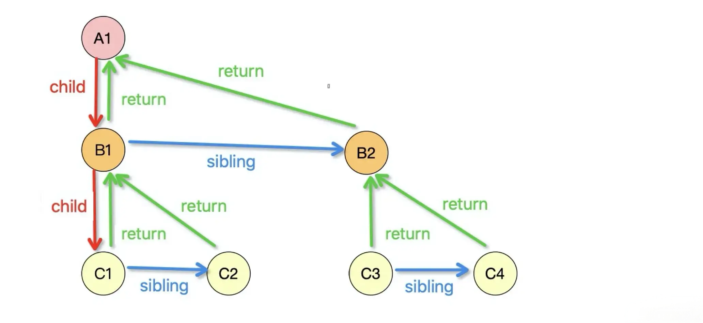

# Fiber 架构以及它是如何实现增量渲染的


`Fiber` 是 `React` 中一种用于实现虚拟 `DOM` 和组件协调的新的架构。它是 `React 16` 中引入的重要概念，旨在优化渲染过程、实现异步渲染，并提高应用的性能和用户体验。

> 首先声明一点,**Fiber** 既可以看作是链表,也可以看作是树。说他是树,是因为它的形状像树,但是并没有树的特征,树是一个只有指向子节点的指针,并没有指向父节点的指针,因为我叫习惯了,所以在后面的内容中都说是 **fiber 树**

## 什么是 Fiber

`Fiber` 也称协程,它和线程不一样,协程本身是没有并发和并行能力的,它需要配合线程,它只是一种控制流程让出机制。

> 线程是并发执行的基本单位，一个进程可以包含多个线程，每个线程独立执行。而协程则是在单个线程中实现的并发。协程通过协作式的方式在同一个线程中切换执行，可以避免多线程之间的竞争条件和锁的使用，减少了线程之间的切换开销和资源消耗。

> 在前端中，JavaScript 提供了一种称为生成器 **Generator** 的功能，它可以用于实现协程。生成器函数可以暂停执行，并且在需要的时候可以从上一个暂停的位置恢复执行。通过调用生成器的 **next()** 方法，可以逐步执行生成器函数的代码并获取生成的值。此外，还可以使用 yield 关键字来指定生成器函数的暂停点，并将值传递给调用者。

`React Fiber` 是一种基于协程的实现，用于实现异步渲染和任务优先级调度。每个 Fiber 可以被看作是一个执行单元，表示了组件树中的一个小部分，负责管理自身对应的组件和其渲染过程。通过引入协程的概念，`React Fiber` 实现了任务的切片和中断与恢复，使得 `React` 能够更高效地处理渲染任务和异步任务，从而提高应用的性能和用户体验。

## Fiber 的形成

`Fiber` 还可以理解为是一种数据结构，`React Fiber` 就是采用链表实现的。每个 `Virtual DOM` 都可以表示为一个 `fiber`，如下图所示:


每个节点都是一个 `fiber`。一个 `fiber` 包括了 `child第一个子节点`、`sibling兄弟节点`、`return父节点`等属性，`React Fiber` 机制的实现，就是依赖于以下的数据结构。每个 `fiber` 树它可以由多个子 `fiber` 组成:


在首次渲染的时候，会创建 `fiberRoot` 和 `rootFiber`,`fiberRoot` 是整个应用的根节点,`rootFiber` 是组件的根节点,这也就是为什么要求你的组件或者页面的父元素必须是一个单节点。

在 `React` 的 `fiber` 中多次更新最多会存在两棵 `Fiber` 树，显示在屏幕上的叫做 `current Fiber` 树，正在内存构建的是 `workInProgress Fiber` 树。

在构建的过程中,`fiberRoot.current` 指向当前界面对应的 `fiber` 树:


构造完成并渲染, 切换 `fiberRoot.current` 指针, 使其继续指向当前界面对应的 `fiber` 树:


整个过程使用深度遍历的方法,对比新老节点,它类似于 `diff` 算法,判断是否发生了变化以及采取相对应的措施,复用还是变更。

## Effect list

在 `React` 中，组件的更新通常会触发副作用，例如修改 `DOM`、发送网络请求、更新状态等。为了确保这些副作用操作在适当的时机执行，`React Fiber` 使用 `Effect List` 来收集和管理这些副作用。

`Effect List` 是一个链表结构，每个节点表示一个副作用操作。在组件更新过程中，`React` 会记录下所有需要执行的副作用操作，并将它们按照指定的顺序链接起来形成 `Effect List`。

`Effect List` 的节点包含以下信息:

*   副作用类型 `Effect Type`: 表示该节点对应的副作用操作的类型，例如更新 `DOM`、发送网络请求等;
*   副作用标记 `Tag`: 表示该节点的状态，例如新增 `Placement`、更新 `Update`、删除 `Deletion` 等。
*   目标对象 `Target`: 表示执行副作用操作的具体对象，例如要更新的 `DOM` 元素、要发送请求的接口等;

通过使用 `Effect List`,`React Fiber` 可以更加精确地控制组件更新的过程，并且在必要时可以进行优化，比如不执行没有变化的副作用操作、批量处理副作用等。这样可以提高 `React` 应用的性能和用户体验。

再看看这一张图,首先它标记处那个是有变更的,适合旧的 `fiber` 树发生变化的:


最终会生成一个链表结构,如下所示:


### EffectList 如何收集

那么问题来了,`EffectList` 是如何收集的?
在 `completeUnitOfWork` 函数中，每个执行完 `completeWork` 且存在 `effectTag` 的 `Fiber` 节点会被保存在一条被称为 `effectList` 的单向链表中。`effectList` 中第一个 `Fiber` 节点保存在 `fiber.firstEffect`，最后一个元素保存在 `fiber.lastEffect`。

`Fiber` 树的构建是深度优先的，也就是先向下构建子级 `Fiber` 节点，子级节点构建完成后，再向上构建父级 `Fiber` 节点，所以 `EffectList` 中总是子级 `Fiber` 节点在前面。

在上面的 `Effect List` 中,因为 `List` 是在 `Fiber` 树中


在该函数中所做的工作:

*   完成该 `Fiber` 节点的构建;
*   将该 `Fiber` 的 `EffectList` 更新到其父 `Fiber` 节点上。`Effect` 链最终会归在 `root` 节点上，`root` 节点上就记录了这个 `fiber` 树上所有需要更新的地方，然后根据 `Effect` 链进行更新;
*   如果当前节点有 `EffectTag`,则将其加入 `EffectList`;
*   如果有 `Sibling`,移动到 `next sibling` 进行同样的操作;
*   没有 `sibling` 则返回父 `fiber`;

### EffectList 的遍历

`Effect list` 在 `React` 的 `commit` 阶段进行处理。


在整个 `commitRootImpl` 函数的执行过程中，根据不同阶段的处理，逐步应用 effectList 中的副作用,在该函数中有如下代码调用:


在该函数中,继而又调用另外一个函数,这个函数就是真正执行逻辑的地方:


该函数的主要作用如下:

*   进入一个循环，直到 `nextEffect` 为 `null` 结束;
*   获取当前循环中的 `fiber` 对象，并存储在 `fiber` 变量中;
*   获取 `fiber` 的子节点，并检查它是否存在并且具有在 `commit` 阶段前的某些变更标志 `subtreeFlags & BeforeMutationMask`;
    *   通过使用 `subtreeFlags`，`React` 在协调和渲染过程中能够更好地识别和理解哪些操作需要执行，从而提高性能并避免不必要的计算和操作;
*   如果子节点存在且满足条件，将子节点的 `return` 属性设置为当前 `fiber`，并将 `nextEffect` 设置为子节点，以便在下一次循环中处理子节点的副作用操作;
*   如果子节点不存在或不满足条件，调用 `commitBeforeMutationEffects_complete()` 函数，结束这个阶段的副作用操作;

概括起来就是 `Effect List` 遍历是在 `commit` 阶段的 `DOM` 更新之前，执行与删除元素相关的副作用操作，并准备处理子节点的副作用操作。

## 状态与副作用

在 `Fiber` 中,它拥有众多属性,其中有两类是十分关键的:

*   `fiber` 节点的自身状态:: 在 `renderRootSync[Concurrent]` 阶段,在这个函数中它会构建 `Fiber` 树并执行组件的渲染和更新,直到整个渲染过程完成,为子节点提供确定的输入数据,,直接影响子节点的生成;
*   `fiber` 节点的副作用: 在 `commitRoot` 阶段,如果 `fiber` 被标记有副作用,则副作用相关函数会被同步或者异步调用;

接下来我们看看 `Fiber` 的定义:

```ts
export type Fiber = {|
  // 1. fiber节点自身状态相关
  pendingProps: any,
  memoizedProps: any,
  updateQueue: mixed,
  memoizedState: any,

  // 2. fiber节点副作用(Effect)相关
  flags: Flags,
  subtreeFlags: Flags,
  deletions: Array<Fiber> | null,
  nextEffect: Fiber | null,
  firstEffect: Fiber | null,
  lastEffect: Fiber | null,
|};
```

### 状态

与状态相关有四个属性:

*   `fiber.pendingProps`: 输入属性,,从 `ReactElement` 对象传入的 `props`.,它和 `fiber.memoizedProps` 比较可以得出属性是否变动,它表示的是最新的 `props`;
*   `fiber.memoizedProps`: 表示上一次渲染后的 `props`,在下一次渲染时会与 `pendingProps` 进行比较,以判断是否需要更新组件。`React` 在进行渲染时会使用 `memoizedProps` 来进行比较,从而确定是否需要重新渲染组件;
*   `fiber.updateQueue`: 存储 `update` 更新对象的队列,每一次发起更新,都需要在该队列上创建一个 `update` 对象。`React` 在进行组件的状态更新时,会将更新操作记录在 `updateQueue` 中,然后在适当的时机进行状态的批量更新;
*   `fiber.memoizedState`: 表示组件上一次渲染后的状态,在下一次渲染时会与新的状态进行比较,以判断是否需要更新组件的状态;

它们的作用只局限于 `fiber` 树构造阶段,它们在组件的渲染和更新过程中起着关键作用,直接影响子节点的生成。

### 副作用

与副作用相关有六个属性:

*   `deletions`: 待删除的子节点,`render` 阶段 `diff` 算法如果检测到 `Fiber` 的子节点应该被删除就会保存到这里;
*   `fiber.nextEffect`: 单向链表,指向下一个副作用 `fiber` 节点;
*   `fiber.firstEffect`: 单向链表,指向第一个副作用 `fiber` 节点;
*   `fiber.lastEffect`: 单向链表,指向最后一个副作用 `fiber` 节点;
*   `fiber.flags`: 标志位, 表明该 `fiber` 节点有副作用,用于在 `React` 的协调和调度过程中标记一些特殊的状态和操作;


副作用的设置可以理解为对撞他功能不足的补充:

*   `状态` 是一个 `静态` 的功能, 它只能为子节点提供数据源;
*   而副作用是一个动态功能, 由于它的调用时机是在 `fiber` 树渲染阶段, 故它拥有更多的能力, 能轻松获取突变前快照, 突变后的 `DOM` 节点等。甚至通过调用 `api` 发起新的一轮 `fiber` 树构造, 进而改变更多的状态, 引发更多的副作用;

### 外部 API

`Fiber` 对象的这两类属性,可以影响到渲染结果,但是 `Fiber` 结构始终是一个内核中的结构,对于调用方来讲,甚至都无需知道 `Fiber` 结构的存在,所以只需要通过暴露 `API` 来直接或间接的修改这两类属性。

从 `React` 包暴露出的 `API` 来归纳,只有 `2` 类组件支持修改,本文只讲 `class` 组件的。

#### class 组件

```jsx
import React from "react";

class App extends React.Component {
  constructor() {
    super();
    this.state = {
      // 初始状态
      a: 1,
    };
  }
  changeState() {
    this.setState({ a: this.state.a + 1 }); // 进入reconciler流程
  }

  // 生命周期函数: 状态相关
  static getDerivedStateFromProps(nextProps, prevState) {
    console.log("getDerivedStateFromProps");
    return prevState;
  }

  // 生命周期函数: 状态相关
  shouldComponentUpdate(newProps, newState, nextContext) {
    console.log("shouldComponentUpdate");
    return true;
  }

  // 生命周期函数: 副作用相关 fiber.flags |= Update
  componentDidMount() {
    console.log("componentDidMount");
  }

  // 生命周期函数: 副作用相关 fiber.flags |= Snapshot
  getSnapshotBeforeUpdate(prevProps, prevState) {
    console.log("getSnapshotBeforeUpdate");
  }

  // 生命周期函数: 副作用相关 fiber.flags |= Update
  componentDidUpdate() {
    console.log("componentDidUpdate");
  }

  render() {
    // 返回下级ReactElement对象
    return <button onClick={this.changeState}>{this.state.a}</button>;
  }
}

export default App;
```

#### 状态相关: Fiber 树构造阶段.

1.  构造函数: `constructor` 实例化时执行, 可以设置初始 `state`, 只执行一次;
2.  生命周期: `getDerivedStateFromProps` 在 `fiber` 树构造阶段执行, 可以修改 state;
3.  生命周期: `shouldComponentUpdate` 在, `fiber` 树构造阶段执行, 返回值决定是否执行 `render`;

在 `resumeMountClassInstance` 函数中,主要以下这段代码:


`getDerivedStateFromProps` 是组件的生命周期方法，用于根据传入的 `props` 来派生更新组件的状态。它是静态方法，可以在组件实例创建之前被调用。

如果 `getDerivedStateFromProps` 是一个有效的函数，那么它调用 `applyDerivedStateFromProps` 方法，将一些参数传递给它:

*   `workInProgress`: 正在进行更新的组件实例,也就是当前正在构建的 `fiber` 树;
*   `ctor`：组件的构造函数;
*   `getDerivedStateFromProps`：从组件中提取的生命周期方法;
*   `newProps`：最新的属性 `props`;

`applyDerivedStateFromProps` 方法的作用是根据 `getDerivedStateFromProps` 方法的返回值来更新组件实例的状态。一旦通过,将 `workInProgress.memoizedState` 的值赋给 `instance.state`。这将确保组件的状态在下一次更新时具有正确的值。

#### 副作用相关: Fiber 树渲染阶段.

##### 生命周期 getSnapshotBeforeUpdate

生命周期: `getSnapshotBeforeUpdate` 在 `fiber` 树渲染阶段 `commitRoot->commitBeforeMutationEffects->commitBeforeMutationEffectOnFiber` 执行;

在组件的 `Update` 阶段,`React` 会通过 `updateClassInstance()` 函数会为 `Fiber` 节点打上 `Snapshot` 的 `effect flag`,根据源码有以下三种方法:


一般情况下我们只需要关注第二个情况,也就是 `checkShouldComponentUpdate()` 函数


在该函数中,它主要通过浅层比较的算法来判断是否需要打上 `Snapshot` 的 `effect flag`。

一旦当前的 `class component` 所对应的 `fiber` 节点的 `effect flag` 包含 `Snapshot` 这个标志位，那么 `react` 就是调用我们定义的 `getSnapshotBeforeUpdate()` 方法。`commit` 阶段又可以分为三个子阶段: `beforeMutation`、`mutation`、`layout`,当前阶段处于 `beforeMutation` 子阶段。


最后，`react` 会在 `layout` 子阶段调用组件实例的 `componentDidUpdate()` 方法，把组件实例的 `__reactInternalSnapshotBeforeUpdate` 属性值作为第三个实参传递进入:

```jsx
componentDidUpdate(prevProps, prevState, snapshot) {
// 使用之前保存的快照做一些操作
if (snapshot !== null) {
 // 根据快照做一些处理
}
}
```

在 `getSnapshotBeforeUpdate()` 生命周期中,它所遵循判断逻辑是:



##### 生命周期 componentDidMount

生命周期: `componentDidMount` 在 `fiber` 树渲染阶段`commitRoot->commitLayoutEffects->commitLayoutEffectOnFiber` 执行,`React` 会在你的组件被添加到屏幕上时调用它。

##### 生命周期 componentDidUpdate

`componentDidUpdate` 在 `fiber` 树更新阶段`commitRoot->commitLayoutEffects->commitLayoutEffectOnFiber` 执行,`React` 会在你的组件用更新的道具或状态重新渲染后立即调用它。

函数式组件就先不讲了,因为它设计到大量的 `hooks`,后面会再写一篇文章来讲解,如果感兴趣的话可以关注一下后续文章。

最终整个 `React` 类组件的生命周期如下所示:


# Concurrent 模型

随着 `React18` 版本的发布, `Concurrent` 模式成为了 `React` 的默认模式。也就是说，在 `React` 18 中，`Concurrent` 模式不再是一个实验性的功能，而是默认启用的。

## 什么是 Concurrent 模式

这是一个特性集合,可以让你的 `React` 应用保持响应,可以根据用户的设备能力和网络情况优雅地调整,它主要分为两个方向的优化,它分别是 `CPU密集型` 和 `I/O密集型`。


`React` 中的 `Concurrent Mode` 是指在 `Reconciler` 中处理 `long task` 时，可以不阻塞浏览器中的其他进程，并且 `React` 中的 `render` 任务 具有各自的优先级，任务可以通过过`时间分片` + `优先级调度`的方式在执行和暂停之间切换状态。

`Fiber` 是 `Concurrent Mode` 的实现基础。`Fiber` 重新设计了 `React` 的协调算法，将渲染过程转换为可中断的任务，从而实现了并发渲染。使得渲染任务可以根据优先级划分和中断，从而提高了渲染性能和用户体验。

### CPU 密集型

`CPU` 密集型指是 `Reconciler` 协调或者 `Diff` 的优化.,在 `Concurrent` 模式下面，`Reconciler` 可以被中断, 让位给高优先级的任务，让应用保持响应。

`React` 转化组件为虚拟 `DOM` 的过程属于 `CPU` 密集型任务,当我们修改组件时，`React` 需要刷新全部的虚拟 `DOM` ，而这个过程，我们就把它叫做 `Reconciler`。

在这个过程中，`React` 需要执行组件函数，生成表示组件结构和内容的虚拟 `DOM` 对象。这涉及到对组件的属性和状态进行计算、逻辑处理和组装，需要占用大量的 `CPU` 资源。尤其在组件树较大、嵌套层级较深的情况下，计算虚拟 DOM 的过程可能会非常复杂和耗时。

### I/O 密集型

在 `React` 中，`I/O` 密集型任务是指在组件渲染或更新过程中涉及到大量的异步操作或需要等待外部资源响应的任务。这些任务可能会阻塞主线程的执行，导致页面的卡顿或不流畅。

以下是一些 `React` 在处理 `I/O` 密集型任务方面的主要优化:

*   异步渲染: `React` 通过引入异步渲染机制，将渲染工作分成多个小任务，并以适当的时机执行，避免阻塞主线程。这使得 `React` 能够更好地响应用户输入和处理 `I/O` 操作;
*   批量更新：`React` 通过批量处理组件更新，将多个更新操作合并为一个更新批次，减少了对实际 `DOM` 的操作次数，提高了性能。特别是在处理大量连续的数据更新时，这种批处理机制可以显著减少不必要的重排和重绘;

## Concurrent 模式给我们带了什么?

在 `React` 中，同步渲染可能会导致以下问题:

*   阻塞主线程：当组件包含大量同步代码或复杂计算时，同步渲染会阻塞主线程的执行。这会导致页面无法响应用户输入、动画卡顿以及其他交互性能下降的问题;
*   页面卡顿：如果渲染操作耗时较长，同步渲染会导致页面出现明显的卡顿感，用户体验变差;
*   延迟加载：当组件存在大量的同步渲染过程时，页面的初始加载时间会变长，因为需要等待所有同步操作完成后才能显示内容;
*   用户体验差：由于同步渲染会导致页面响应变慢，用户可能会感到不满意或不流畅，从而影响整体的用户体验。

而并发渲染则允许渲染过程被中断和恢复，将任务拆分为多个小任务，以便在多个帧中分布执行。

在并发渲染中,情况并非总是如此。`React` 可能会开始渲染更新，在中间暂停，然后再继续。它甚至可能完全放弃正在进行的渲染。`React` 保证即使渲染被中断，`UI` 也会保持一致。为此，它等待执行 `DOM` 突变，直到整个树计算完毕。有了这个功能，`React` 可以在不阻塞主线程的情况下在后台准备新的屏幕。这意味着即使在大型渲染任务中，`UI` 也可以立即响应用户输入，从而创建流畅的用户体验。

最特别的是在 `Concurrent` 模式下它是可以重用状态的,例如你可以删除屏幕上的 `UI` 部分,然后在重用以前的状态时将它们添加回来。但是这个功能目前还没有实现,正在计划当中 [离屏渲染](https://react.docschina.org/blog/2022/06/15/react-labs-what-we-have-been-working-on-june-2022#offscreen)

## 时间切片和可中断渲染

我们在前面花了这么多时间来讲解 `Concurrent` 模式,目的是为了引出时间切片和可中断渲染。

这篇文章会和 `React` 的调度系统 `Scheduler` 有关,在 `react-reconciler` 中通过函数 `scheduleUpdateOnFiber(...)` 将 `fiber` 树生成逻辑封装到一个回调函数中,然后通过 `performSyncWorkOnRoot(...)` 或 `performConcurrentWorkOnRoot(...)` 送入 `scheduler` 进行调度。

在 `Scheduler` 调度器开始调度 `Task` 后，会进入 `Concurrent` 模式工作流的第一步 `Reconciliation`，这一步流程主要是我们常说的调和。

我们再来借用一下这张图吧!


`performConcurrentWorkOnRoot` 是 `Scheduler` 开启调度时实际执行的任务:


该函数主要做的事情就是有以下两个方面:

*   获取当前需要执行的 `lane/lanes`，用最高优先级的 `lane` 作为任务执行的优先级标准，同时计算 `lane` 对应的优先级;
*   开始 `Reconciler` 的 `render` 阶段，`exitStatus` 用来表示 `render` 流程的结果状态;


看完了前面部分的代码,我们接着看后面部分的代码,我们以 `render` 流程的结果作为结束点,下半部分主要是处理 `exitStatus` 在不同场景下的流程:

*   先处理边缘场景，在 `rendering` 阶段中，如果发生了新的 `update`，但是这个 `update` 是把一些隐藏的组件重新展示出来，但是新的 `update` 的 `lane` 已经在当前的 `rendering` 阶段中被标记执行过了，所以需要重头开始;

*   如果 `exitStatus !== RootInProgress`,它主要处理根组件渲染的各种状态，包括渲染完成、出现异常、挂起等情况。在这里我们就不对错误处理进行过多描述,我们来看看一些比较重要的场景:

    1.  `exitStatus` 为 `RootDidNotComplete`,说明渲染过程未完成，即挂起状态。函数会通过 `markRootSuspended` 将根组件标记为挂起状态，等待后续任务再次调度;
    2.  `exitStatus` 为其他值,说明渲染过程已经完成。函数会判断之前的渲染是否是并发渲染，并且是否与外部数据存储一致。如果之前的渲染是并发渲染且不一致，会重新进行同步渲染,调用 `renderRootSync`,以确保数据的一致性。
    3.  当渲染任务完成时，函数会将结果保存到根组件的 `finishedWork` 和 `finishedLanes` 属性中。然后调用 `finishConcurrentRender` 完成并发渲染的后续处理，包括提交 DOM 变更等。

*   最后一步就是执行 `ensureRootIsScheduled` 函数。如果当前执行的 `scheduler task` 未发生变化，还是最初在执行的那个 `task`，则返回 `performConcurrentWorkOnRoot` 函数，并绑定 root 参数；如果不相同，则返回 `null`;

### Reconciler 是如何利用 Scheduler 进行任务中断与恢复的

在前面的内容中我们只是说到了 `ensureRootIsScheduled` 是如何进入 `Scheduler` 的,但是并没有具体分析这个函数:

*   取消当前正在执行中的任务,然后清空 `root.callbackNode` 和 `root.callbackPriority`，表示没有需要调度的任务，函数直接返回;

*   看看哪些 `lane` 已经超时了，标记到 `root.expiredLanes`;

    

*   获取当前需要执行的 `lane/lanes`，用最高优先级的 `lane` 作为任务执行的优先级标准，同时计算 `lane` 对应的 `priority`;

*   获取 `nextLanes` 对应的 `priority`,如果 `nextLanes` 属于 `NoLanes`，那么判断是否有还在执行中的任务，有的话取消当前的 `scheduler task`，并清除保存在 `root` 上的一些信息;

流程到这里算是一个分水岭，如果执行完上面的流程后函数退出，说明，任务被取消掉了或者当前无任务了。

如果函数继续往下走:


如果已经有执行中的任务，可以判断是否复用执行中的任务，若任务优先级没有发生变化，则不需要走后续的 `Scheduler` 分配任务流程。若优先级发生了变化，则取消当前的 `scheduler task`。

如果在进入了 `cancelCallback()` 函数的调用,说明没有被 `return`,说明了两种情况:

1.  没有执行中的任务，下面需要分配一个新的;
2.  原有的任务被取消掉了，现在重新分配一个新的;

所以会有后面的这段代码:


前者是取消现有的回调,保存一个新的,后者是根据更新任务的优先级，创建新的回调任务，并保存到 `newCallbackNode` 中。

一般来说，如果没有出现更高优先级的 `lane priority`，任务 `task` 就不会取消，也就是 `root.callbackNode` 和 `root.callbackPriority` 都没有发生变化，若任务处于 `RootInComplete` - 未完成 状态，那么 `performConcurrentWorkOnRoot` 会返回 `performConcurrentWorkOnRoot.bind(null, root)` 作为恢复任务的关键，`Scheduler` 在执行 `workLoop` 流程中会保存这个返回的回调，并重新赋值到 `task.callback` 上，在下次调度时重新执行。

### Reconciler 遍历 Fiber Tree 时是怎么中断任务的，中断后为什么可以恢复到上次循环中断的位置

现在我们应该都了解 `Reconciler` 是如何利用 `Scheduler` 进行任务中断与恢复的了,但是没有解决前面提到的 `long task`。

在我们之前的 `performConcurrentWorkOnRoot` 中的一个关键入口:

```js
let exitStatus = renderRootConcurrent(root, lanes);
```

而在这个函数调用中最终还是循环调用下面这个函数:

```js
function workLoopConcurrent() {
  while (workInProgress !== null && !shouldYield()) {
    performUnitOfWork(workInProgress);
  }
}
```

遍历过程很简单，就是 `workInProgress` 这个 `fiber node` 不为空就执行 `performUnitOfWork`,这里中断循环的两种方法有两种:

1.  整个 `Fiber tree` 遍历 `render` 完成;
2.  通过时间分片控制给每个 `fiber node` 分配执行时间

当循环中断后，`workInProgress` 记录了当前执行中的节点，通过 `Reconciler` 与 `Scheduler` 的任务中断恢复机制，下次进入循环时可以从停止的地方开始。

在下一次渲染时，`React` 从已经更新的部分 `Fiber` 节点开始继续更新。这里利用了 `Fiber` 数据结构的双缓冲技术，通过 `alternate` 指针找到上一次更新的状态。`React` 使用调和过程对组件树进行更新。它会比较上一次更新和本次更新之间的差异，并根据差异进行局部更新，从而实现高效的更新。

但是当高优先级的任务改变了之前已经过了的 `DOM`，`React` 会采取一些措施来确保页面的一致性和正确性。这是通过 `React Fiber` 的调和机制和双缓冲技术实现的。

React Fiber 采用双缓冲技术，有两个重要的属性 current 和 alternate，分别指向当前的 Fiber 节点和上一次更新的 Fiber 节点。当一个更新过程中断后，React 会记录中断位置，并将中断位置之前的更新称为 `work-in-progress` 状态。

假设有以下情况:

*   开始渲染一个 `Fiber` 树并完成了一部分节点的更新;
*   高优先级的任务触发并中断了当前的渲染过程;
*   高优先级的任务对之前已经更新的 `DOM` 进行了改变;

React 在此时会执行以下操作:

1.  记录中断位置：`React` 会记录当前更新的进度，即哪些节点已经更新;
2.  中断渲染：高优先级的任务优先执行，`React` 将中断当前渲染任务，以便及时响应高优先级任务。
3.  回滚到之前的状态：`React` 使用 `alternate` 指针回滚到之前的状态，恢复之前更新的 `Fiber` 树。这样可以确保组件树处于一个一致的状态;
4.  继续渲染：当高优先级任务执行完毕后，`React` 会重新调度被中断的渲染任务，并从中断位置继续渲染。`React` 会使用之前记录的中断位置作为起点，从 `workInProgress` 状态继续更新未完成的部分。
5.  重新调和：`React Fiber` 会根据更新的差异重新调和组件树，并对已经更新过的 `DOM` 进行修改。这样，React 确保了整个组件树在完成渲染后的一致性。

那么问题就来了,回滚的话,这不会引起性能损耗吗?

答案是肯定的,回滚操作可能会造成一定的性能损耗，但 `React Fiber` 通过双缓冲技术尽量最小化了性能损耗，并且在大多数情况下，这种损耗是可以接受的。

尽管回滚操作可能会带来一定的性能损耗，但 React Fiber 尽可能地减小了这种损耗，并通过以下方式来优化性能:

*   双缓冲技术：`React Fiber` 使用双缓冲技术，通过 `current` 和 `alternate` 指针，实现高效的回滚操作。回滚时只需要切换指针，无需重新构建整个组件树;
*   最小化回滚范围：`React Fiber` 会尽量最小化回滚的范围，只回滚中断位置之后的更新，而不是整个组件树。这样可以减少不必要的计算和 `DOM` 操作。
*   状态复用: 状态复用可以保持之前已经计算的结果，避免了重复计算的开销。回滚时可以直接使用之前的计算结果，而不需要重新计算;

## 时间切片和可中断渲染具体实现

在前面的内容中我们讲到 `ensureRootIsScheduled` 是进入 `Scheduler` 调度的入口函数,而 `unstable_scheduleCallback` 是正是进入 `Scheduler` 调度的。


这个函数的主要流程是有以下几个方面:

1.  获取当前时间 `currentTime`;
2.  根据 `options` 中的 `delay` 值计算任务的开始时间 `startTime` 。如果 `delay` 是一个大于 0 的数字，则任务将会延迟执行；否则任务将立即执行;
3.  根据 `priorityLevel` 确定任务的超时时间 `timeout`。不同的优先级对应不同的超时时间;
4.  计算任务的过期时间 expirationTime，即任务应该在何时过期 ,`var expirationTime = startTime + timeout;`;
5.  创建一个新的任务对象 `newTask`，其中包含任务的唯一标识 `id`、回调函数 `callback`、优先级 `priorityLevel`、开始时间 `startTime`、过期时间 `expirationTime` 和排序索引 `sortIndex`。
6.  `startTime > currentTime` 为 `true` 的话,存放到 `timeQueue`,否则存放到 `taskQueue`;
7.  如果是即时任务，则存入 `taskQueue`。如果无主任务执行且 `performWorkUntilDeadline` 也没有递归调用，则调用 `requestHostCallback` 进入正常的任务调度;

`taskQueue` 用于管理异步任务，执行时机是在浏览器的下一次渲染帧之前或之后。`timerQueue` 用于管理定时器任务，执行时机是在指定的延迟时间后。

延迟任务到期后会被添加到 `taskQueue` 中按过期时间重新排序处理。在处理 `taskQueue` 时，每执行完一次普通任务，都会检查 `timerQueue` 中是否有延迟任务到期了，如果有，则添加进 `taskQueue` 中。

延迟任务存储在 `timerQueue` 中，按 `startTime` 排序，到期后会被取出添加到 taskQueue 中，重新按照 expirationTime 进行排序。

### Scheduler 的 MessageChannel

那 `Scheduler` 和 `MessageChannel` 有啥关系呢?
关键点就在于当 scheduler.shouldYield() 返回 true 后，Scheduler 需要满足以下功能点:

1.  暂停 `JS` 执行，将主线程还给浏览器，让浏览器有机会更新页面;
2.  在未来某个时刻继续调度任务，执行上次还没有完成的任务;

接下来我们来看看 `Scheduler` 实现任务分片的核心函数:

1.  `requestHostCallback`和 `cancelHostCallback`：它就是一个 `setTimeout` 的封装，所谓延时任务，就是一个延时安排调度的任务，怎么保证在延时时间达到后立刻安排调度呢，`React` 就用了 `setTimeout`，计算 `startTime - currentTime` 来实现,而后者就是取消任务了;

    *   如果 `taskQueue` 为空，我们的延时任务会创建最多一个定时器，在定时器到期后，将任务添加到 `taskQueue` 中。如果 `taskQueue` 列表不为空，我们在每个普通任务执行完后都会检查是否有任务到期了，然后将到期的任务添加到 `taskQueue` 中。

2.  `advanceTimers`: `advanceTimers` 做的事情就是遍历延期调度任务对列，这个任务队列中存放着需要延期执行的任务，判断这些任务是否到期，如果到期了,将到期的延时任务转移到 `taskQueue` 中;

    

3.  `handleTimeout`: 接下来我们直接看看 `handleTimeout` 的源码:
    
    可以看到首先调用了 `advanceTimers`，将到期的延时任务转移到 `taskQueue` 中。

    如果 `taskQueue` 不为空，那就执行 `requestHostCallback`,告诉浏览器，等空了就干活，继续遍历执行 `taskQueue` 中的任务。

4.  最后我们来总结一下前面这三个步骤的流程。当我们创建一个延时任务后，我们将其添加到 `timerQueue` 中，我们使用 `requestHostTimeout` 来安排调度，`requestHostTimeout` 本质是一个 `setTimeout`，当时间到期后，执行 `handleTimeout`，将到期的任务转移到 `taskQueue`，然后按照普通任务的执行流程走;

5.  `shouldYieldToHost` 和 `requestPaint`:

    *   `shouldYieldToHost` 函数主要用于判断当前是否应该将执行权让给浏览器。会在每个时间片结束时被调用，用于判断是否应该暂时让出主线程，让浏览器处理其他任务或用户输入。如果 `shouldYieldToHost` 返回 `true`，则表示应该让出主线程;
    *   `requestPaint` 函数用于请求浏览器执行绘制操作。在现代浏览器中，绘制操作通常由浏览器的绘制引擎负责执行，它会将绘制任务放入绘制队列中，然后在合适的时机执行绘制操作;
    *   `shouldYieldToHost` 函数用于判断是否应该暂时让出主线程，让浏览器处理其他任务或用户输入`requestPaint` 函数用于请求浏览器执行绘制操作，以提高页面的响应速度和性能。两者都是为了优化任务调度和页面渲染的性能而存在的;

        

6.  `performWorkUntilDeadline`: 该函数主要用于时间切片。它会在每个时间片结束时被调用，用于执行剩余的任务片段，直到达到时间片的截止时间。在每次执行任务片段后，它会检查是否需要让出主线程，以响应其他高优先级任务或用户输入。如果仍有剩余任务片段且还未到达时间片截止时间，则会继续执行下一个任务片段，直到达到时间片的截止时间为止。这样就能够在时间片内尽可能多地执行任务，并保证在每个时间片结束时能够让出主线程。

我们主要来看看这段代码:


这段代码的主要逻辑如下:

1.  在 `performWorkUntilDeadline` 函数中，当执行到 `schedulePerformWorkUntilDeadline` 的时候，会调用 `requestHostCallback` 函数，并将 `channel.port2` 传入作为回调函数;
2.  在 `requestHostCallback` 中，会保存传入的回调函数 `scheduledHostCallback` 也就是 `channel.port2.postMessage`，并标记 `isMessageLoopRunning` 为 `true`;
3.  然后，通过 `schedulePerformWorkUntilDeadline`` 函数中的 `scheduleMessageChannelCallback`来发送一个消息到`channel.port1`，从而触发 `performWorkUntilDeadline\` 的执行;
4.  在 `performWorkUntilDeadline` 中，会调用 `scheduledHostCallback`，即 `channel.port2.postMessage`，从而开始下一次的时间片执行;

这样，通过 `MessageChannel` 和消息的发送和接收，`React` 实现了时间切片的循环执行，使得任务可以在浏览器空闲时执行，从而实现了异步渲染并保持页面的响应性。

接着我们来看一下这个流程图:


### flushWork 执行任务

`flushWork` 作为 `requestHostCallback` 回调函数，在经历 `requestHostCallback` 复杂的 `Scheduler` 过程后，`flushWork` 开始执行调度任务。

这个函数有两个参数,其中:

*   `hasTimeRemaining`: 代表当前帧是否还有时间留给 `react`;
*   `initialTime`: 即 `currentTime`;


你会发现这段代码看似很长,实际上就是在做一件事情,将主要执行权交给它的小弟 `workLoop ` 函数。

### workLoop

`workLoop` 就是一个大循环, 虽然代码也不多, 但是非常精髓, 在此处实现了时间切片和 `fiber` 树的可中断渲染. 这 `2` 大特性的实现, 都集中于这个 `while` 循环.

```js
function workLoop(hasTimeRemaining, initialTime) {
  let currentTime = initialTime;
  // 先把过期的任务从 timerQueue 捞出来丢到 taskQueue 打包一块执行了
  advanceTimers(currentTime);
  // 获取优先级最高的任务
  currentTask = peek(taskQueue);
  // 循环任务队列
  while (
    currentTask !== null &&
    !(enableSchedulerDebugging && isSchedulerPaused)
  ) {
    if (
      currentTask.expirationTime > currentTime &&
      // shouldYieldToHost 这个函数用来判断是否需要等待
      (!hasTimeRemaining || shouldYieldToHost())
    ) {
      // 如果没有剩余时间或者该任务停止了就退出循环
      break;
    }
    // 取出当前的任务中的回调函数 performConcurrentWorkOnRoot
    const callback = currentTask.callback;
    if (typeof callback === "function") {
      // 只有 callback 为函数时才会被识别为有效的任务
      currentTask.callback = null;
      // 设置执行任务的优先级，回想下 flushWork中的恢复优先级，关键就在这
      currentPriorityLevel = currentTask.priorityLevel;
      const didUserCallbackTimeout = currentTask.expirationTime <= currentTime;
      if (enableProfiling) {
        markTaskRun(currentTask, currentTime);
      }

      // 如果返回新的函数,表示当前的工作还没有完成
      const continuationCallback = callback(didUserCallbackTimeout);
      currentTime = getCurrentTime();
      if (typeof continuationCallback === "function") {
        // 这里是真正的恢复任务，等待下一轮循环时执行
        currentTask.callback = continuationCallback;

        if (enableProfiling) {
          markTaskYield(currentTask, currentTime);
        }
      } else {
        if (enableProfiling) {
          markTaskCompleted(currentTask, currentTime);
          currentTask.isQueued = false;
        }
        if (currentTask === peek(taskQueue)) {
          // 不需要恢复任务了，标识当前任务已执行完，把任务从队列中移除掉
          pop(taskQueue);
        }
      }
      // 先把过期的任务从 timerQueue 捞出来丢到 taskQueue 打包一块执行了
      advanceTimers(currentTime);
    } else {
      pop(taskQueue);
    }
    // 获取最高优先级的任务（不一定是下一个任务）
    currentTask = peek(taskQueue);
  }
  // Return whether there's additional work
  if (currentTask !== null) {
    // 还有任务说明调度被暂停了，返回true标明需要恢复任务
    return true;
  } else {
    const firstTimer = peek(timerQueue);
    if (firstTimer !== null) {
      // 任务都跑完了
      requestHostTimeout(handleTimeout, firstTimer.startTime - currentTime);
    }
    // 返回false意味着当前任务都执行完了，不需要恢复
    return false;
  }
}
```

最后贴上一张完整的工作循环图:


还有一张完整的 `Scheduler` [调度流程](https://p6-juejin.byteimg.com/tos-cn-i-k3u1fbpfcp/493c087e2fd64e1a8c552f16927192f6~tplv-k3u1fbpfcp-watermark.png?)

至此,整个 `Scheduler` 调度流程完整结束。

### 小结

`React` 实现时间分片和可中断渲染是通过 `Fiber` 架构和调度器来实现的。具体如下所示:

1.  `Fiber` `架构：Fiber` 是一种数据结构，它表示 `React` 组件树中的每个节点。每个 `Fiber` `节点包含了组件的状态和描述如何构建组件的信息。Fiber` 节点形成一个链表，称为 `Fiber` 树;
2.  任务调度: `React` 的调度器负责任务的调度和执行。调度器使用优先级来确定任务的重要性和执行顺序。任务的优先级决定了任务在调度器中的位置，优先级高的任务会优先执行;
3.  时间分片：时间分片是将大的渲染任务拆分成小的可中断的任务单元。`React` 将整个渲染过程分成多个时间片段，每个时间片段都有一个固定的时间段,例如 `5ms` 来执行任务。在每个时间片段内，`React` 执行一部分工作，然后让出主线程，允许浏览器执行其他任务，从而实现渐进式渲染;
4.  可中断渲染: `Fiber` 架构使得 `React` 能够在渲染过程中中断任务的执行，并在必要时重新调度任务。如果浏览器需要执行其他高优先级任务,如用户交互事件,`React` 会中断当前渲染任务，并优先执行其他任务。一旦高优先级任务完成,`React` 会恢复中断的渲染任务，确保及时响应用户操作;
5.  执行中断: 在 `React` 执行渲染任务时，会周期性地检查是否有其他高优先级的任务需要执行。如果有,`React` 会中断当前任务，让出主线程，并执行其他紧急任务。一旦高优先级任务完成,`React` 会恢复中断的渲染任务，继续执行渲染过程;

通过以上的实现,`React` 能够在渲染过程中灵活地控制任务的执行顺序，使得页面可以更及时地响应用户操作，提高用户体验。同时，时间分片和可中断渲染还能够确保在大型组件树的渲染过程中，不会阻塞主线程，保持页面的流畅性。

# 附加问题: React 如何实现增量渲染

React 实现增量渲染是通过 Fiber 架构和协调器来实现的。增量渲染是一种渐进式渲染方式，它将整个渲染过程拆分成多个增量步骤，并将这些步骤分布在多个时间片段中执行，从而实现渲染的分阶段、增量式进行。

通过时间分片的方式将整个渲染过程分成多个时间片段。这样页面的渲染过程被分成多个增量步骤进行，避免了长时间的渲染阻塞。`React` 使用虚拟 `DOM` 和 `Diff` 算法来对比前后两个状态的差异，然后仅更新真正需要变化的部分，而不是重新渲染整个组件树。这样，`React` 只需要更新变化的部分，从而实现增量渲染。

增量渲染使得页面可以更快地显示，从而保持页面的流畅性和响应性,提高了用户体验。

# 参考资料

*   [这可能是最通俗的 React Fiber(时间分片) 打开方式](https://juejin.cn/post/6844903975112671239?searchId=202307211104193A52811F13B35C8DE99E#heading-11)

*   [从源码学 API 系列之 getSnapshotBeforeUpdate()](https://juejin.cn/post/7221413753731874875)

*   [【React】Concurrent 的奥秘](https://juejin.cn/post/7092415927714578462/#heading-10)

*   [React 之 Scheduler 源码解读（下）](https://juejin.cn/post/7171319288849137694#heading-4)

*   [React 源码系列五：React Scheduler 调度原理第二篇](https://juejin.cn/post/6914089940649246734/#heading-11)

*   [React 源码细读-并发模式下的 Reconciler 与可中断渲染](https://zhuanlan.zhihu.com/p/391820501)

*   [React 调度原理(scheduler)](https://7km.top/main/scheduler/)

# 总结

传统的 `React` 渲染过程是同步执行的，即在进行更新时会一直持续到更新完成，这可能会导致长时间的主线程阻塞，从而造成页面卡顿和用户体验下降。而 `React Fiber` 的出现就是为了解决这个问题。

`React Fiber` 引入了一套新的协调算法，将渲染过程分割成多个优先级较低的小任务,也称为 `Fiber`，通过任务优先级和时间片的概念，使得 `React` 可以灵活地控制任务的调度和执行。这样一来，当浏览器有空闲时间时，`React Fiber` 可以中断当前任务，暂停执行，然后处理其他紧急任务或 `I/O` 操作，提高了页面的响应性能。同时，`React Fiber` 也支持增量渲染，即将渲染工作分解成多个步骤，每次只渲染一小部分，不会阻塞主线程太久。

综合来说，Scheduler 调度和 Fiber 树的渲染共同实现了 React 的增量渲染和可中断渲染机制，使得 React 可以更加高效地处理大型组件树和复杂更新，并提供更好的用户体验。

最后分享两个我的两个开源项目,它们分别是:

*   [前端脚手架 create-neat](https://github.com/xun082/react-cli)
*   [在线代码协同编辑器](https://github.com/xun082/online-cooperative-edit)

这两个项目都会一直维护的,如果你也喜欢,欢迎 star 🥰🥰🥰
