# react事件系统原理


# 一 前言

今天我们来一起探讨一下`React`事件原理，这篇文章，我尽量用通俗简洁的方式，把`React`事件系统讲的明明白白。


我们讲的`react`版本是`16.13.1` , `v17`之后`react`对于事件系统会有相关的改版，文章后半部分会提及。

老规矩，在正式讲解`react`之前，我们先想想这几个问题(**如果我是面试官，你会怎么回答?**)：

* 1 我们写的事件是绑定在`dom`上么，如果不是绑定在哪里？
* 2 为什么我们的事件不能绑定给组件？
* 3 为什么我们的事件手动绑定`this`(不是箭头函数的情况)
* 4 为什么不能用 `return false `来阻止事件的默认行为？
* 5 `react`怎么通过`dom`元素，找到与之对应的 `fiber`对象的？
* 6 `onClick`是在冒泡阶段绑定的？ 那么`onClickCapture`就是在事件捕获阶段绑定的吗？


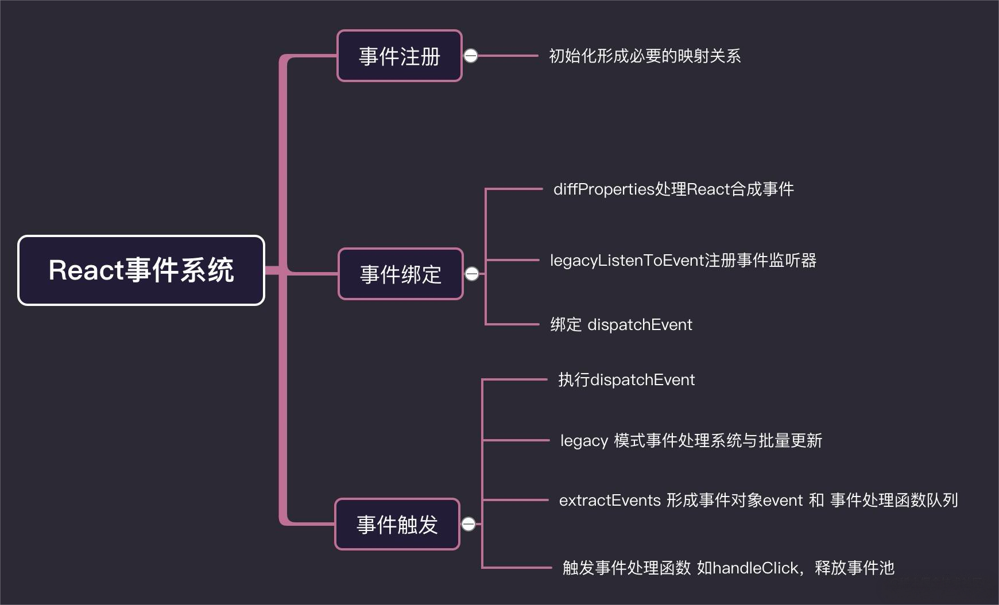


## 必要的知识概念

在弄清楚`react`事件之前，有几个概念我们必须弄清楚，因为只有弄明白这几个概念，在事件触发阶段，我们才能更好的理解`react`处理事件本质。

### 我们写在JSX事件终将变成什么？

我们先写一段含有点击事件的`react JSX`语法，看一下它最终会变成什么样子？

````js
class Index extends React.Component{
    handerClick= (value) => console.log(value) 
    render(){
        return <div>
            <button onClick={ this.handerClick } > 按钮点击 </button>
        </div>
    }
}
````
经过`babel`转换成`React.createElement`形式，如下：


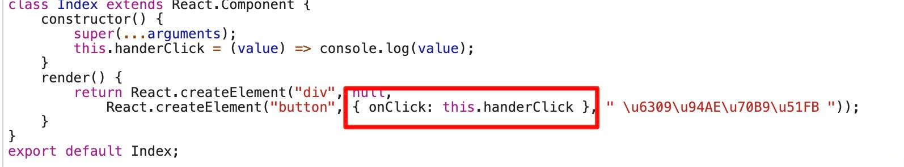

最终转成`fiber`对象形式如下：


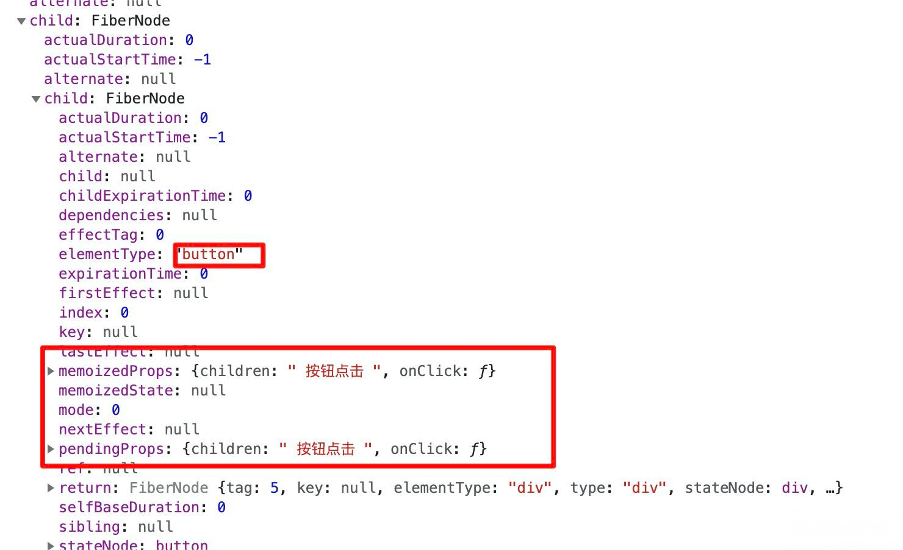

`fiber`对象上的`memoizedProps` 和 `pendingProps`保存了我们的事件。

### 什么是合成事件？


通过上一步我们看到了，我们声明事件保存的位置。但是事件有没有被真正的注册呢？我们接下来看一下：

我们看一下当前这个元素`<button>`上有没有绑定这个事件监听器呢？

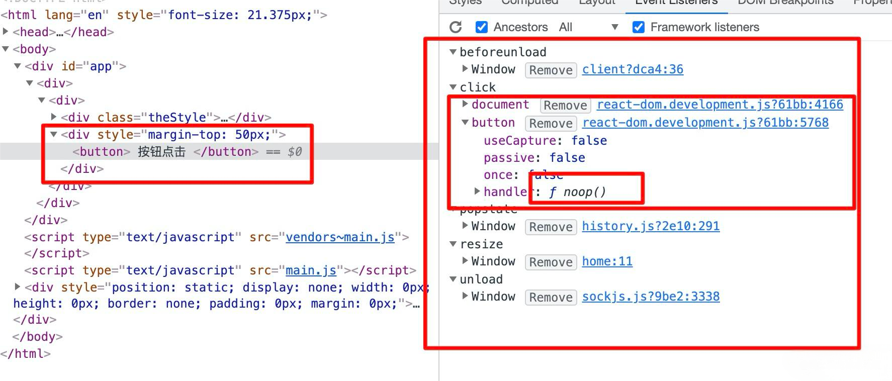

**button上绑定的事件**

我们可以看到 ，`button`上绑定了两个事件，一个是`document`上的事件监听器，另外一个是`button`，但是事件处理函数`handle`，并不是我们的`handerClick`事件，而是`noop`。

`noop`是什么呢？我们接着来看。

原来`noop`就指向一个空函数。

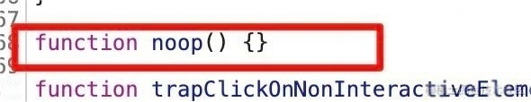


**然后我们看`document`绑定的事件**


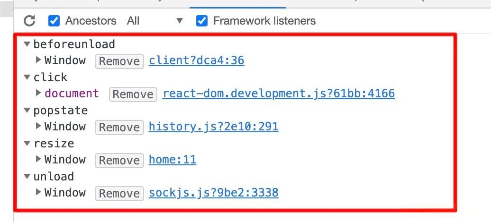

可以看到`click`事件被绑定在`document`上了。

接下来我们再搞搞事情😂😂😂，在`demo`项目中加上一个`input`输入框，并绑定一个`onChange`事件。睁大眼睛看看接下来会发生什么？

````js
class Index extends React.Component{
    componentDidMount(){
        console.log(this)
    }
    handerClick= (value) => console.log(value) 
    handerChange=(value) => console.log(value)
    render(){
        return <div style={{ marginTop:'50px' }} >
            <button onClick={ this.handerClick } > 按钮点击 </button>
            <input  placeholder="请输入内容" onChange={ this.handerChange }  />
        </div>
    }
}
````

**我们先看一下`input dom`元素上绑定的事件**


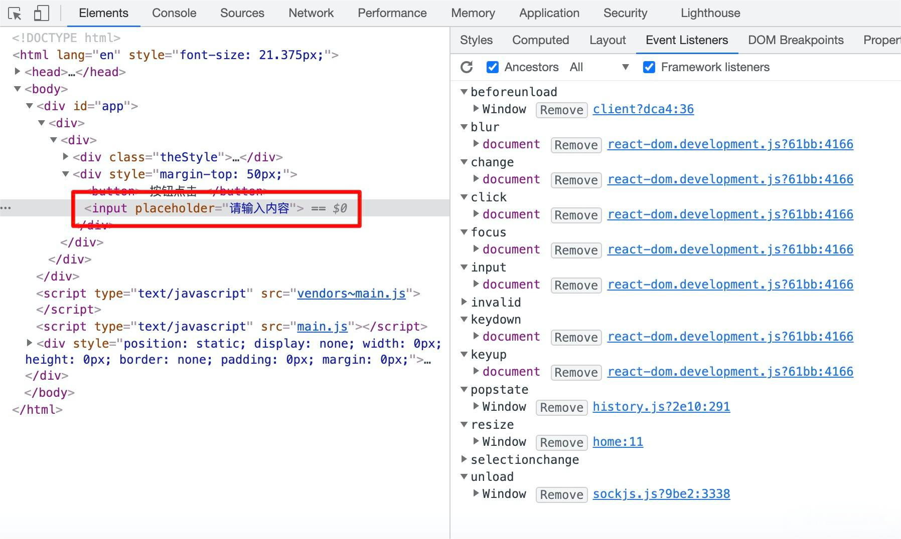

**然后我们看一下`document`上绑定的事件**


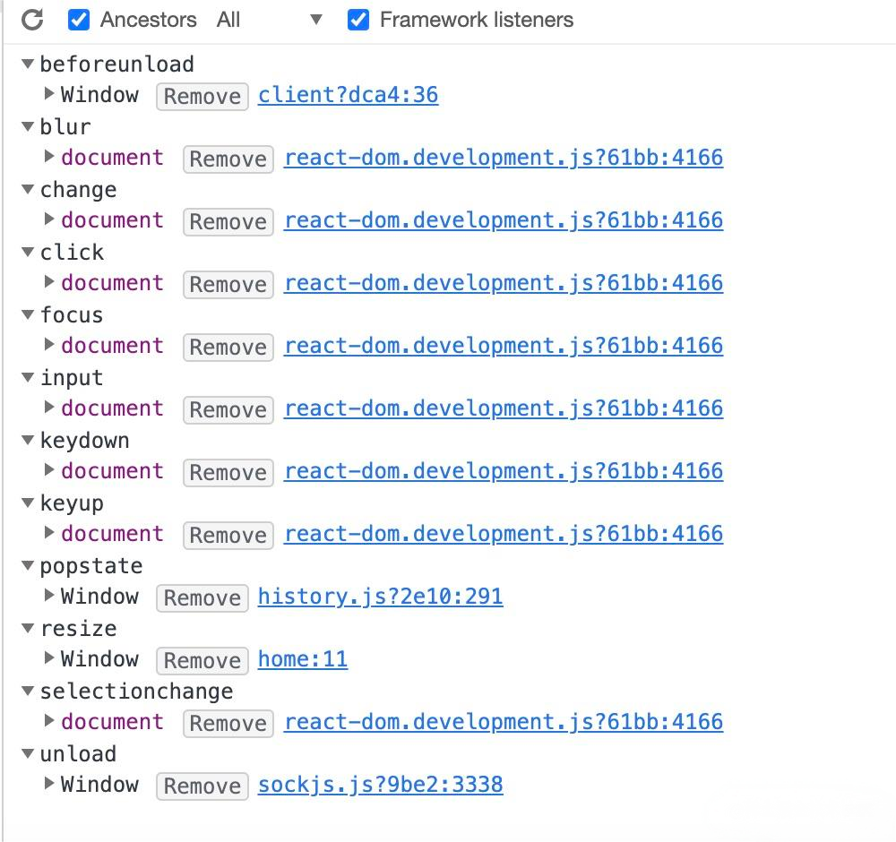


我们发现，我们给`<input>`绑定的`onChange`，并没有直接绑定在`input`上，而是统一绑定在了`document`上，然后我们`onChange`被处理成很多事件监听器，比如`blur` , `change` , `input` , `keydown` , `keyup` 等。 


综上我们可以得出结论：


* ①**我们在 `jsx` 中绑定的事件(demo中的`handerClick`，`handerChange`),根本就没有注册到真实的`dom`上。是绑定在`document`上统一管理的。**

* ②**真实的`dom`上的`click`事件被单独处理,已经被`react`底层替换成空函数。**

* ③**我们在`react`绑定的事件,比如`onChange`，在`document`上，可能有多个事件与之对应。**

* ④ **`react`并不是一开始，把所有的事件都绑定在`document`上，而是采取了一种按需绑定，比如发现了`onClick`事件,再去绑定`document click`事件。**

那么什么是`react`事件合成呢？

**在`react`中，我们绑定的事件`onClick`等，并不是原生事件，而是由原生事件合成的`React`事件，比如 `click`事件合成为`onClick`事件。比如`blur` , `change` , `input` , `keydown` , `keyup`等 , 合成为`onChange`。**

那么`react`采取这种事件合成的模式呢？

一方面，将事件绑定在`document`统一管理，防止很多事件直接绑定在原生的`dom`元素上。造成一些不可控的情况

另一方面， `React` 想实现一个全浏览器的框架， 为了实现这种目标就需要提供全浏览器一致性的事件系统，以此抹平不同浏览器的差异。

接下来的文章中，会介绍`react`是怎么做事件合成的。

### dom元素对应的fiber Tag对象

我们知道了`react`怎么储存了我们的事件函数和事件合成因果。接下来我想让大家记住一种类型的 `fiber` 对象,因为后面会用到，这对后续的理解很有帮助。

我们先来看一个代码片段：

````js
<div> 
  <div> hello , my name is alien </div>
</div>
````
看` <div> hello , my name is alien </div>` 对应的 `fiber`类型。 tag = 5 


然后我们去`react`源码中找到这种类的`fiber`类型。

> /react-reconciler/src/ReactWorkTagsq.js
````js
export const HostComponent = 5; // 元素节点

````
好的 ，我们暂且把 `HostComponent` 和 `HostText`记录📝下来。接下来回归正题，我们先来看看`react`事件合成机制。


# 二 事件初始化-事件合成，插件机制

接下来，我们来看一看`react`这么处理事件合成的。首先我们从上面我们知道，`react`并不是一次性把所有事件都**绑定进去**，而是如果发现项目中有`onClick`，才绑定`click`事件，发现有`onChange`事件，才绑定`blur` , `change` , `input` , `keydown` , `keyup`等。
所以为了把原理搞的清清楚楚，笔者把事件原理分成三部分来搞定：

* 1 `react`对事件是如何合成的。
* 2 `react`事件是怎么绑定的。
* 3 `react`事件触发流程。

## 事件合成-事件插件

### 1 必要概念

我们先来看来几个常量关系，这对于我们吃透`react`事件原理很有帮助。在解析来的讲解中，我也会讲到这几个对象如何来的，具体有什么作用。

#### ①namesToPlugins
第一个概念：**namesToPlugins** 装事件名 -> 事件模块插件的映射,`namesToPlugins`最终的样子如下：

````js
const namesToPlugins = {
    SimpleEventPlugin,
    EnterLeaveEventPlugin,
    ChangeEventPlugin,
    SelectEventPlugin,
    BeforeInputEventPlugin,
}
````
`SimpleEventPlugin`等是处理各个事件函数的插件，比如一次点击事件，就会找到`SimpleEventPlugin`对应的处理函数。我们先记录下它，至于具体有什么作用，接下来会讲到。

#### ②plugins

`plugins`，这个对象就是上面注册的所有插件列表,初始化为空。

````js
const  plugins = [LegacySimpleEventPlugin, LegacyEnterLeaveEventPlugin, ...];
````

#### ③registrationNameModules

`registrationNameModules`记录了React合成的事件-对应的事件插件的关系，在`React`中，处理`props`中事件的时候，会根据不同的事件名称，找到对应的事件插件，然后统一绑定在`document`上。对于没有出现过的事件，就不会绑定，我们接下来会讲到。`registrationNameModules`大致的样子如下所示。

````js
{
    onBlur: SimpleEventPlugin,
    onClick: SimpleEventPlugin,
    onClickCapture: SimpleEventPlugin,
    onChange: ChangeEventPlugin,
    onChangeCapture: ChangeEventPlugin,
    onMouseEnter: EnterLeaveEventPlugin,
    onMouseLeave: EnterLeaveEventPlugin,
    ...
}
````


#### ④事件插件
那么我们首先就要搞清楚，`SimpleEventPlugin`,`EnterLeaveEventPlugin`每个插件都是什么？我们拿`SimpleEventPlugin`为例，看一下它究竟是什么样子？

````js
const SimpleEventPlugin = {
    eventTypes:{ 
        'click':{ /* 处理点击事件  */
            phasedRegistrationNames:{
                bubbled: 'onClick',       // 对应的事件冒泡 - onClick 
                captured:'onClickCapture' //对应事件捕获阶段 - onClickCapture
            },
            dependencies: ['click'], //事件依赖
            ...
        },
        'blur':{ /* 处理失去焦点事件 */ },
        ...
    }
    extractEvents:function(topLevelType,targetInst,){ /* eventTypes 里面的事件对应的统一事件处理函数，接下来会重点讲到 */ }
}
````

首先事件插件是一个对象，有两个属性，第一个`extractEvents`作为事件统一处理函数，第二个`eventTypes`是一个对象，对象保存了原生事件名和对应的配置项`dispatchConfig`的映射关系。由于v16React的事件是统一绑定在`document`上的，React用独特的事件名称比如`onClick`和`onClickCapture`，来说明我们给绑定的函数到底是在冒泡事件阶段，还是捕获事件阶段执行。


#### ⑤ registrationNameDependencies

`registrationNameDependencies`用来记录，合成事件比如 `onClick` 和原生事件 `click`对应关系。比如 `onChange` 对应 `change` , `input` , `keydown` , `keyup`事件。

````js
{
    onBlur: ['blur'],
    onClick: ['click'],
    onClickCapture: ['click'],
    onChange: ['blur', 'change', 'click', 'focus', 'input', 'keydown', 'keyup', 'selectionchange'],
    onMouseEnter: ['mouseout', 'mouseover'],
    onMouseLeave: ['mouseout', 'mouseover'],
    ...
}
````


### 2 事件初始化

对于事件合成，`v16.13.1`版本`react`采用了初始化注册方式。

> react-dom/src/client/ReactDOMClientInjection.js

````js
/* 第一步：注册事件：  */
injectEventPluginsByName({
    SimpleEventPlugin: SimpleEventPlugin,
    EnterLeaveEventPlugin: EnterLeaveEventPlugin,
    ChangeEventPlugin: ChangeEventPlugin,
    SelectEventPlugin: SelectEventPlugin,
    BeforeInputEventPlugin: BeforeInputEventPlugin,
});
````

`injectEventPluginsByName` 这个函数具体有什么用呢，它在`react`底层是默认执行的。我们来简化这个函数,看它到底是干什么的。

> legacy-event/EventPluginRegistry.js

````js
/* 注册事件插件 */
export function injectEventPluginsByName(injectedNamesToPlugins){
     for (const pluginName in injectedNamesToPlugins) {
         namesToPlugins[pluginName] = injectedNamesToPlugins[pluginName]
     }
     recomputePluginOrdering()
}
````

`injectEventPluginsByName`做的事情很简单，形成上述的`namesToPlugins`，然后执行`recomputePluginOrdering`，我们接下来看一下`recomputePluginOrdering`做了写什么？

````js
const eventPluginOrder = [ 'SimpleEventPlugin' , 'EnterLeaveEventPlugin','ChangeEventPlugin','SelectEventPlugin' , 'BeforeInputEventPlugin' ]

function recomputePluginOrdering(){
    for (const pluginName in namesToPlugins) {
        /* 找到对应的事件处理插件，比如 SimpleEventPlugin  */
        const pluginModule = namesToPlugins[pluginName];
        const pluginIndex = eventPluginOrder.indexOf(pluginName);
        /* 填充 plugins 数组  */
        plugins[pluginIndex] = pluginModule;
        const publishedEvents = pluginModule.eventTypes;
    for (const eventName in publishedEvents) {
       // publishedEvents[eventName] -> eventConfig , pluginModule -> 事件插件 ， eventName -> 事件名称
        publishEventForPlugin(publishedEvents[eventName],pluginModule,eventName,)
    } 
    }


}

````
**recomputePluginOrdering**,作用很明确了，形成上面说的那个`plugins`,数组。然后就是**重点的函数`publishEventForPlugin`**。

````js
/*
  dispatchConfig -> 原生事件对应配置项 { phasedRegistrationNames :{  冒泡 捕获  } ，   }
  pluginModule -> 事件插件 比如SimpleEventPlugin  
  eventName -> 原生事件名称。
*/
function publishEventForPlugin (dispatchConfig,pluginModule,eventName){
    eventNameDispatchConfigs[eventName] = dispatchConfig;
    /* 事件 */
    const phasedRegistrationNames = dispatchConfig.phasedRegistrationNames;
    if (phasedRegistrationNames) {
    for (const phaseName in phasedRegistrationNames) {
        if (phasedRegistrationNames.hasOwnProperty(phaseName)) {
            // phasedRegistrationName React事件名 比如 onClick / onClickCapture
            const phasedRegistrationName = phasedRegistrationNames[phaseName];
            // 填充形成 registrationNameModules React 合成事件 -> React 处理事件插件映射关系
            registrationNameModules[phasedRegistrationName] = pluginModule;
            // 填充形成 registrationNameDependencies React 合成事件 -> 原生事件 映射关系
            registrationNameDependencies[phasedRegistrationName] = pluginModule.eventTypes[eventName].dependencies;
        }
    }
    return true;
    }
}
````
`publishEventForPlugin` 作用形成上述的 **`registrationNameModules`** 和 **`registrationNameDependencies`** 对象中的映射关系。


### 3 事件合成总结

到这里整个初始化阶段已经完事了，我来总结一下初始化事件合成都做了些什么。这个阶段主要形成了上述的几个重要对象，构建初始化React合成事件和原生事件的对应关系，合成事件和对应的事件处理插件关系。接下来就是事件绑定阶段。

# 三 事件绑定-从一次点击事件开始

## 事件绑定流程

如果我们在一个组件中这么写一个点击事件，`React`会一步步如何处理。

### 1 diffProperties 处理React合成事件
````js
<div>
  <button onClick={ this.handerClick }  className="button" >点击</button>
</div>
````

第一步，首先通过上面的讲解，我们绑定给hostComponent种类的fiber(如上的button元素)，会 `button` 对应的fiber上，以`memoizedProps` 和 `pendingProps`形成保存。

````js
button 对应 fiber
memoizedProps = {
   onClick:function handerClick(){},
   className:'button'
}
````

结构图如下所示：


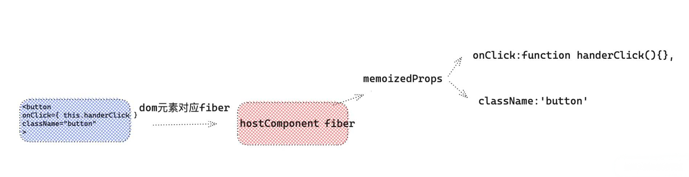

第二步，React在调合子节点后，进入diff阶段，如果判断是`HostComponent`(dom元素)类型的fiber，会用diff props函数`diffProperties`单独处理。

> react-dom/src/client/ReactDOMComponent.js

````js
function diffProperties(){
    /* 判断当前的 propKey 是不是 React合成事件 */
    if(registrationNameModules.hasOwnProperty(propKey)){
         /* 这里多个函数简化了，如果是合成事件， 传入成事件名称 onClick ，向document注册事件  */
         legacyListenToEvent(registrationName, document）;
    }
}
````
`diffProperties`函数在 `diff props` 如果发现是合成事件(`onClick`) 就会调用`legacyListenToEvent`函数。注册事件监听器。

### 2 legacyListenToEvent 注册事件监听器

> react-dom/src/events/DOMLegacyEventPluginSystem.js
````js
//  registrationName -> onClick 事件
//  mountAt -> document or container
function legacyListenToEvent(registrationName，mountAt){
   const dependencies = registrationNameDependencies[registrationName]; // 根据 onClick 获取  onClick 依赖的事件数组 [ 'click' ]。
    for (let i = 0; i < dependencies.length; i++) {
    const dependency = dependencies[i];
    //这个经过多个函数简化，如果是 click 基础事件，会走 legacyTrapBubbledEvent ,而且都是按照冒泡处理
     legacyTrapBubbledEvent(dependency, mountAt);
  }
}
````
legacyTrapBubbledEvent 就是执行将绑定真正的dom事件的函数 legacyTrapBubbledEvent(冒泡处理)。
````js
function legacyTrapBubbledEvent(topLevelType,element){
   addTrappedEventListener(element,topLevelType,PLUGIN_EVENT_SYSTEM,false)
}

````
第三步： 在`legacyListenToEvent`函数中，先找到 `React` 合成事件对应的原生事件集合，比如 onClick -> ['click'] , onChange -> [`blur` , `change` , `input` , `keydown` , `keyup`]，然后遍历依赖项的数组，绑定事件，**这就解释了，为什么我们在刚开始的demo中，只给元素绑定了一个`onChange`事件，结果在`document`上出现很多事件监听器的原因，就是在这个函数上处理的。**


 我们上面已经透露了React是采用事件绑定，`React` 对于 `click` 等基础事件，会默认按照事件冒泡阶段的事件处理，**不过这也不绝对的，比如一些事件的处理，有些特殊的事件是按照事件捕获处理的。**

````js
case TOP_SCROLL: {                                // scroll 事件
    legacyTrapCapturedEvent(TOP_SCROLL, mountAt); // legacyTrapCapturedEvent 事件捕获处理。
    break;
}
case TOP_FOCUS: // focus 事件
case TOP_BLUR:  // blur 事件
legacyTrapCapturedEvent(TOP_FOCUS, mountAt);
legacyTrapCapturedEvent(TOP_BLUR, mountAt);
break;
````
### 3 绑定 dispatchEvent，进行事件监听

如上述的`scroll`事件，`focus` 事件 ，`blur`事件等，是默认按照事件捕获逻辑处理。接下来就是最重要关键的一步。React是如何绑定事件到`document`？ 事件处理函数函数又是什么？问题都指向了上述的`addTrappedEventListener`，让我们来揭开它的面纱。

````js
/*
  targetContainer -> document
  topLevelType ->  click
  capture = false
*/
function addTrappedEventListener(targetContainer,topLevelType,eventSystemFlags,capture){
   const listener = dispatchEvent.bind(null,topLevelType,eventSystemFlags,targetContainer) 
   if(capture){
       // 事件捕获阶段处理函数。
   }else{
       /* TODO: 重要, 这里进行真正的事件绑定。*/
      targetContainer.addEventListener(topLevelType,listener,false) // document.addEventListener('click',listener,false)
   }
}
````

第四步： 这个函数内容虽然不多，但是却非常重要,首先绑定我们的事件统一处理函数 `dispatchEvent`，绑定几个默认参数，事件类型 `topLevelType` demo中的`click` ，还有绑定的容器`doucment`。**然后真正的事件绑定,添加事件监听器`addEventListener`。** 事件绑定阶段完毕。


### 4 事件绑定过程总结

我们来做一下事件绑定阶段的总结。

* ① 在React，diff DOM元素类型的fiber的props的时候， 如果发现是React合成事件，比如`onClick`，会按照事件系统逻辑单独处理。
* ② 根据React合成事件类型，找到对应的原生事件的类型，然后调用判断原生事件类型，大部分事件都按照冒泡逻辑处理，少数事件会按照捕获逻辑处理（比如`scroll`事件）。
* ③ 调用 addTrappedEventListener 进行真正的事件绑定，绑定在`document`上，`dispatchEvent` 为统一的事件处理函数。
* ④ **有一点值得注意: 只有上述那几个特殊事件比如 `scorll`,`focus`,`blur`等是在事件捕获阶段发生的，其他的都是在事件冒泡阶段发生的，无论是`onClick`还是`onClickCapture`都是发生在冒泡阶段**，至于 React 本身怎么处理捕获逻辑的。我们接下来会讲到。


# 四 事件触发-一次点击事件，在`react`底层系统会发生什么？

````js
<div>
  <button onClick={ this.handerClick }  className="button" >点击</button>
</div>
````

还是上面这段代码片段，当点击一下按钮，在 `React` 底层会发生什么呢？接下来，让我共同探索事件触发的奥秘。

## 事件触发处理函数 dispatchEvent

我们在事件绑定阶段讲过，React事件注册时候，统一的监听器`dispatchEvent`，也就是当我们**点击按钮之后，首先执行的是`dispatchEvent`函数**，因为`dispatchEvent`前三个参数已经被bind了进去，所以真正的事件源对象`event`，被默认绑定成第四个参数。

> react-dom/src/events/ReactDOMEventListener.js
````js
function dispatchEvent(topLevelType,eventSystemFlags,targetContainer,nativeEvent){
    /* 尝试调度事件 */
    const blockedOn = attemptToDispatchEvent( topLevelType,eventSystemFlags, targetContainer, nativeEvent);
}
````

````js
/*
topLevelType -> click
eventSystemFlags -> 1
targetContainer -> document
nativeEvent -> 原生事件的 event 对象
*/
function attemptToDispatchEvent(topLevelType,eventSystemFlags,targetContainer,nativeEvent){
    /* 获取原生事件 e.target */
    const nativeEventTarget = getEventTarget(nativeEvent)
    /* 获取当前事件，最近的dom类型fiber ，我们 demo中 button 按钮对应的 fiber */
    let targetInst = getClosestInstanceFromNode(nativeEventTarget); 
    /* 重要：进入legacy模式的事件处理系统 */
    dispatchEventForLegacyPluginEventSystem(topLevelType,eventSystemFlags,nativeEvent,targetInst,);
    return null;
}
````
在这个阶段主要做了这几件事：

* ① 首先根据真实的事件源对象，找到 `e.target` 真实的 `dom` 元素。
* ② 然后根据`dom`元素，找到与它对应的 `fiber` 对象`targetInst`，在我们 `demo` 中，找到 `button` 按钮对应的 `fiber`。 
* ③ 然后正式进去`legacy`模式的事件处理系统，也就是我们目前用的React模式都是`legacy`模式下的，在这个模式下，批量更新原理，即将拉开帷幕。

这里有一点问题，**`React`怎么样通过原生的`dom`元素，找到对应的`fiber`的呢？** ，也就是说 `getClosestInstanceFromNode` 原理是什么？

答案是首先 `getClosestInstanceFromNode` 可以找到当前传入的 `dom` 对应的最近的元素类型的 `fiber` 对象。`React` 在初始化真实 `dom` 的时候，用一个随机的 `key internalInstanceKey`  指针指向了当前`dom`对应的`fiber`对象，`fiber`对象用`stateNode`指向了当前的`dom`元素。

````js
// 声明随机key
var internalInstanceKey = '__reactInternalInstance$' + randomKey;

// 使用随机key 
function getClosestInstanceFromNode(targetNode){
  // targetNode -dom  targetInst -> 与之对应的fiber对象
  var targetInst = targetNode[internalInstanceKey];
}
````
**在谷歌调试器上看**

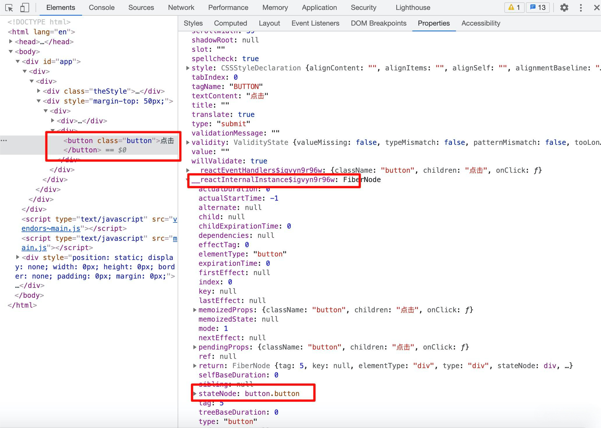

**两者关系图**


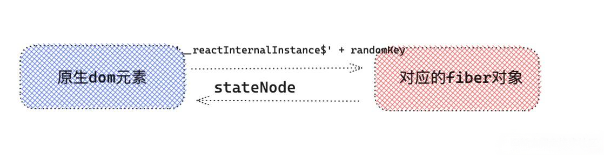

## legacy 事件处理系统与批量更新

> react-dom/src/events/DOMLegacyEventPluginSystem.js

````js
/* topLevelType - click事件 ｜ eventSystemFlags = 1 ｜ nativeEvent = 事件源对象  ｜ targetInst = 元素对应的fiber对象  */
function dispatchEventForLegacyPluginEventSystem(topLevelType,eventSystemFlags,nativeEvent,targetInst){
    /* 从React 事件池中取出一个，将 topLevelType ，targetInst 等属性赋予给事件  */
    const bookKeeping = getTopLevelCallbackBookKeeping(topLevelType,nativeEvent,targetInst,eventSystemFlags);
    try { /* 执行批量更新 handleTopLevel 为事件处理的主要函数 */
    batchedEventUpdates(handleTopLevel, bookKeeping);
  } finally {
    /* 释放事件池 */  
    releaseTopLevelCallbackBookKeeping(bookKeeping);
  }
}
````

对于v16事件池，我们接下来会讲到，首先 `batchedEventUpdates`为批量更新的主要函数。我们先来看看`batchedEventUpdates`

> react-dom/src/events/ReactDOMUpdateBatching.js

````js
export function batchedEventUpdates(fn,a){
    isBatchingEventUpdates = true;
    try{
       fn(a) // handleTopLevel(bookKeeping)
    }finally{
        isBatchingEventUpdates = false
    }
}
````
批量更新简化成如上的样子，从上面我们可以看到，React通过开关`isBatchingEventUpdates`来控制是否启用批量更新。`fn(a)`，事件上调用的是 `handleTopLevel(bookKeeping)` ，由于js是单线程的，我们真正在组件中写的事件处理函数，比如demo 的 `handerClick`实际执行是在`handleTopLevel(bookKeeping)`中执行的。所以如果我们在`handerClick`里面触发`setState`，那么就能读取到` isBatchingEventUpdates = true`这就是React的合成事件为什么具有批量更新的功能了。比如我们这么写

````js
state={number:0}
handerClick = () =>{
    this.setState({number: this.state.number + 1   })
    console.log(this.state.number) //0
    this.setState({number: this.state.number + 1   })
    console.log(this.state.number) //0
    setTimeout(()=>{
        this.setState({number: this.state.number + 1   })
        console.log(this.state.number) //2
        this.setState({number: this.state.number + 1   })
        console.log(this.state.number)// 3
    })
}
````

如上述所示，第一个`setState`和第二个`setState`在批量更新条件之内执行，所以打印不会是最新的值，但是如果是发生在`setTimeout`中,由于eventLoop 放在了下一次事件循环中执行，此时 batchedEventUpdates 中已经执行完`isBatchingEventUpdates = false`，所以批量更新被打破，我们就可以直接访问到最新变化的值了。

接下来我们有两点没有梳理：
* 一是React事件池概念
* 二是最后的线索是执行`handleTopLevel(bookKeeping)`，那么`handleTopLevel`到底做了写什么。

## 执行事件插件函数

上面说到整个事件系统，最后指向函数 `handleTopLevel(bookKeeping)` 那么 `handleTopLevel` 到底做了什么事情？

````js
// 流程简化后
// topLevelType - click  
// targetInst - button Fiber
// nativeEvent
function handleTopLevel(bookKeeping){
    const { topLevelType,targetInst,nativeEvent,eventTarget, eventSystemFlags} = bookKeeping
    for(let i=0; i < plugins.length;i++ ){
        const possiblePlugin = plugins[i];
        /* 找到对应的事件插件，形成对应的合成event，形成事件执行队列  */
        const  extractedEvents = possiblePlugin.extractEvents(topLevelType,targetInst,nativeEvent,eventTarget,eventSystemFlags)  
    }
    if (extractedEvents) {
        events = accumulateInto(events, extractedEvents);
    }
    /* 执行事件处理函数 */
    runEventsInBatch(events);
}
````
我把整个流程简化，只保留了核心的流程，`handleTopLevel`最后的处理逻辑就是执行我们说的事件处理插件(SimpleEventPlugin)中的处理函数`extractEvents`，比如我们demo中的点击事件 onClick 最终走的就是 `SimpleEventPlugin` 中的 `extractEvents` 函数，那么React为什么这么做呢? 我们知道我们React是采取事件合成，事件统一绑定，并且我们写在组件中的事件处理函数( handerClick )，也不是真正的执行函数`dispatchAciton`，那么我们在`handerClick`的事件对象 `event`,也是React单独合成处理的，里面单独封装了比如 `stopPropagation`和`preventDefault`等方法，**这样的好处是，我们不需要跨浏览器单独处理兼容问题，交给React底层统一处理。**

## extractEvents 形成事件对象event 和 事件处理函数队列


**重点来了！重点来了！重点来了！**，extractEvents 可以作为整个事件系统核心函数，我们先回到最初的`demo`，如果我们这么写,那么四个回调函数，那么点击按钮，四个事件是如何处理的呢。首先如果点击按钮，最终走的就是`extractEvents`函数，一探究竟这个函数。

> legacy-events/SyntheticEvent.js

````js
const  SimpleEventPlugin = {
    extractEvents:function(topLevelType,targetInst,nativeEvent,nativeEventTarget){
        const dispatchConfig = topLevelEventsToDispatchConfig.get(topLevelType);
        if (!dispatchConfig) {
            return null;
        }
        switch(topLevelType){
            default:
            EventConstructor = SyntheticEvent;
            break;
        }
        /* 产生事件源对象 */
        const event = EventConstructor.getPooled(dispatchConfig,targetInst,nativeEvent,nativeEventTarget)
        const phasedRegistrationNames = event.dispatchConfig.phasedRegistrationNames;
        const dispatchListeners = [];
        const {bubbled, captured} = phasedRegistrationNames; /* onClick / onClickCapture */
        const dispatchInstances = [];
        /* 从事件源开始逐渐向上，查找dom元素类型HostComponent对应的fiber ，收集上面的React合成事件，onClick / onClickCapture  */
         while (instance !== null) {
              const {stateNode, tag} = instance;
              if (tag === HostComponent && stateNode !== null) { /* DOM 元素 */
                   const currentTarget = stateNode;
                   if (captured !== null) { /* 事件捕获 */
                        /* 在事件捕获阶段,真正的事件处理函数 */
                        const captureListener = getListener(instance, captured);
                        if (captureListener != null) {
                        /* 对应发生在事件捕获阶段的处理函数，逻辑是将执行函数unshift添加到队列的最前面 */
                            dispatchListeners.unshift(captureListener);
                            dispatchInstances.unshift(instance);
                            dispatchCurrentTargets.unshift(currentTarget);
                        }
                    }
                    if (bubbled !== null) { /* 事件冒泡 */
                        /* 事件冒泡阶段，真正的事件处理函数，逻辑是将执行函数push到执行队列的最后面 */
                        const bubbleListener = getListener(instance, bubbled);
                        if (bubbleListener != null) {
                            dispatchListeners.push(bubbleListener);
                            dispatchInstances.push(instance);
                            dispatchCurrentTargets.push(currentTarget);
                        }
                    }
              }
              instance = instance.return;
         }
          if (dispatchListeners.length > 0) {
              /* 将函数执行队列，挂到事件对象event上 */
            event._dispatchListeners = dispatchListeners;
            event._dispatchInstances = dispatchInstances;
            event._dispatchCurrentTargets = dispatchCurrentTargets;
         }
        return event
    }
}

````


事件插件系统的核心`extractEvents`主要做的事是:

* ① 首先形成`React`事件独有的合成事件源对象，这个对象，保存了整个事件的信息。将作为参数传递给真正的事件处理函数(handerClick)。
* ② 然后声明事件执行队列 ，按照`冒泡`和`捕获`逻辑，从事件源开始逐渐向上，查找dom元素类型HostComponent对应的fiber ，收集上面的 `React` 合成事件，例如 `onClick` / `onClickCapture` ，对于冒泡阶段的事件(`onClick`)，将 `push` 到执行队列后面 ， 对于捕获阶段的事件(`onClickCapture`)，将 `unShift`到执行队列的前面。
* ③ 最后将事件执行队列，保存到React事件源对象上。等待执行。

举个例子比如如下

````js
handerClick = () => console.log(1)
handerClick1 = () => console.log(2)
handerClick2 = () => console.log(3) 
handerClick3= () => console.log(4)
render(){
    return <div onClick={ this.handerClick2 } onClickCapture={this.handerClick3}  > 
        <button onClick={ this.handerClick }  onClickCapture={ this.handerClick1  }  className="button" >点击</button>
    </div>
}
````
打印 // 4  2  1  3

看到这里我们应该知道上述函数打印顺序为什么了吧，首先遍历 `button` 对应的fiber，首先遇到了 `onClickCapture` ,将 `handerClick1`  放到了数组最前面，然后又把`onClick`对应`handerClick`的放到数组的最后面，形成的结构是`[ handerClick1 , handerClick ]` ， 然后向上遍历，遇到了`div`对应fiber,将`onClickCapture`对应的`handerClick3`放在了数组前面，将`onClick`对应的 `handerClick2` 放在了数组后面，形成的结构 `[ handerClick3,handerClick1 , handerClick,handerClick2 ]` ,所以执行的顺序 // 4  2  1  3，就是这么简单，完美！


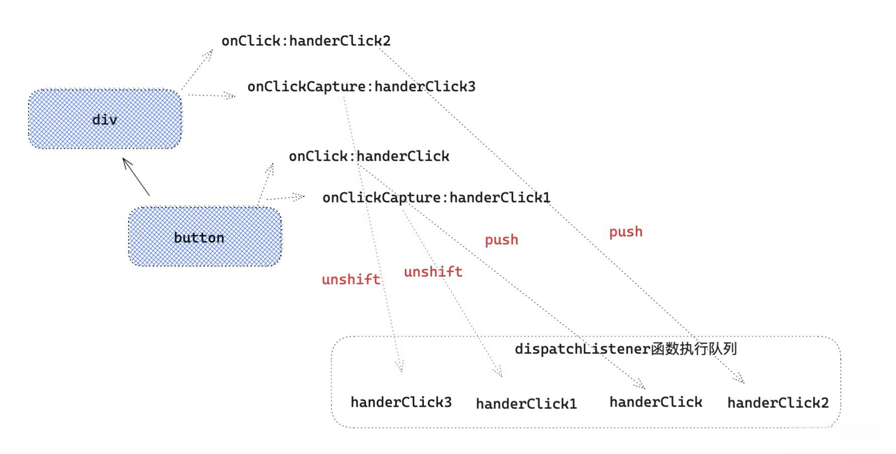


## 事件触发

有的同学可能好奇React的事件源对象是什么样的，以上面代码中`SyntheticEvent`为例子我们一起来看看：

> legacy-events/SyntheticEvent.js/

````js
function SyntheticEvent( dispatchConfig,targetInst,nativeEvent,nativeEventTarget){
  this.dispatchConfig = dispatchConfig;
  this._targetInst = targetInst;
  this.nativeEvent = nativeEvent;
  this._dispatchListeners = null;
  this._dispatchInstances = null;
  this._dispatchCurrentTargets = null;
  this.isPropagationStopped = () => false; /* 初始化，返回为false  */

}
SyntheticEvent.prototype={
    stopPropagation(){ this.isPropagationStopped = () => true;  }, /* React单独处理，阻止事件冒泡函数 */
    preventDefault(){ },  /* React单独处理，阻止事件捕获函数  */
    ...
}
````

在 `handerClick` 中打印 `e` :


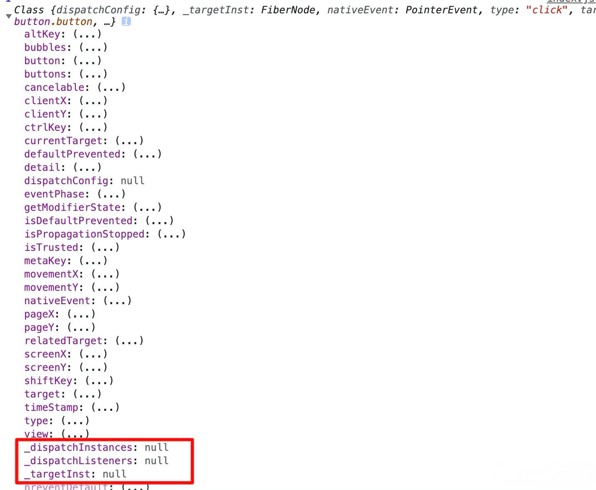

既然事件执行队列和事件源对象都形成了，接下来就是最后一步**事件触发**了。上面大家有没有注意到一个函数`runEventsInBatch`，所有事件绑定函数，就是在这里触发的。让我们一起看看。

> legacy-events/EventBatching.js

````js
function runEventsInBatch(){
    const dispatchListeners = event._dispatchListeners;
    const dispatchInstances = event._dispatchInstances;
    if (Array.isArray(dispatchListeners)) {
    for (let i = 0; i < dispatchListeners.length; i++) {
      if (event.isPropagationStopped()) { /* 判断是否已经阻止事件冒泡 */
        break;
      }
      
      dispatchListeners[i](event)
    }
  }
  /* 执行完函数，置空两字段 */
  event._dispatchListeners = null;
  event._dispatchInstances = null;
}
````


`dispatchListeners[i](event)`就是执行我们的事件处理函数比如`handerClick`,从这里我们知道，**我们在事件处理函数中，返回 false ，并不会阻止浏览器默认行为**。

````js
handerClick(){ //并不能阻止浏览器默认行为。
    return false
}
````
应该改成这样：


````js
handerClick(e){
    e.preventDefault()
}
````

另一方面React对于阻止冒泡，就是通过isPropagationStopped，判断是否已经阻止事件冒泡。如果我们在事件函数执行队列中，某一会函数中，调用`e.stopPropagation()`，就会赋值给`isPropagationStopped=()=>true`，当再执行 `e.isPropagationStopped()`就会返回 `true` ,接下来事件处理函数，就不会执行了。

## 其他概念-事件池

````js
 handerClick = (e) => {
    console.log(e.target) // button 
    setTimeout(()=>{
        console.log(e.target) // null
    },0)
}
````
对于一次点击事件的处理函数，在正常的函数执行上下文中打印`e.target`就指向了`dom`元素，但是在`setTimeout`中打印却是`null`，如果这不是React事件系统，两次打印的应该是一样的，但是为什么两次打印不一样呢？ **因为在React采取了一个事件池的概念，每次我们用的事件源对象，在事件函数执行之后，可以通过`releaseTopLevelCallbackBookKeeping`等方法将事件源对象释放到事件池中，这样的好处每次我们不必再创建事件源对象，可以从事件池中取出一个事件源对象进行复用，在事件处理函数执行完毕后,会释放事件源到事件池中，清空属性，这就是`setTimeout`中打印为什么是`null`的原因了。**


## 事件触发总结

我把事件触发阶段做的事总结一下：

* **①首先通过统一的事件处理函数 `dispatchEvent`,进行批量更新batchUpdate。** 

* **②然后执行事件对应的处理插件中的`extractEvents`，合成事件源对象,每次React会从事件源开始，从上遍历类型为 hostComponent即 dom类型的fiber,判断props中是否有当前事件比如onClick,最终形成一个事件执行队列，React就是用这个队列，来模拟事件捕获->事件源->事件冒泡这一过程。**

* **③最后通过`runEventsInBatch`执行事件队列，如果发现阻止冒泡，那么break跳出循环，最后重置事件源，放回到事件池中，完成整个流程。**


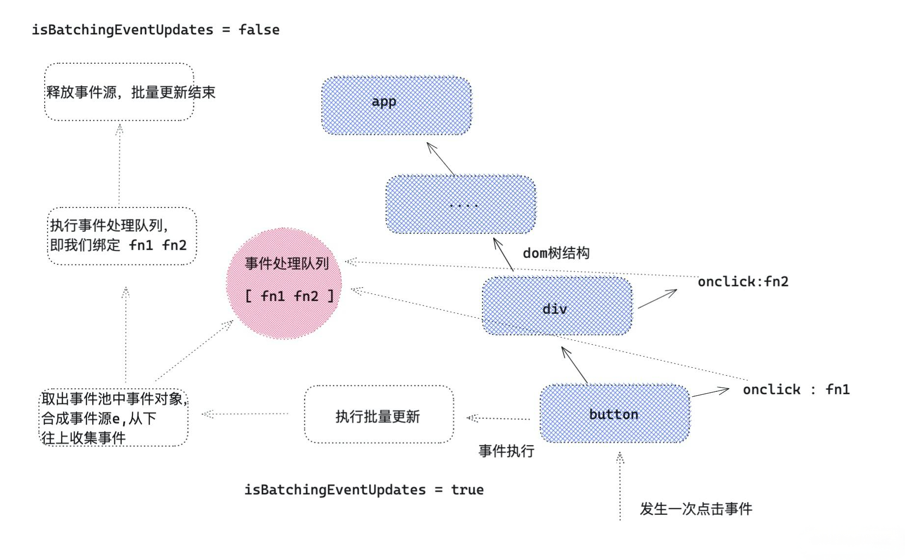


# 五 关于react v17版本的事件系统

React v17 整体改动不是很大，但是事件系统的改动却不小，首先上述的很多执行函数，在v17版本不复存在了。我来简单描述一下v17事件系统的改版。

 **1 事件统一绑定container上，ReactDOM.render(app， container);而不是document上，这样好处是有利于微前端的，微前端一个前端系统中可能有多个应用，如果继续采取全部绑定在`document`上，那么可能多应用下会出现问题。**


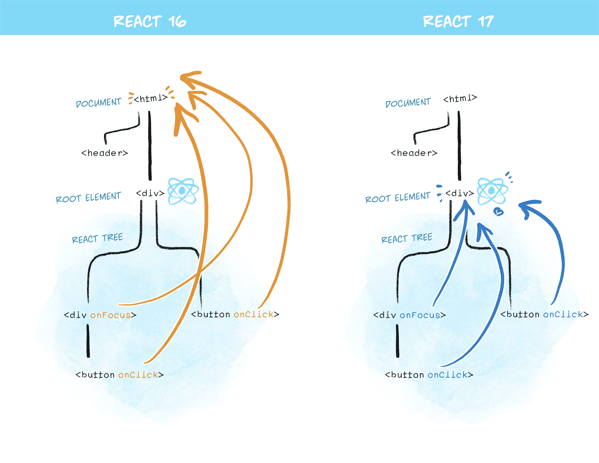

 **2 对齐原生浏览器事件**

`React 17 `中终于支持了原生捕获事件的支持， 对齐了浏览器原生标准。同时 `onScroll` 事件不再进行事件冒泡。`onFocus` 和 `onBlur` 使用原生 `focusin`， `focusout` 合成。

**3 取消事件池**
`React 17 `取消事件池复用，也就解决了上述在`setTimeout`打印，找不到`e.target`的问题。


# 六 总结

本文从**事件合成**，**事件绑定**，**事件触发**三个方面详细介绍了React事件系统原理，希望大家能通过这篇文章更加深入了解v16 React 事件系统，如果有疑问和不足之处，也希望大家能在评论区指出。

最后, 送人玫瑰，手留余香，觉得有收获的朋友可以给笔者**点赞，关注**一波 ，陆续更新前端超硬核文章。

提前透漏：接下来会出一部揭秘`react`调度系统的文章。感兴趣的同学请关注公众号 **前端Sharing**  第一时间更新前端硬文。

## 往期react文章

**React进阶系列**

* [「react进阶」一文吃透react-hooks原理](https://juejin.cn/post/6944863057000529933) `880+`👍

* [「React进阶」 React全部api解读+基础实践大全(夯实基础2万字总结)](https://juejin.cn/post/6950063294270930980) `1580+`👍

* [「react进阶」年终送给react开发者的八条优化建议](https://juejin.cn/post/6908895801116721160)  `950+` 👍 

* [「react进阶」一文吃透React高阶组件(HOC)](https://juejin.cn/post/6940422320427106335) `353+` 👍

## 参考文档

* [react源码](https://github.com/facebook/react)

* [React 事件系统工作原理](https://juejin.cn/post/6909271104440205326)
