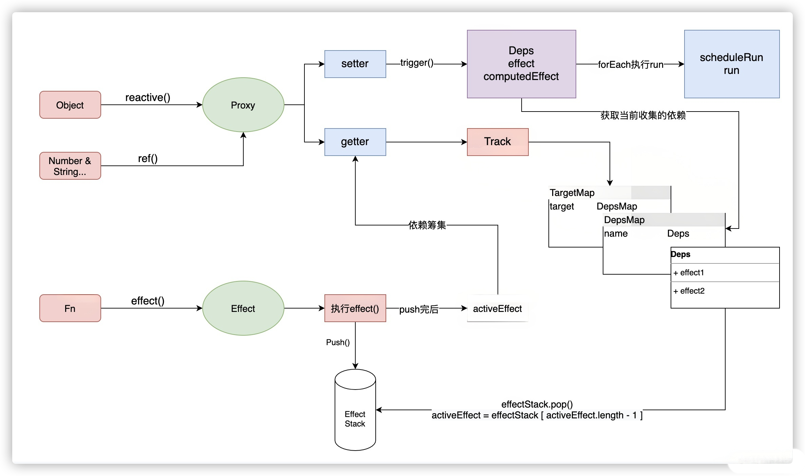
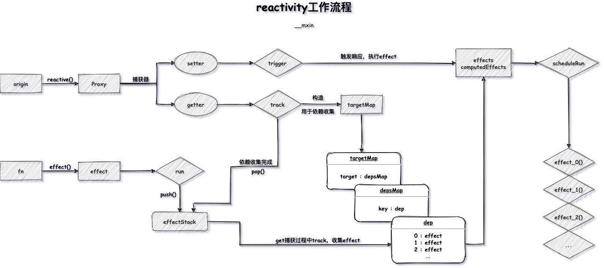
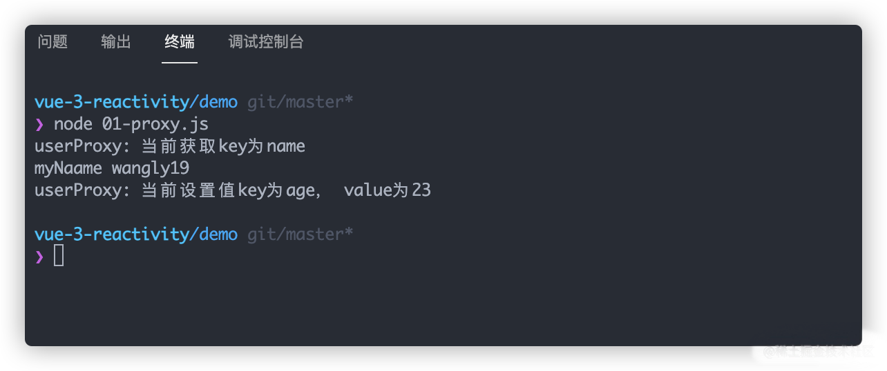
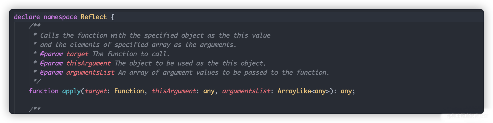
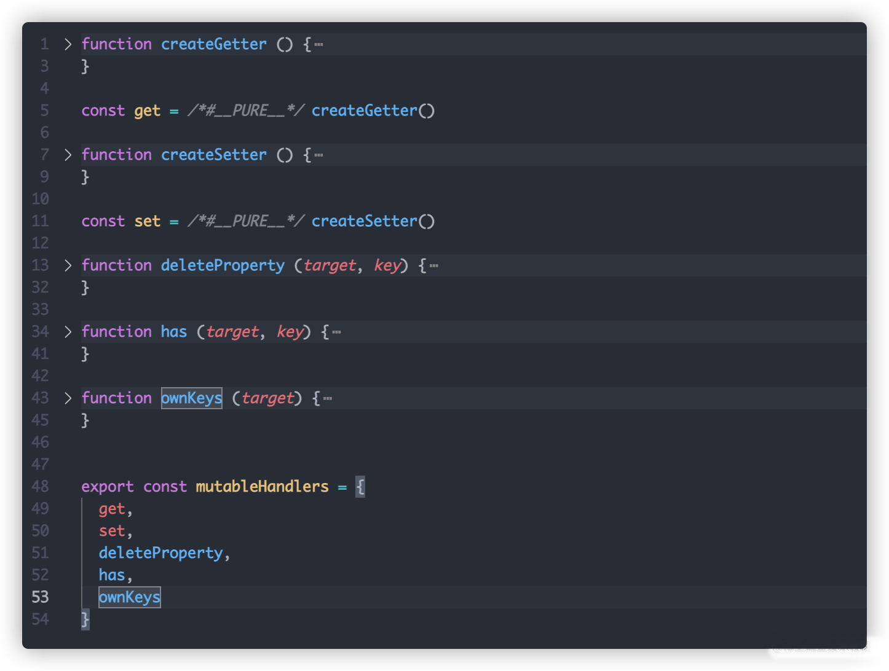
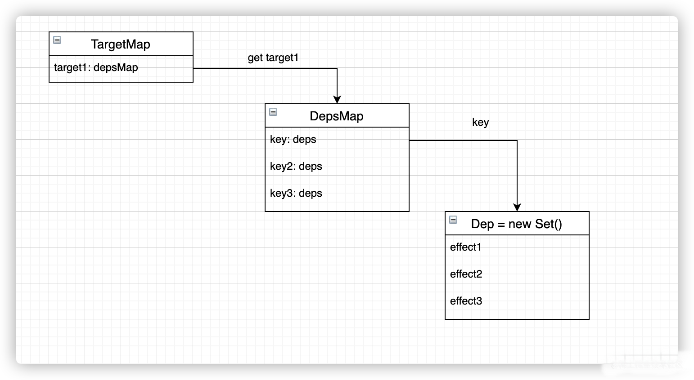
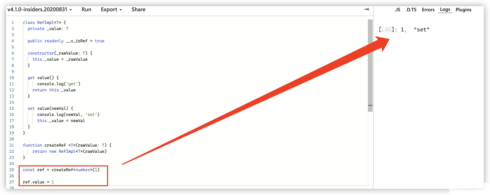

# Vue3 Reactivity数据响应式原理解析




> 基本差不多了，图有点小丑，也可以看别人比较全的图。[@mxin](https://juejin.cn/post/6871164853751873550)




## 基础篇

在开始之前，如果不了解`ES6`出现的一些`高阶api`，如，`Proxy`, `Reflect`, `WeakMap`, `WeakSet`,`Map`, `Set`等等可以自行翻阅到资源章节，先了解前置知识点在重新观看为最佳。

### Proxy

在`@vue/reactivity`中，`Proxy`是整个调度的基石。

通过`Proxy`代理对象，才能够在`get`, `set`方法中完成后续的事情，比如`依赖收集`，`effect`，`track`, `trigger`等等操作，在这里就不详细展开，后续会详细展开叙述。

> 如果有同学迫不及待，加上天资聪慧，`ES6`有一定基础，可以直接跳转到原理篇进行观看和思考。

先来手写一个简单的`Proxy`。在其中`handleCallback`中写了了`set`, `get`两个方法，又来拦截当前属性值变化的数据监听。先上代码：

```js
const user = {
  name: 'wangly19',
  age: 22,
  description: '一名掉头发微乎其微的前端小哥。'
}

const userProxy = new Proxy(user, {
  get(target, key) {
    console.log(`userProxy: 当前获取key为${key}`)
    if (target.hasOwnProperty(key)) return target[key]
    return {
    }
  },
  set(target, key, value) {
    console.log(`userProxy: 当前设置值key为${key}， value为${value}`)
    let isWriteSuccess = false
    if (target.hasOwnProperty(key)) {
      target[key] = value
      isWriteSuccess = true
    }
    return isWriteSuccess
  }
})

console.log('myNaame', userProxy.name)

userProxy.age = 23
```

当我们在对值去进行赋值修改和打印的时候，分别触发了当前的`set`和`get`方法。

这一点非常重要，对于其他的一些属性和使用方法在这里就不过多的赘述，




###  Reflect

`Reflect`并不是一个类，是一个内置的对象。这一点呢大家要知悉，不要直接`实例化(new)`使用，它的功能比较和`Proxy`的`handles`有点类似，在这一点基础上又添加了很多`Object`的方法。

> 在这里我们不去深究`Reflect`,如果想要深入了解功能的同学，可以在后续资源中找到对应地址进行学习。在本章主要介绍了通过`Reflect`安全的操作对象。



以下是对`user`对象的一些`修改`操作的实例，可以参考一下，在后续可能会用到。

```js
const user = {
  name: 'wangly19',
  age: 22,
  description: '一名掉头发微乎其微的前端小哥。'
}

console.log('change age before' , Reflect.get(user, 'age'))

const hasChange = Reflect.set(user, 'age', 23)
console.log('set user age is done? ', hasChange ? 'yes' : 'no')

console.log('change age after' , Reflect.get(user, 'age'))

const hasDelete = Reflect.deleteProperty(user, 'age')

console.log('delete user age is done?', hasDelete ? 'yes' : 'none')

console.log('delete age after' , Reflect.get(user, 'age'))
```


## 原理篇

当了解了前置的一些知识后，就要开始`@vue/reactivity`的源码解析篇章了。下面开始会以简单的思路来实现一个基础的`reactivity`，当你了解其本质原理后，你会对`@vue/reactivity`的`依赖收集(track)`和`触发更新(trigger)`，以及`副作用(effect)`究竟是什么工作。

### reactive

`reactive`是`vue3`中用于生成`引用类型`的`api`。

```js
const user = reactive({
  name: 'wangly19',
  age: 22,
  description: '一名掉头发微乎其微的前端小哥。'
})
```
那么往函数内部看看，`reactive`方法究竟做了什么？

在内部，对传入的对象进行了一个`target`的只读判断，如果你传入的`target`是一个只读代理的话，会直接返回掉。对于正常进行`reactive`的话则是返回了`createReactiveObject`方法的值。

```ts
export function reactive(target: object) {
  // if trying to observe a readonly proxy, return the readonly version.
  if (target && (target as Target)[ReactiveFlags.IS_READONLY]) {
    return target
  }
  return createReactiveObject(
    target,
    false,
    mutableHandlers,
    mutableCollectionHandlers,
    reactiveMap
  )
}
```

#### createReactiveObject

在`createReactiveObject`中，做的事情就是为`target`添加一个`proxy`代理。这是其核心，`reactive`最终拿到的是一个`proxy`代理，参考`Proxy`章节的简单事例就可以知道`reactive`是如何进行工作的了，那么在来看下`createReactiveObject`做了一些什么事情。

首先先判断当前`target`的类型，如果不符合要求，直接抛出警告并且返回原来的值。

```
if (!isObject(target)) {
    if (__DEV__) {
      console.warn(`value cannot be made reactive: ${String(target)}`)
    }
    return target
  }
```

其次判断当前对象是否已经被代理且并不是只读的，那么本身就是一个代理对象，那么就没有必要再去进行代理了，直接将其当作返回值返回，避免重复代理。

```ts
if (
    target[ReactiveFlags.RAW] &&
    !(isReadonly && target[ReactiveFlags.IS_REACTIVE])
  ) {
    return target
  }
```
对于这些判断代码来说，阅读起来并不是很困难，注意`if ()`中判断的条件，看看它做了一些什么动作即可。而`createReactiveObject`做的最重要的事情就是创建`target`的`proxy`, 并将其放到`Map`中记录。

而比较有意思的是其中对传入的`target`调用了不同的`proxy handle`。那么就一起来看看`handles`中究竟干了一些什么吧。

```ts
const proxy = new Proxy(
    target,
    targetType === TargetType.COLLECTION ? collectionHandlers : baseHandlers
  )
  proxyMap.set(target, proxy)
  return proxy
```

#### handles的类型

在对象类型中，将`Object`和`Array`与`Map`,`Set`, `WeakMap`,`WeakSet`区分开来了。它们调用的是不同的`Proxy Handle`。

- `baseHandlers.ts`： `Object` & `Array`会调用此文件下的`mutableHandlers`对象作为`Proxy Handle`。
- `collectionHandlers.ts`：`Map`,`Set`, `WeakMap`,`WeakSet`会调用此文件下的`mutableCollectionHandlers`对象作为`Proxy Handle`。

```ts
/**
 * 对象类型判断
 * @lineNumber 41
 */
function targetTypeMap(rawType: string) {
  switch (rawType) {
    case 'Object':
    case 'Array':
      return TargetType.COMMON
    case 'Map':
    case 'Set':
    case 'WeakMap':
    case 'WeakSet':
      return TargetType.COLLECTION
    default:
      return TargetType.INVALID
  }
}
```
会在`new Proxy`的根据返回的`targetType`判断。

```ts
const proxy = new Proxy(
  target,
  targetType === TargetType.COLLECTION ? collectionHandlers : baseHandlers
)
```

> 由于篇幅有限，下文中只举例`mutableHandlers`当作分析的参考。当理解`mutableHandlers`后对于`collectionHandlers`只是时间的问题。

### Proxy Handle

在上面说到了根据不同的`Type`调用不同的`handle`，那么一起来看看`mutableHandlers`究竟做了什么吧。

在基础篇中，都知道`Proxy`可以接收一个配置对象，其中我们演示了`get`和`set`的属性方法。而`mutableHandlers`就是何其相同意义的事情，在内部分别定义`get`, `set`, `deleteProperty`, `has`, `oneKeys`等多个属性参数，如果不知道什么含义的话，可以看下`Proxy Mdn`。在这里你需要理解`被监听的数据`
只要发生`增查删改`后，绝大多数都会进入到对应的回执通道里面。



在这里，我们用简单的`get`, `set`来进行简单的模拟实例。

```js
function createGetter () {
    return (target, key, receiver) => {
      const result = Reflect.get(target, key, receiver)
      track(target, key)
      return result
    }
}

const get = /*#__PURE__*/ createGetter()

function createSetter () {
  
  return (target, key, value, receiver) => {
    const oldValue = target[key]
  const result = Reflect.set(target, key, value, receiver)
  if (result && oldValue != value) {
    trigger(target, key)
  }
  return result
  }
}
```

在`get`的时候会进行一个`track`的依赖收集，而`set`的时候则是触发`trigger`的触发机制。在`vue3`，而`trigger`和`track`的话都是在我们`effect.ts`当中声明的，那么接下来就来看看`依赖收集`和`响应触发`究竟做了一些什么吧。

### Effect

对于整个effect模块，将其分为三个部分来去阅读：

- `effect`： 副作用函数
- `teack`: 依赖收集，在`proxy`代理数据`get`时调用
- `trigger`: 触发响应，在`proxy`代理数据发生变化的时候调用。

#### effect

通过一段实例来看下`effect`的使用，并且了解它主要参数是一个函数。在函数内部会帮你执行一些副作用记录和特性判断。

```
effect(() => {
    proxy.user = 1
})
```

来看看`vue`的`effect`干了什么？

在这里，首先判断当前参数`fn`是否是一个`effect`，如果是的话就将`raw`中存放的`fn`进行替换。然后重新进行`createReactiveEffect`生成。

```ts
export function effect<T = any>(
  fn: () => T,
  options: ReactiveEffectOptions = EMPTY_OBJ
): ReactiveEffect<T> {
  if (isEffect(fn)) {
    fn = fn.raw
  }
  const effect = createReactiveEffect(fn, options)
  if (!options.lazy) {
    effect()
  }
  return effect
}

```

在`createReactiveEffect`会将我们`effect`推入到`effectStack`中进行入栈操作，然后用`activeEffect`进行存取当前执行的`effect`，在执行完后会将其进行`出栈`。同时替换`activeEffect`为新的栈顶。

而在`effect`执行的过程中就会触发`proxy handle`然后`track`和`trigger`两个关键的函数。

```
function createReactiveEffect<T = any>(
  fn: () => T,
  options: ReactiveEffectOptions
): ReactiveEffect<T> {
  const effect = function reactiveEffect(): unknown {
    if (!effect.active) {
      return options.scheduler ? undefined : fn()
    }
    if (!effectStack.includes(effect)) {
      cleanup(effect)
      try {
        enableTracking()
        effectStack.push(effect)
        activeEffect = effect
        return fn()
      } finally {
        effectStack.pop()
        resetTracking()
        activeEffect = effectStack[effectStack.length - 1]
      }
    }
  } as ReactiveEffect
  effect.id = uid++
  effect.allowRecurse = !!options.allowRecurse
  effect._isEffect = true
  effect.active = true
  effect.raw = fn
  effect.deps = []
  effect.options = options
  return effect
}
```
来看一个简版的`effect`，抛开大多数代码包袱，下面的代码是不是清晰很多。

```js
function effect(eff) {
  try {
    effectStack.push(eff)
    activeEffect = eff
    return eff(...argsument)
    
  } finally {
    effectStack.pop()
    activeEffect = effectStack[effectStack.length  - 1]
  }
}
```

#### track(依赖收集)

在`track`的时候，会进行我们所熟知的依赖收集，会将当前`activeEffect`添加到`dep`里面，而说起这一类的关系。它会有一个一对多对多的关系。




从代码看也非常的清晰，首先我们会有一个一个总的`targetMap`它是一个`WeakMap`，`key`是`target(代理的对象)`, `value`是一个`Map`，称之为`depsMap`，它是用于管理当前`target`中每个`key`的`deps`也就是副作用依赖，也就是以前熟知的`depend`。在`vue3`中是通过`Set`来去实现的。

第一步先凭借当前`target`获取`targetMap`中的`depsMap`，如果不存在就进行`targetMap.set(target, (depsMap = new Map()))`初始化声明，其次就是从`depsMap`中拿当前`key`的`deps`,如果没有找到的话，同样是使用`depsMap.set(key, (dep = new Set()))`进行初始化声明，最后将当前`activeEffect`推入到`deps`,进行依赖收集。

- 1. 在`targetMap`中找`target`
- 2. 在`depsMap`中找`key`
- 3. 将`activeEffect`保存到`dep`里面。

这样的话就会形成一个一对多对多的结构模式，里面存放的是所有被`proxy`劫持的依赖。

```ts
function track(target: object, type: TrackOpTypes, key: unknown) {
  if (!shouldTrack || activeEffect === undefined) {
    return
  }
  let depsMap = targetMap.get(target)
  if (!depsMap) {
    targetMap.set(target, (depsMap = new Map()))
  }
  let dep = depsMap.get(key)
  if (!dep) {
    depsMap.set(key, (dep = new Set()))
  }
  if (!dep.has(activeEffect)) {
    dep.add(activeEffect)
    activeEffect.deps.push(dep)
    if (__DEV__ && activeEffect.options.onTrack) {
      activeEffect.options.onTrack({
        effect: activeEffect,
        target,
        type,
        key
      })
    }
  }
}
```

#### trigger（响应触发）

在`trigger`的时候，做的事情其实就是触发当前响应依赖的执行。

首先，需要获取当前`key`下所有渠道的`deps`，所以会看到有一个`effects`和`add`函数, 做的事情非常的简单，就是来判断当前传入的`depsMap`的属性是否需要添加到`effects`里面，在这里的条件就是`effect`不能是当前的`activeEffect`和`effect.allowRecurse`，来确保当前`set key`的依赖都进行执行。

```ts
const effects = new Set<ReactiveEffect>()
  const add = (effectsToAdd: Set<ReactiveEffect> | undefined) => {
    if (effectsToAdd) {
      effectsToAdd.forEach(effect => {
        if (effect !== activeEffect || effect.allowRecurse) {
          effects.add(effect)
        }
      })
    }
  }
```

下面下面熟知的场景就是判断当前传入的一些变化行为，最常见的就是在`trigger`中会传递的`TriggerOpTypes`行为，然后执行`add`方法将其将符合条件的`effect`添加到`effects`当中去，在这里`@vue/reactivity`做了很多数据就变异上的行为，如`length`变化。

然后根据不同的`TriggerOpTypes`进行`depsMap`的数据取出，最后放入`effects`。随后通过`run`方法将当前的`effect`执行，通过`effects.forEach(run)`进行执行。


```ts
if (type === TriggerOpTypes.CLEAR) {
    // collection being cleared
    // trigger all effects for target
    depsMap.forEach(add)
  } else if (key === 'length' && isArray(target)) {
    depsMap.forEach((dep, key) => {
      if (key === 'length' || key >= (newValue as number)) {
        add(dep)
      }
    })
  } else {
    // schedule runs for SET | ADD | DELETE
    if (key !== void 0) {
      add(depsMap.get(key))
    }

    // also run for iteration key on ADD | DELETE | Map.SET
    switch (type) {
      case TriggerOpTypes.ADD:
        if (!isArray(target)) {
          add(depsMap.get(ITERATE_KEY))
          if (isMap(target)) {
            add(depsMap.get(MAP_KEY_ITERATE_KEY))
          }
        } else if (isIntegerKey(key)) {
          // new index added to array -> length changes
          add(depsMap.get('length'))
        }
        break
      case TriggerOpTypes.DELETE:
        if (!isArray(target)) {
          add(depsMap.get(ITERATE_KEY))
          if (isMap(target)) {
            add(depsMap.get(MAP_KEY_ITERATE_KEY))
          }
        }
        break
      case TriggerOpTypes.SET:
        if (isMap(target)) {
          add(depsMap.get(ITERATE_KEY))
        }
        break
    }
  }
```
而`run`又做了什么呢？

首先就是判断当前`effect`中`options`下有没有`scheduler`，如果有的话就使用`schedule`来处理执行，反之直接直接执行`effect()`。

```js
if (effect.options.scheduler) {
      effect.options.scheduler(effect)
    } else {
      effect()
    }
```

将其缩短一点看处理逻辑，其实就是从`targetMap`中拿对应`key`的依赖。

```js
const depsMap = targetMap.get(target)
  if (!depsMap) {
    return
  }
  const dep = depsMap.get(key)
  if (dep) {
    dep.forEach((effect) => {
      effect()
    })
  }
```
### Ref

众所周知，`ref`是`vue3`对普通类型的一个响应式数据声明。而获取`ref`的值需要通过`ref.value`的方式进行获取，很多人以为`ref`就是一个简单的`reactive`但其实不是。

在源码中，`ref`最终是调用一个`createRef`的方法，在其内部返回了`RefImpl`的实例。它与`Proxy`不同的是，`ref`的依赖收集和响应触发是在`getter/setter`当中，这一点可以参考图中`demo`形式，链接地址[gettter/setter](https://www.typescriptlang.org/play?ts=4.1.0-pr-40336-8#code/MYGwhgzhAEBKCmAzAkgWwA4gDwBUB80A3gFDTToBOAlgG5gAu80A+nSAK7wBc0Oxp5dgCMQVYNArwwAEwD2AOxABPFq2ZUICRNAC80ehU78ywBRAPtg9WRQAUzCmADuANTAduvAJREBZegAWGgB0rO6cuiyOruHwAgC+xtAA5vD00Gyctj4kZHnQpvIQsiDwwSCyybYA5Kn01V5+EmnsFPL6QRChmXFkiQIQaRmxtvLwMSA5TSZmJWUVVWMTADTQ1YP1jfn+nd2xkUtuIAnE-Yjs8lZUCgWSDPBa0Lh4ttFHnDw4U-mS9K3tSzgSDQmGer2c73gjX6hXMzW0emAd0YWiw8nYqCE8AoLwAjI1iJJEMEepFccQgA)。

```ts
export function ref<T extends object>(value: T): ToRef<T>
export function ref<T>(value: T): Ref<UnwrapRef<T>>
export function ref<T = any>(): Ref<T | undefined>
export function ref(value?: unknown) {
  return createRef(value)
}

function createRef(rawValue: unknown, shallow = false) {
  if (isRef(rawValue)) {
    return rawValue
  }
  return new RefImpl(rawValue, shallow)
}
```




如图所示，`vue`在`getter`中与`proxy中的get`一样都调用了`track`收集依赖，在`setter`中进行`_value`值更改后调用`trigger`触发器。

```ts
class RefImpl<T> {
  private _value: T

  public readonly __v_isRef = true

  constructor(private _rawValue: T, public readonly _shallow = false) {
    this._value = _shallow ? _rawValue : convert(_rawValue)
  }

  get value() {
    track(toRaw(this), TrackOpTypes.GET, 'value')
    return this._value
  }

  set value(newVal) {
    if (hasChanged(toRaw(newVal), this._rawValue)) {
      this._rawValue = newVal
      this._value = this._shallow ? newVal : convert(newVal)
      trigger(toRaw(this), TriggerOpTypes.SET, 'value', newVal)
    }
  }
}
```

那么你现在应该知道：

- `proxy handle`是`reactive`的原理，而`ref`的原理是`getter/setter`。
- 在`get`的时候都调用了`track`，`set`的时候都调用了`trigger`
- `effect`是数据响应的核心。

### Computed

`computed`一般有两种常见的用法, 一种是通过传入一个对象，内部有`set`和`get`方法，这种属于`ComputedOptions`的形式。

```ts
export function computed<T>(getter: ComputedGetter<T>): ComputedRef<T>
export function computed<T>(
  options: WritableComputedOptions<T>
): WritableComputedRef<T>
export function computed<T>(
  getterOrOptions: ComputedGetter<T> | WritableComputedOptions<T>
)
```

而在内部会有`getter / setter`两个变量来进行保存。

当`getterOrOptions`为函数的时候，会将其赋值给与`getter`。

当`getterOrOptions`为对象的时候，会将`set`和`get`分别赋值给`setter`,`getter`。

随后将其作为参数进行实例化`ComputedRefImpl`类，并将其当作返回值返回出去。

```ts
let getter: ComputedGetter<T>
  let setter: ComputedSetter<T>

  if (isFunction(getterOrOptions)) {
    getter = getterOrOptions
    setter = __DEV__
      ? () => {
          console.warn('Write operation failed: computed value is readonly')
        }
      : NOOP
  } else {
    getter = getterOrOptions.get
    setter = getterOrOptions.set
  }
  
  return new ComputedRefImpl(
    getter,
    setter,
    isFunction(getterOrOptions) || !getterOrOptions.set
  ) as any
```

那么`ComputedRefImpl`干了一些什么？

计算属性的源码，其实绝大多数是依赖前面对`effect`的一些理解。


首先，我们都知道，`effect`可以传递一个`函数`和一个`对象options`。

在这里将`getter`当作函数参数传递，也就是`副作用`，而在`options`当中配置了`lazy`和`scheduler`。

`lazy`表示`effect`并不会立即被执行，而`scheduler`是在`trigger`中会判断你是否传入了`scheduler`，传入后就执行`scheduler`方法。

而在`computed scheduler`当中，会判断当前的`_dirty`是否为`false`，如果是的话会把`_dirty`设置为`true`，且执行`trigger`触发响应。

```ts
class ComputedRefImpl<T> {
  private _value!: T
  private _dirty = true

  public readonly effect: ReactiveEffect<T>

  public readonly __v_isRef = true;
  public readonly [ReactiveFlags.IS_READONLY]: boolean

  constructor(
    getter: ComputedGetter<T>,
    private readonly _setter: ComputedSetter<T>,
    isReadonly: boolean
  ) {
    this.effect = effect(getter, {
      lazy: true,
      scheduler: () => {
        if (!this._dirty) {
          this._dirty = true
          trigger(toRaw(this), TriggerOpTypes.SET, 'value')
        }
      }
    })

    this[ReactiveFlags.IS_READONLY] = isReadonly
  }
```

而在`getter/setter`中会对`_value`进行不同操作。

首先，在`get value`中，判断当前`._dirty`是否为`true`，如果是的话执行缓存的`effect`并将其返回结果存放到`_value`，并执行`track`进行依赖收集。

其次，在`set value`中，则是调用`_setter`方法重新新值。

```ts
get value() {
    // the computed ref may get wrapped by other proxies e.g. readonly() #3376
    const self = toRaw(this)
    if (self._dirty) {
      self._value = this.effect()
      self._dirty = false
    }
    track(self, TrackOpTypes.GET, 'value')
    return self._value
  }

  set value(newValue: T) {
    this._setter(newValue)
  }
```


## 资源引用

下面是一些参考资源，有兴趣的小伙伴可以看下

- [ES6 系列之 WeakMap](https://juejin.cn/post/6844903646623186958)
- [Proxy 和 Reflect](https://juejin.cn/post/6844904090116292616#heading-6)
- [Vue Mastery](https://www.vuemastery.com/courses-path/vue3)
- [Vue Docs](https://vue3js.cn/docs/zh/)
- [React中引入Vue3的@vue/reactivity 实现响应式状态管理](https://juejin.cn/post/6844904054192078855)

## 总结

如果你使用`vue`的话强烈建议自己`debug`将这一块看完，绝对会对你写代码有很大的帮助。`vue3`如火如荼，目前已经有团队作用于生产环境进行项目开发，社区的生态也慢慢的发展起来。

`@vue/reactivity`的阅读难度并不高，也有很多优质的教程，有一定的工作基础和代码知识都能循序渐进的理解下来。
我个人其实并不需要将其理解的滚瓜烂熟，理解每一行代码的意思什么的，而是了解其核心思想，学习框架理念以及一些框架开发者代码写法的思路。这都是能够借鉴并将其吸收成为自己的知识。

> 对于一个已经转到`React`生态体系下的前端来说，读`Vue`的源码其实更多的是丰富自己在思维上的知识，而不是为了面试而去读的。正如同你背书不是为了考试，而是学习知识。在现在的环境下，很难做到这些事情，静下心来专心理解一件知识不如背几篇面经。